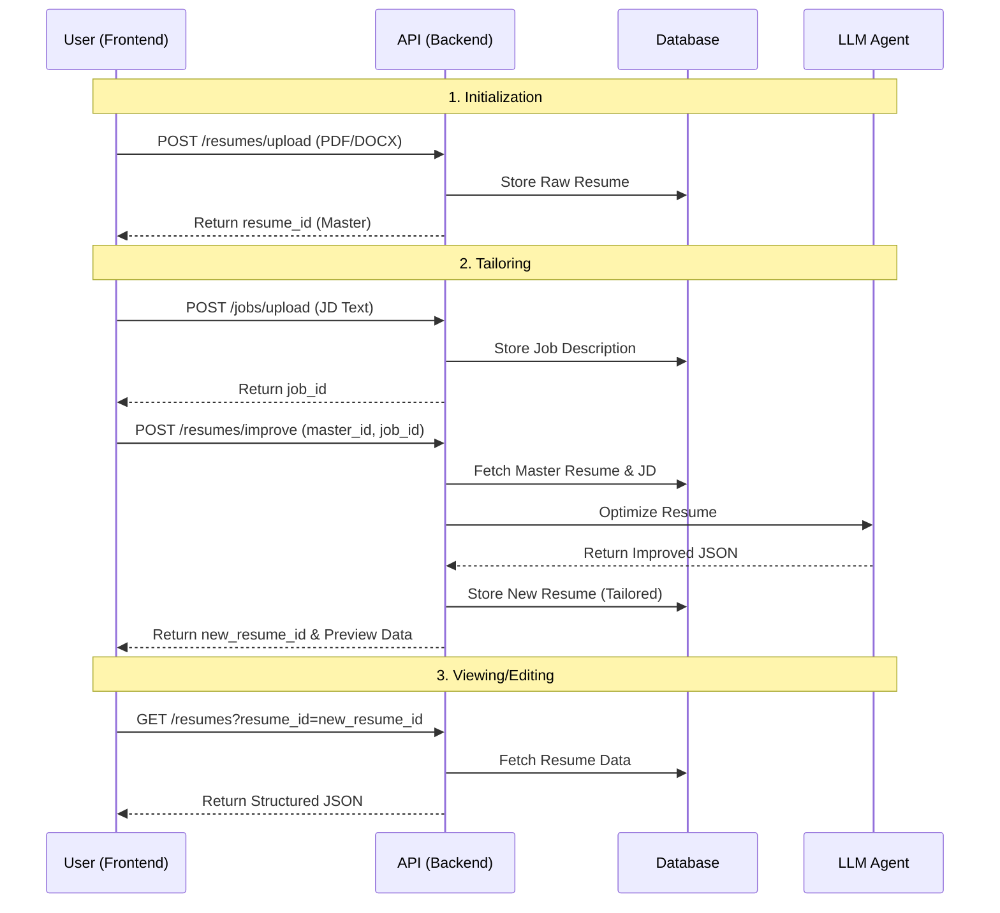

# Frontend API Contract

This document defines the API contract between the Next.js frontend and the FastAPI backend for the Resume Matcher "Master Resume" and tailoring workflow.

## Overview

The workflow consists of four main steps:
1.  **Initialize**: Uploading a base "Master Resume" (PDF/DOCX).
2.  **View**: Fetching resume data for display.
3.  **Tailor**: Uploading a target Job Description (JD).
4.  **Improve**: Generating a tailored resume based on the Master Resume + Job Description.

## API Endpoints

### 1. Upload Master Resume

Uploads a raw resume file (PDF or DOCX), converts it to Markdown, and stores it.

-   **Endpoint**: `POST /api/v1/resumes/upload`
-   **Content-Type**: `multipart/form-data`
-   **Request Body**:
    -   `file`: The resume file (PDF or DOCX, max 2MB).
-   **Response (200 OK)**:
    ```json
    {
      "message": "File <filename> successfully processed as MD and stored in the DB",
      "request_id": "uuid-string",
      "resume_id": "uuid-string"
    }
    ```
-   **Errors**:
    -   `400 Bad Request`: Invalid file type or empty file.
    -   `413 Payload Too Large`: File exceeds 2MB.
    -   `422 Unprocessable Entity`: Validation failure.

### 2. Fetch Resume Details

Retrieves the structured data for a specific resume (Master or Tailored). Used by the Viewer and Builder.

-   **Endpoint**: `GET /api/v1/resumes`
-   **Query Parameters**:
    -   `resume_id`: The UUID of the resume to fetch.
-   **Response (200 OK)**:
    ```json
    {
      "request_id": "uuid-string",
      "data": {
        "resume_id": "uuid-string",
        "raw_resume": {
          "id": 123,
          "content": "string (JSON stringified or Markdown text)",
          "content_type": "md",
          "created_at": "ISO-8601-timestamp"
        },
        "processed_resume": {
           "personal_data": { ... },
           "experiences": [ ... ],
           "education": [ ... ],
           "projects": [ ... ],
           "skills": [ ... ],
           "processed_at": "ISO-8601-timestamp"
        }
      }
    }
    ```
    *Note: `processed_resume` may be null if the resume hasn't been parsed/structured yet.*

-   **Errors**:
    -   `400 Bad Request`: Missing `resume_id`.
    -   `404 Not Found`: Resume ID does not exist.

### 3. Upload Job Description

Stores a raw text job description to be used for tailoring.

-   **Endpoint**: `POST /api/v1/jobs/upload`
-   **Content-Type**: `application/json`
-   **Request Body**:
    ```json
    {
      "job_descriptions": ["Raw text of the job description..."],
      "resume_id": "uuid-string (optional linkage)"
    }
    ```
-   **Response (200 OK)**:
    ```json
    {
      "message": "data successfully processed",
      "job_id": ["uuid-string"],
      "request": { ... }
    }
    ```
    *Note: Returns an array of job_ids corresponding to the input array.*

-   **Errors**:
    -   `400 Bad Request`: Invalid payload or missing fields.

### 4. Improve / Tailor Resume

Triggers the AI agent to optimize the Master Resume against the Job Description.

-   **Endpoint**: `POST /api/v1/resumes/improve`
-   **Content-Type**: `application/json`
-   **Request Body**:
    ```json
    {
      "resume_id": "uuid-string (Master Resume ID)",
      "job_id": "uuid-string (Job ID from step 3)"
    }
    ```
-   **Response (200 OK)**:
    ```json
    {
      "request_id": "uuid-string",
      "data": {
        "request_id": "uuid-string",
        "resume_id": "uuid-string (ID of the NEW tailored resume)",
        "job_id": "uuid-string",
        "original_score": 75,
        "new_score": 95,
        "resume_preview": {
            // Full structured resume object matching the Builder's data shape
            "personalInfo": { ... },
            "workExperience": [ ... ],
            // ...
        },
        "improvements": [
            { "suggestion": "...", "lineNumber": 10 }
        ]
      }
    }
    ```
-   **Errors**:
    -   `500 Internal Server Error`: AI processing failure or database error.
    -   `422 Unprocessable Entity`: Keyword extraction failed.

## Data Flow Diagram



