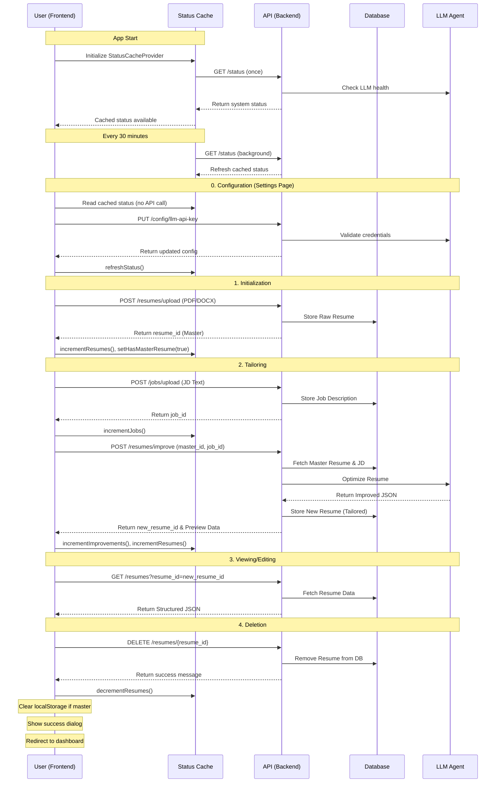

# Frontend API Contract

This document defines the API contract between the Next.js frontend and the FastAPI backend for the Resume Matcher application.

## Overview

The API supports the following workflows:
1.  **Initialize**: Uploading a base "Master Resume" (PDF/DOCX).
2.  **View**: Fetching resume data for display.
3.  **List**: Fetching tailored resumes for dashboard tiles.
4.  **Tailor**: Uploading a target Job Description (JD).
5.  **Improve**: Generating a tailored resume based on the Master Resume + Job Description.
6.  **Update**: Saving resume edits from the builder.
7.  **Delete**: Removing a resume (Master or Tailored) from the system.
8.  **Download**: Generating a pixel-perfect PDF via headless Chromium.
9.  **Configure**: Managing LLM provider settings and viewing system status.

## API Endpoints

### 1. Upload Master Resume

Uploads a raw resume file (PDF or DOCX), converts it to Markdown, and stores it.

-   **Endpoint**: `POST /api/v1/resumes/upload`
-   **Content-Type**: `multipart/form-data`
-   **Request Body**:
    -   `file`: The resume file (PDF or DOCX, max 2MB).
-   **Response (200 OK)**:
    ```json
    {
      "message": "File <filename> successfully processed as MD and stored in the DB",
      "request_id": "uuid-string",
      "resume_id": "uuid-string"
    }
    ```
-   **Errors**:
    -   `400 Bad Request`: Invalid file type or empty file.
    -   `413 Payload Too Large`: File exceeds 2MB.
    -   `422 Unprocessable Entity`: Validation failure.

### 2. Fetch Resume Details

Retrieves the structured data for a specific resume (Master or Tailored). Used by the Viewer and Builder.

-   **Endpoint**: `GET /api/v1/resumes`
-   **Query Parameters**:
    -   `resume_id`: The UUID of the resume to fetch.
-   **Response (200 OK)**:
    ```json
    {
      "request_id": "uuid-string",
      "data": {
        "resume_id": "uuid-string",
        "raw_resume": {
          "id": 123,
          "content": "string (JSON stringified or Markdown text)",
          "content_type": "md",
          "created_at": "ISO-8601-timestamp",
          "processing_status": "pending | processing | ready | failed"
        },
        "processed_resume": {
           "personalInfo": {
             "name": "string",
             "title": "string",
             "email": "string",
             "phone": "string",
             "location": "string",
             "website": "string | null",
             "linkedin": "string | null",
             "github": "string | null"
           },
           "summary": "string",
           "workExperience": [
             {
               "id": 1,
               "title": "string (job title)",
               "company": "string",
               "location": "string | null",
               "years": "string (e.g., '2020 - Present')",
               "description": ["string (bullet points)"]
             }
           ],
           "education": [
             {
               "id": 1,
               "institution": "string",
               "degree": "string",
               "years": "string",
               "description": "string | null"
             }
           ],
           "personalProjects": [
             {
               "id": 1,
               "name": "string",
               "role": "string",
               "years": "string",
               "description": ["string"]
             }
           ],
           "additional": {
             "technicalSkills": ["string"],
             "languages": ["string"],
             "certificationsTraining": ["string"],
             "awards": ["string"]
           }
        }
      }
    }
    ```
    *Note: `processed_resume` may be null if the resume hasn't been parsed/structured yet.*

-   **Errors**:
    -   `400 Bad Request`: Missing `resume_id`.
    -   `404 Not Found`: Resume ID does not exist.

### 3. List Resumes

Lists resumes for dashboard tiles (default excludes the master resume).

-   **Endpoint**: `GET /api/v1/resumes/list?include_master=false`
-   **Response (200 OK)**:
    ```json
    {
      "request_id": "uuid-string",
      "data": [
        {
          "resume_id": "uuid-string",
          "filename": "tailored_resume.pdf",
          "is_master": false,
          "parent_id": "uuid-string",
          "processing_status": "ready",
          "created_at": "ISO-8601-timestamp",
          "updated_at": "ISO-8601-timestamp"
        }
      ]
    }
    ```

### 4. Upload Job Description

Stores a raw text job description to be used for tailoring.

-   **Endpoint**: `POST /api/v1/jobs/upload`
-   **Content-Type**: `application/json`
-   **Request Body**:
    ```json
    {
      "job_descriptions": ["Raw text of the job description..."],
      "resume_id": "uuid-string (optional linkage)"
    }
    ```
-   **Response (200 OK)**:
    ```json
    {
      "message": "data successfully processed",
      "job_id": ["uuid-string"],
      "request": { ... }
    }
    ```
    *Note: Returns an array of job_ids corresponding to the input array.*

-   **Errors**:
    -   `400 Bad Request`: Invalid payload or missing fields.

### 5. Improve / Tailor Resume

Triggers the AI agent to optimize the Master Resume against the Job Description.

-   **Endpoint**: `POST /api/v1/resumes/improve`
-   **Content-Type**: `application/json`
-   **Request Body**:
    ```json
    {
      "resume_id": "uuid-string (Master Resume ID)",
      "job_id": "uuid-string (Job ID from step 3)"
    }
    ```
-   **Response (200 OK)**:
    ```json
    {
      "request_id": "uuid-string",
      "data": {
        "request_id": "uuid-string",
        "resume_id": "uuid-string (ID of the NEW tailored resume)",
        "job_id": "uuid-string",
        "resume_preview": {
            // Full structured resume object matching the Builder's data shape
            "personalInfo": { ... },
            "workExperience": [ ... ],
            "education": [ ... ],
            "personalProjects": [ ... ],
            "additional": { ... }
        }
      }
    }
    ```
    *Note: Scoring feature was removed in v1. Focus is on keyword alignment quality.*

-   **Errors**:
    -   `500 Internal Server Error`: AI processing failure or database error.
    -   `422 Unprocessable Entity`: Keyword extraction or JSON parsing failed.

### 6. Update Resume

Updates a resume using structured JSON from the builder.

-   **Endpoint**: `PATCH /api/v1/resumes/{resume_id}`
-   **Content-Type**: `application/json`
-   **Request Body**:
    ```json
    {
      "personalInfo": { ... },
      "summary": "...",
      "workExperience": [ ... ],
      "education": [ ... ],
      "personalProjects": [ ... ],
      "additional": { ... }
    }
    ```
-   **Response (200 OK)**: Same shape as Fetch Resume.

### 7. Delete Resume

Permanently deletes a resume from the system.

-   **Endpoint**: `DELETE /api/v1/resumes/{resume_id}`
-   **Response (200 OK)**:
    ```json
    {
      "message": "Resume deleted successfully"
    }
    ```
-   **Errors**:
    -   `404 Not Found`: Resume ID does not exist.

**Frontend Integration:**
-   Called from Resume Viewer page via `deleteResume(resumeId)` in `lib/api/resume.ts`
-   Shows confirmation dialog before deletion (Swiss-style danger variant)
-   Shows success dialog after deletion before redirecting to dashboard
-   If deleting master resume, clears `master_resume_id` from localStorage
-   Dashboard refreshes resume list on window focus to reflect deletions

### 8. Download Resume PDF

Generates a pixel-perfect PDF using headless Chromium with customizable template settings.

-   **Endpoint**: `GET /api/v1/resumes/{resume_id}/pdf`
-   **Query Parameters**:
    | Parameter | Type | Default | Range | Description |
    |-----------|------|---------|-------|-------------|
    | `template` | string | `swiss-single` | `swiss-single`, `swiss-two-column` | Resume layout template |
    | `pageSize` | string | `A4` | `A4`, `LETTER` | Page size format |
    | `marginTop` | int | 10 | 5-25 | Top margin in mm |
    | `marginBottom` | int | 10 | 5-25 | Bottom margin in mm |
    | `marginLeft` | int | 10 | 5-25 | Left margin in mm |
    | `marginRight` | int | 10 | 5-25 | Right margin in mm |
    | `sectionSpacing` | int | 3 | 1-5 | Gap between sections (1=tight, 5=loose) |
    | `itemSpacing` | int | 2 | 1-5 | Gap between items within sections |
    | `lineHeight` | int | 3 | 1-5 | Text line height |
    | `fontSize` | int | 3 | 1-5 | Base font size (1=11px, 5=16px) |
    | `headerScale` | int | 3 | 1-5 | Header size multiplier |
-   **Response (200 OK)**: PDF binary (`application/pdf`) with `Content-Disposition` attachment.

**WYSIWYG Implementation:**
-   Margins are applied in the HTML content (via padding), not by Playwright
-   The print route (`/print/resumes/[id]`) renders the resume at exact page dimensions
-   Playwright uses zero margins to preserve the HTML layout exactly
-   This ensures the PDF matches the paginated preview in the builder 1:1

**Frontend Integration:**
-   Called via `downloadResumePdf(resumeId, templateSettings)` in `lib/api/resume.ts`
-   `TemplateSettings` object contains all formatting options
-   Settings are persisted in `localStorage` under `resume_builder_settings`
-   The paginated preview in the builder shows exactly what the PDF will look like

### 9. Get System Status

Returns comprehensive system health and database statistics.

-   **Endpoint**: `GET /api/v1/status`
-   **Response (200 OK)**:
    ```json
    {
      "status": "ready | setup_required",
      "llm_configured": true,
      "llm_healthy": true,
      "has_master_resume": true,
      "database_stats": {
        "total_resumes": 5,
        "total_jobs": 3,
        "total_improvements": 2,
        "has_master_resume": true
      }
    }
    ```

### 10. Get LLM Configuration

Retrieves current LLM provider configuration (API key is masked).

-   **Endpoint**: `GET /api/v1/config/llm-api-key`
-   **Response (200 OK)**:
    ```json
    {
      "provider": "openai",
      "model": "gpt-4o-mini",
      "api_key": "sk-...xxxx",
      "api_base": null
    }
    ```

### 11. Update LLM Configuration

Updates LLM provider settings. Validates the configuration before saving.

-   **Endpoint**: `PUT /api/v1/config/llm-api-key`
-   **Content-Type**: `application/json`
-   **Request Body**:
    ```json
    {
      "provider": "openai | anthropic | openrouter | gemini | deepseek | ollama",
      "model": "gpt-4o-mini",
      "api_key": "sk-...",
      "api_base": "http://localhost:11434 (optional, for Ollama)"
    }
    ```
    *Note: All fields are optional. Only provided fields are updated.*
-   **Response (200 OK)**:
    ```json
    {
      "provider": "openai",
      "model": "gpt-4o-mini",
      "api_key": "sk-...xxxx",
      "api_base": null
    }
    ```
-   **Errors**:
    -   `400 Bad Request`: Invalid configuration (e.g., bad API key).

### 12. Test LLM Connection

Tests the current LLM configuration by making a minimal API call.

-   **Endpoint**: `POST /api/v1/config/llm-test`
-   **Response (200 OK)**:
    ```json
    {
      "healthy": true,
      "provider": "openai",
      "model": "gpt-4o-mini",
      "response_model": "gpt-4o-mini-2024-07-18"
    }
    ```
-   **Response (200 OK - Unhealthy)**:
    ```json
    {
      "healthy": false,
      "provider": "openai",
      "model": "gpt-4o-mini",
      "error": "Invalid API key"
    }
    ```

## Supported LLM Providers

| Provider | Model Format | Requires API Key |
|----------|--------------|------------------|
| `openai` | `gpt-4o-mini`, `gpt-4o` | Yes |
| `anthropic` | `claude-3-5-sonnet-20241022` | Yes |
| `openrouter` | `anthropic/claude-3.5-sonnet` | Yes |
| `gemini` | `gemini-1.5-flash` | Yes |
| `deepseek` | `deepseek-chat` | Yes |
| `ollama` | `llama3.2`, `mistral` | No (local) |

## Centralized API Client

All API calls are routed through a centralized client (`lib/api/client.ts`) that provides:

### Configuration
```typescript
export const API_URL = process.env.NEXT_PUBLIC_API_URL || 'http://localhost:8000';
export const API_BASE = `${API_URL}/api/v1`;
```

### Helper Functions
| Function | Description |
|----------|-------------|
| `apiFetch(endpoint, options?)` | Base fetch wrapper, prepends API_BASE |
| `apiPost(endpoint, body)` | POST with JSON body |
| `apiPatch(endpoint, body)` | PATCH with JSON body |
| `apiPut(endpoint, body)` | PUT with JSON body |
| `apiDelete(endpoint)` | DELETE request |
| `getUploadUrl()` | Returns full upload endpoint URL |

### Barrel Export
All API functions are re-exported from `lib/api/index.ts` for clean imports:
```typescript
import { fetchResume, uploadJobDescriptions, API_BASE } from '@/lib/api';
```

## Status Caching System

The frontend implements a caching layer for system status to avoid expensive LLM health check API calls on every page visit.

### StatusCacheProvider (`lib/context/status-cache.tsx`)

Wraps the application and provides cached status data:

```typescript
const {
  status,           // SystemStatus | null
  isLoading,        // boolean
  lastFetched,      // Date | null
  refreshStatus,    // () => Promise<void>
  // Counter update methods (optimistic updates)
  incrementResumes,
  decrementResumes,
  incrementJobs,
  incrementImprovements,
  setHasMasterResume,
} = useStatusCache();
```

### Caching Behavior
| Behavior | Details |
|----------|---------|
| Initial Load | Status fetched once on app start |
| Auto-Refresh | LLM health check every 30 minutes (background) |
| Manual Refresh | User can click "Refresh" in Settings |
| Optimistic Updates | Counters update instantly without API call |

### Counter Update Triggers
| Action | Counter Updates |
|--------|-----------------|
| Upload master resume | `incrementResumes()`, `setHasMasterResume(true)` |
| Delete master resume | `decrementResumes()`, `setHasMasterResume(false)` |
| Upload job description | `incrementJobs()` |
| Generate tailored resume | `incrementJobs()`, `incrementImprovements()`, `incrementResumes()` |
| Delete any resume | `decrementResumes()` |

### Performance Benefits
- **No LLM API call on Settings page load** - Uses cached data
- **Instant counter updates** - No round-trip to server
- **Background refresh** - Status stays fresh without blocking UI

## Data Flow Diagram


