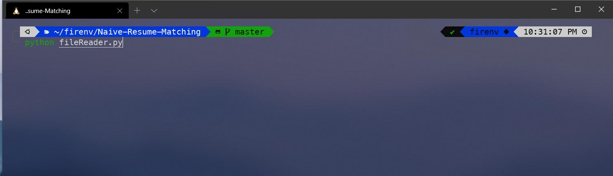
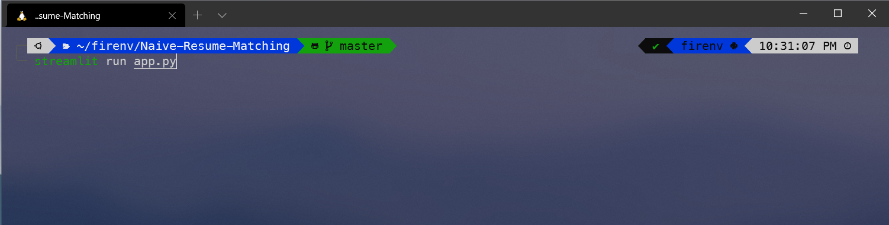

# Steps to run the Code

1. All the resumes and the job description needs to be uploaded/saved in the Data/Resume and Data/JobDesc folders respectively.
2. After saving the documents execute the [fileReader.py](fileReader.py) script.

3. Then the two CSV files will be updated with the new resumes and job desciptions.

   _Note:- Incase the textract fails to read the data (May happen in Windows users, users need to Use the Demo files saved in the Demo Folder, to run the `app.1py`. Just Replace them with the respective CSVs and you'll be good to go. If textract fails then a new code needs to be created to extract documents from their specific file extensions.)_

4. Run ` streamlit run app.py` to run the streamlit server.

## Information about the Python Files.

`Distill.py` : It's a code cleaning file that contains functions to be called in an order to clean the code.

`Cleaner.py` : It takes in text and calls the `Distill.py`'s functions to remove stopwords, lemmatize data etc.

`fileReader.py` : Script for reading documents and creating a CSV from them.

`tf_idf.py` : It's called by `fileReader.py` to generate tf-idf based top words that resemble the document more accurately.

`Similar.py` : It contains the code for running the similarity queries. Uses textdistance package based functions to do so. It's used in `app.py`

`app.py` : It contains the main funtion and streamlilt server to run the application.
