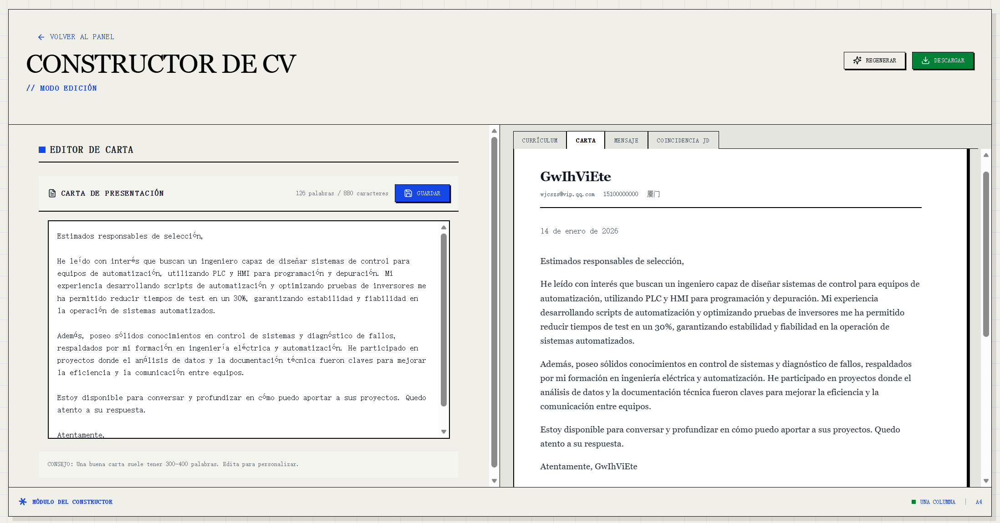

<div align="center">

[](https://www.resumematcher.fyi)

# Resume Matcher

[English](README.md) | **Español** | [简体中文](README.zh-CN.md) | [日本語](README.ja.md)

[𝙹𝚘𝚒𝚗 𝙳𝚒𝚜𝚌𝚘𝚛𝚍](https://dsc.gg/resume-matcher) ✦ [𝚆𝚎𝚋𝚜𝚒𝚝𝚎](https://resumematcher.fyi) ✦ [𝙷𝚘𝚠 𝚝𝚘 𝙸𝚗𝚜𝚝𝚊𝚕𝚕](https://resumematcher.fyi/docs/installation) ✦ [𝙲𝚘𝚗𝚝𝚛𝚒𝚋𝚞𝚝𝚘𝚛𝚜](#contributors) ✦ [𝚂𝚙𝚘𝚗𝚜𝚘𝚛](#sponsor-resume-matcher) ✦ [𝚃𝚠𝚒𝚝𝚝𝚎𝚛/𝚇](https://twitter.com/srbhrai) ✦ [𝙻𝚒𝚗𝚔𝚎𝚍𝙸𝚗](https://www.linkedin.com/company/resume-matcher/) ✦ [𝙲𝚛𝚎𝚊𝚝𝚘𝚛](https://srbhr.com)

**Deja de ser rechazado automáticamente por los bots ATS.** Resume Matcher es la plataforma impulsada por IA que aplica ingeniería inversa a los algoritmos de contratación para mostrarte exactamente cómo adaptar tu currículum. Obtén las palabras clave, el formato y los conocimientos que realmente te ayudarán a superar el primer filtro y llegar a manos humanas.

Esperamos convertir esto en **el VS Code para crear currículums**.


</div>

<br>

<div align="center">


  

[](https://dsc.gg/resume-matcher) [](https://resumematcher.fyi) [](https://www.linkedin.com/company/resume-matcher/)

<a href="https://trendshift.io/repositories/565" target="_blank"></a>


</div>

> \[!IMPORTANT]
>
> Este proyecto está en desarrollo activo. Se están añadiendo nuevas características continuamente y agradecemos las contribuciones de la comunidad. Si tienes alguna sugerencia o solicitud de características, no dudes en abrir un *issue* en GitHub o discutirlo en nuestro servidor de [Discord](https://dsc.gg/resume-matcher).

## Primeros pasos

Resume Matcher funciona creando un currículum maestro que puedes usar para adaptar cada postulación. Instrucciones de instalación aquí: [Cómo instalar](#how-to-install)

### Cómo funciona

1. **Sube** tu currículum maestro (PDF o DOCX)
2. **Pega** la descripción del puesto al que apuntas
3. **Revisa** mejoras y contenido adaptado generado por IA
4. **Genera** carta de presentación y plantillas de email para la postulación
5. **Personaliza** el diseño y las secciones a tu estilo
6. **Exporta** como PDF profesional con tu plantilla preferida

### Mantente conectado

[](https://dsc.gg/resume-matcher)

Únete a nuestro [Discord](https://dsc.gg/resume-matcher) para discusiones, solicitudes de funcionalidades y soporte de la comunidad.

[](https://www.linkedin.com/company/resume-matcher/)

Síguenos en [LinkedIn](https://www.linkedin.com/company/resume-matcher/) para actualizaciones.


Dale una estrella al repositorio para apoyar el desarrollo y recibir notificaciones de nuevas versiones.

## Patrocinadores


Estamos agradecidos a nuestros patrocinadores que ayudan a mantener este proyecto. Si Resume Matcher te resulta útil, considera [**apoyarnos**](https://github.com/sponsors/srbhr) para asegurar el desarrollo y las mejoras continuas.

| Patrocinador | Descripción |
|---------|-------------|
| [APIDECK](https://apideck.com?utm_source=resumematcher&utm_medium=github&utm_campaign=sponsors) | Una API para conectar tu aplicación con más de 200 plataformas SaaS (contabilidad, HRIS, CRM, almacenamiento de archivos). Crea integraciones una vez, no 50. 🌐 [apideck.com](https://apideck.com?utm_source=resumematcher&utm_medium=github&utm_campaign=sponsors) |
| [Vercel](https://vercel.com?utm_source=resumematcher&utm_medium=github&utm_campaign=sponsors) | Resume Matcher es parte del programa Vercel OSS // Summer 2025 🌐 [vercel.com](https://vercel.com?utm_source=resumematcher&utm_medium=github&utm_campaign=sponsors) |
| [Cubic.dev](https://cubic.dev?utm_source=resumematcher&utm_medium=github&utm_campaign=sponsors) | Cubic ofrece revisiones de PR para Resume Matcher 🌐 [cubic.dev](https://cubic.dev?utm_source=resumematcher&utm_medium=github&utm_campaign=sponsors) |
| [Kilo Code](https://kilo.ai?utm_source=resumematcher&utm_medium=github&utm_campaign=sponsors) | Kilo Code proporciona revisiones de código de IA y créditos de codificación a Resume Matcher 🌐 [kilo.ai](https://kilo.ai?utm_source=resumematcher&utm_medium=github&utm_campaign=sponsors) |

<a id="support-the-development-by-donating"></a>

## Patrocina Resume Matcher


Por favor lee nuestra [Sponsorship Guide](https://resumematcher.fyi/docs/sponsoring) para detalles de cómo tu patrocinio ayuda al proyecto. Recibirás un agradecimiento especial en el ReadME y en nuestro sitio web.

| Plataforma  | Enlace |
|-----------|--------|
| GitHub | [](https://github.com/sponsors/srbhr) |
| Buy Me a Coffee | [](https://www.buymeacoffee.com/srbhr) |

## Nota del Creador

Gracias por visitar Resume Matcher. Si quieres conectar, colaborar o simplemente saludar, ¡no dudes en contactarme!
~ **Saurabh Rai** ✨

Puedes seguirme en:

- Website: [https://srbhr.com](https://srbhr.com)
- Linkedin: [https://www.linkedin.com/in/srbhr/](https://www.linkedin.com/in/srbhr/)
- Twitter: [https://twitter.com/srbhrai](https://twitter.com/srbhrai)
- GitHub: [https://github.com/srbhr](https://github.com/srbhr)

## Funciones clave


### Funciones principales

**Currículum maestro**: crea un currículum maestro completo a partir de tu currículum actual.


### Constructor de currículum


Pega una descripción del puesto y obtén un currículum adaptado con ayuda de IA.

Puedes:

- Modificar el contenido sugerido
- Añadir/quitar secciones
- Reordenar secciones con arrastrar y soltar
- Elegir entre múltiples plantillas

### Generador de carta de presentación y email

Genera cartas de presentación y plantillas de email adaptadas según la descripción del puesto y tu currículum.



### Puntuación del currículum (función en desarrollo)

Estamos trabajando en una función de puntuación que analiza tu currículum frente a la descripción del puesto y ofrece un puntaje de coincidencia con sugerencias de mejora.


### Exportación a PDF

Exporta tu currículum adaptado y tu carta de presentación en PDF.

### Plantillas

| Nombre de plantilla | Vista previa | Descripción |
|---------------------|-------------|-------------|
| **Clásica (una columna)** |  | Diseño tradicional y limpio, adecuado para la mayoría de industrias. [Ver PDF](assets/pdf-templates/single-column.pdf) |
| **Moderna (una columna)** |  | Diseño contemporáneo enfocado en legibilidad y estética. [Ver PDF](assets/pdf-templates/modern-single-column.pdf) |
| **Clásica (dos columnas)** |  | Estructura que separa secciones para mayor claridad. [Ver PDF](assets/pdf-templates/two-column.pdf) |
| **Moderna (dos columnas)** |  | Diseño elegante que usa dos columnas para mejor organización. [Ver PDF](assets/pdf-templates/modern-two-column.pdf) |

### Internacionalización

- **UI multilingüe**: interfaz disponible en inglés, español, chino y japonés
- **Contenido multilingüe**: genera currículums y cartas de presentación en tu idioma preferido

### Roadmap

Si tienes alguna sugerencia o solicitud de características, no dudes en abrir un *issue* en GitHub o discutirlo en nuestro servidor de [Discord](https://dsc.gg/resume-matcher).

- Resaltado visual de palabras clave
- AI Canvas para crear contenido de currículum impactante y basado en métricas
- Optimización para múltiples descripciones de trabajo

<a id="how-to-install"></a>

## Cómo instalar


Para instrucciones detalladas de configuración, consulta **[SETUP.es.md](SETUP.es.md)**. También está disponible en [English](SETUP.md), [简体中文](SETUP.zh-CN.md) y [日本語](SETUP.ja.md).

### Requisitos previos

| Herramienta | Versión | Instalación |
|------------|---------|-------------|
| Python | 3.13+ | [python.org](https://python.org) |
| Node.js | 22+ | [nodejs.org](https://nodejs.org) |
| uv | Última | [astral.sh/uv](https://docs.astral.sh/uv/getting-started/installation/) |

### Inicio rápido

La forma más rápida (MacOS, WSL y Ubuntu):

```bash
# Clona el repositorio
git clone https://github.com/srbhr/Resume-Matcher.git
cd Resume-Matcher

# Backend (Terminal 1)
cd apps/backend
cp .env.example .env        # Configura tu proveedor de IA
uv sync                      # Instala dependencias
uv run uvicorn app.main:app --reload --port 8000

# Frontend (Terminal 2)
cd apps/frontend
npm install
npm run dev
```

Abre **<http://localhost:3000>** y configura tu proveedor de IA en Settings.

### Proveedores de IA compatibles

| Proveedor | Local/Nube | Notas |
|----------|------------|-------|
| **Ollama** | Local | Gratis, se ejecuta en tu máquina |
| **OpenAI** | Nube | GPT-4o, GPT-4o-mini |
| **Anthropic** | Nube | Claude 3.5 Sonnet |
| **Google Gemini** | Nube | Gemini 1.5 Flash/Pro |
| **OpenRouter** | Nube | Acceso a múltiples modelos |
| **DeepSeek** | Nube | DeepSeek Chat |

### Despliegue con Docker

```bash
docker pull srbhr/resume-matcher:latest

docker run srbhr/resume-matcher:latest
```

<!-- Nota: La documentación de Docker está pendiente. Por ahora, usa docker-compose.yml como referencia -->

> **¿Usas Ollama con Docker?** Usa `http://host.docker.internal:11434` como URL de Ollama en lugar de `localhost`.

### Stack tecnológico

| Componente | Tecnología |
|-----------|------------|
| Backend | FastAPI, Python 3.13+, LiteLLM |
| Frontend | Next.js 15, React 19, TypeScript |
| Base de datos | TinyDB (almacenamiento en archivo JSON) |
| Estilos | Tailwind CSS 4, Swiss International Style |
| PDF | Chromium headless vía Playwright |

## Únete y contribuye


¡Damos la bienvenida a las contribuciones de todos! Ya seas un desarrollador, diseñador o simplemente alguien que quiere ayudar. Todos los colaboradores están listados en la [página "Acerca de"](https://resumematcher.fyi/about) en nuestro sitio web y en el Readme de GitHub.

Echa un vistazo al roadmap si te gustaría trabajar en las características que están planeadas para el futuro. Si tienes alguna sugerencia o solicitud de características, no dudes en abrir un *issue* en GitHub y discutirlo en nuestro servidor de [Discord](https://dsc.gg/resume-matcher).

<a id="contributors"></a>

## Colaboradores


<a href="https://github.com/srbhr/Resume-Matcher/graphs/contributors">
  
</a>

<details>
  <summary><kbd>Historial de Estrellas</kbd></summary>
  <picture>
    <source media="(prefers-color-scheme: dark)" srcset="https://api.star-history.com/svg?repos=srbhr/resume-matcher&theme=dark&type=Date">
    
  </picture>
</details>

## Resume Matcher es parte del [Vercel Open Source Program](https://vercel.com/oss)


