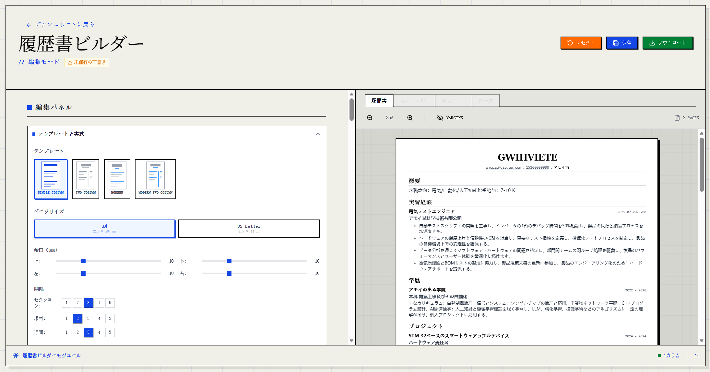
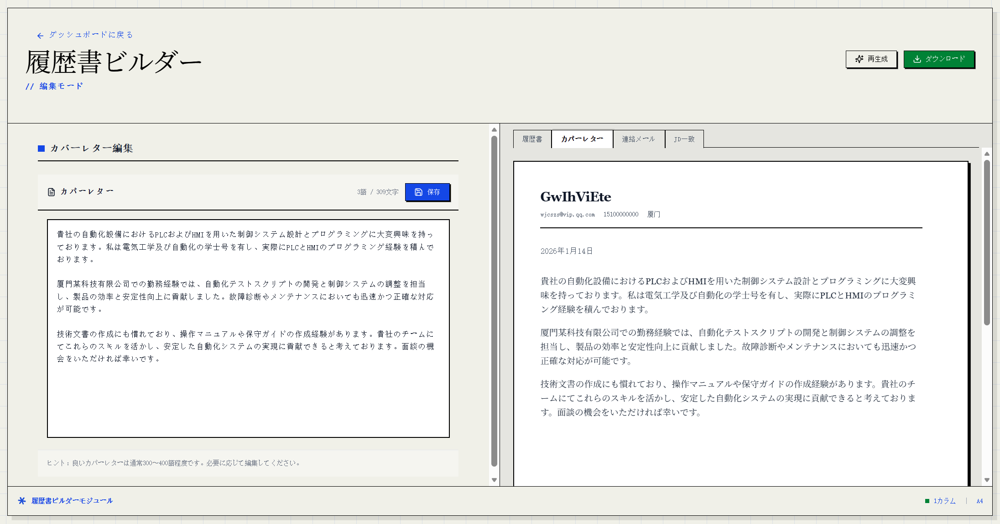
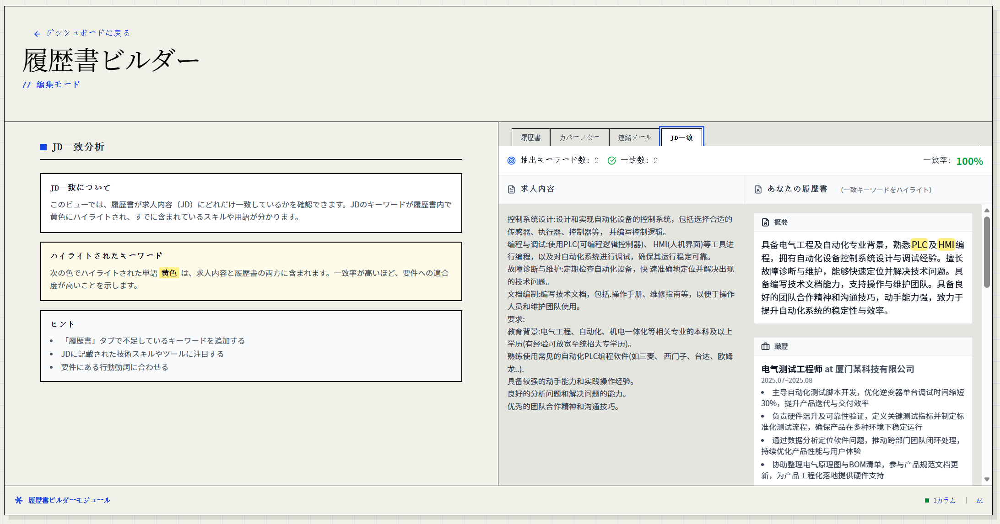

<div align="center">

[](https://www.resumematcher.fyi)

# Resume Matcher

[English](README.md) | [Español](README.es.md) | [简体中文](README.zh-CN.md) | **日本語**

[Discord](https://dsc.gg/resume-matcher) • [公式サイト](https://resumematcher.fyi) • [インストール手順](https://resumematcher.fyi/docs/installation) • [コントリビューター](#contributors) • [寄付](#support-the-development-by-donating) • [X/Twitter](https://twitter.com/srbhrai) • [LinkedIn](https://www.linkedin.com/company/resume-matcher/)

求人ごとに最適化した履歴書を、AI の提案で作成できます。Ollama を使ってローカルで動かすことも、API 経由でお気に入りの LLM プロバイダに接続することも可能です。


</div>

<br>

<div align="center">


  

[](https://dsc.gg/resume-matcher) [](https://resumematcher.fyi) [](https://www.linkedin.com/company/resume-matcher/)

<a href="https://trendshift.io/repositories/565" target="_blank"></a>


</div>

> \[!IMPORTANT]
>
> 本プロジェクトはアクティブに開発中です。新機能は継続的に追加され、コミュニティからのコントリビューションも歓迎しています。提案や機能要望があれば、GitHub に Issue を立てるか、[Discord](https://dsc.gg/resume-matcher) でご相談ください。

## はじめに

Resume Matcher は、まず「マスター履歴書」を作り、それを各求人応募向けに調整する形で動作します。インストール手順は：[インストール方法](#how-to-install)

### 仕組み

1. **アップロード**：マスター履歴書（PDF / DOCX）
2. **貼り付け**：応募先の求人票（Job Description）
3. **確認**：AI が生成した改善案と最適化内容
4. **生成**：求人向けのカバーレターとメール文面
5. **調整**：レイアウトやセクションを好みに合わせてカスタマイズ
6. **書き出し**：好みのテンプレートで PDF を出力

### コミュニティ

[](https://dsc.gg/resume-matcher)

ディスカッション、要望、サポートは [Discord](https://dsc.gg/resume-matcher) へ。

[](https://www.linkedin.com/company/resume-matcher/)

最新情報は [LinkedIn](https://www.linkedin.com/company/resume-matcher/) でも発信しています。


Star を付けていただけると開発の励みになります（リリース通知も受け取れます）。

## スポンサー


スポンサーの皆さまに感謝します。Resume Matcher が役立ったと感じたら、[**GitHub Sponsors**](https://github.com/sponsors/srbhr) での支援をご検討ください。継続的な開発と改善につながります。

| Sponsor | Description |
|---------|-------------|
| [APIDECK](https://apideck.com?utm_source=resumematcher&utm_medium=github&utm_campaign=sponsors) | One API to connect your app to 200+ SaaS platforms (accounting, HRIS, CRM, file storage). Build integrations once, not 50 times. Visit [apideck.com](https://apideck.com?utm_source=resumematcher&utm_medium=github&utm_campaign=sponsors). |

<a id="support-the-development-by-donating"></a>
## 寄付で開発を支援する


Resume Matcher の開発を寄付で支援できます。ご支援はプロジェクトの継続と新機能の追加に活用されます。

| プラットフォーム | リンク |
|------------------|--------|
| GitHub | [](https://github.com/sponsors/srbhr) |
| Buy Me a Coffee | [](https://www.buymeacoffee.com/srbhr) |

## 主な機能


### コア機能

**マスター履歴書（Master Resume）**：既存の履歴書から、再利用できる包括的なマスター履歴書を作成します。


### 履歴書ビルダー



求人票を貼り付けると、その職種に合わせた AI 提案の履歴書を生成します。

できること：

- 提案内容の編集
- セクションの追加/削除
- ドラッグ＆ドロップで順序変更
- 複数テンプレートから選択

### カバーレター＆メール生成

求人票と履歴書に基づき、カスタマイズされたカバーレターとメール文面を生成します。



### 履歴書スコアリング（開発中）

履歴書と求人票を比較して、マッチスコアと改善提案を出す機能を開発中です。



### PDF 出力

最適化した履歴書とカバーレターを PDF として出力できます。

### テンプレート

| テンプレート名 | プレビュー | 説明 |
|---------------|-----------|------|
| **クラシック（1 カラム）** |  | 伝統的でクリーンなレイアウト。多くの業種に適しています。[PDF を見る](assets/pdf-templates/single-column.pdf) |
| **モダン（1 カラム）** |  | 可読性と美しさを重視した現代的なデザイン。[PDF を見る](assets/pdf-templates/modern-single-column.pdf) |
| **クラシック（2 カラム）** |  | セクションを分けて見やすく整理します。[PDF を見る](assets/pdf-templates/two-column.pdf) |
| **モダン（2 カラム）** |  | 2 カラムを活用して情報をより整理します。[PDF を見る](assets/pdf-templates/modern-two-column.pdf) |

### 国際化

- **多言語 UI**：英語・スペイン語・中国語・日本語に対応
- **多言語コンテンツ**：希望言語で履歴書とカバーレターを生成

### ロードマップ

提案や機能要望があれば、GitHub に Issue を立てるか、[Discord](https://dsc.gg/resume-matcher) でご相談ください。

- キーワードの視覚的ハイライト
- 定量的でインパクトのある内容を作る AI Canvas
- 複数求人票の同時最適化

<a id="how-to-install"></a>
## インストール方法


詳細なセットアップ手順は **[SETUP.ja.md](SETUP.ja.md)** を参照してください（[English](SETUP.md) / [Español](SETUP.es.md) / [简体中文](SETUP.zh-CN.md) も利用できます）。

### 前提条件

| ツール | バージョン | インストール |
|--------|------------|--------------|
| Python | 3.13+ | [python.org](https://python.org) |
| Node.js | 22+ | [nodejs.org](https://nodejs.org) |
| uv | 最新 | [astral.sh/uv](https://docs.astral.sh/uv/getting-started/installation/) |

### クイックスタート

MacOS / WSL / Ubuntu で最も手早い手順：

```bash
# リポジトリをクローン
git clone https://github.com/srbhr/Resume-Matcher.git
cd Resume-Matcher

# バックエンド（ターミナル 1）
cd apps/backend
cp .env.example .env        # AI プロバイダを設定
uv sync                      # 依存関係をインストール
uv run uvicorn app.main:app --reload --port 8000

# フロントエンド（ターミナル 2）
cd apps/frontend
npm install
npm run dev
```

**<http://localhost:3000>** を開き、Settings で AI プロバイダを設定してください。

### 対応 AI プロバイダ

| プロバイダ | ローカル/クラウド | 備考 |
|------------|-------------------|------|
| **Ollama** | ローカル | 無料。手元のマシンで動作 |
| **OpenAI** | クラウド | GPT-4o、GPT-4o-mini |
| **Anthropic** | クラウド | Claude 3.5 Sonnet |
| **Google Gemini** | クラウド | Gemini 1.5 Flash/Pro |
| **OpenRouter** | クラウド | 複数モデルへアクセス |
| **DeepSeek** | クラウド | DeepSeek Chat |

### Docker デプロイ

```bash
docker pull srbhr/resume-matcher:latest

docker run srbhr/resume-matcher:latest
```

Docker の詳細は [docs/agent/60-docker/docker.md](docs/agent/60-docker/docker.md) を参照してください。

> **Docker で Ollama を使う場合**： [docs/agent/60-docker/docker-ollama.md](docs/agent/60-docker/docker-ollama.md)。TL;DR：Ollama の URL は `localhost` ではなく `http://host.docker.internal:11434` を指定します。

### 技術スタック

| コンポーネント | 技術 |
|----------------|------|
| バックエンド | FastAPI、Python 3.13+、LiteLLM |
| フロントエンド | Next.js 15、React 19、TypeScript |
| データベース | TinyDB（JSON ファイル保存） |
| スタイリング | Tailwind CSS 4、Swiss International Style |
| PDF | Playwright による Headless Chromium |

## 参加・コントリビュート


どなたでもコントリビュート歓迎です。開発者・デザイナー・ユーザーを問わず、協力してくれる方を募集しています。コントリビューター一覧は、公式サイトの [about ページ](https://resumematcher.fyi/about) と GitHub README に掲載されています。

ロードマップも参考にしてください。提案や機能要望があれば、GitHub で Issue を作成し、[Discord](https://dsc.gg/resume-matcher) でも議論できます。

<a id="contributors"></a>
## コントリビューター


<a href="https://github.com/srbhr/Resume-Matcher/graphs/contributors">
  
</a>

<br/>

<details>
  <summary><kbd>Star の推移</kbd></summary>
  <picture>
    <source media="(prefers-color-scheme: dark)" srcset="https://api.star-history.com/svg?repos=srbhr/resume-matcher&theme=dark&type=Date">
    
  </picture>
</details>

## Resume Matcher は [Vercel Open Source Program](https://vercel.com/oss) の一部です


