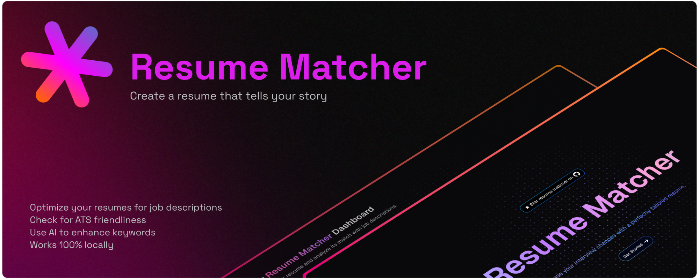

# Resume Matcher

[𝙹𝚘𝚒𝚗 𝙳𝚒𝚜𝚌𝚘𝚛𝚍](https://dsc.gg/resume-matcher) ✦ [𝚆𝚎𝚋𝚜𝚒𝚝𝚎](https://resumematcher.fyi) ✦ [𝙷𝚘𝚠 𝚝𝚘 𝙸𝚗𝚜𝚝𝚊𝚕𝚕 ](#how-to-install) ✦ [𝙲𝚘𝚗𝚝𝚛𝚒𝚋𝚞𝚝𝚎](#join-us-contribute) ✦ [𝙳𝚘𝚗𝚊𝚝𝚎](#please-support-the-development-by-donating) ✦ [𝚃𝚠𝚒𝚝𝚝𝚎𝚛/𝚇](https://twitter.com/_srbhr_) ✦ [𝙻𝚒𝚗𝚔𝚎𝚍𝙸𝚗](https://www.linkedin.com/company/resume-matcher/)

**Stop getting auto-rejected by ATS bots.** Resume Matcher is the AI-powered platform that reverse-engineers hiring algorithms to show you exactly how to tailor your resume. Get the keywords, formatting, and insights that actually get you past the first screen and into human hands.

 

   
  

## Getting started with Resume Matcher

Resume Matcher is designed to help you optimize your resume with the aim to highlight your skills and experience in a way that resonates with potential employers. We're working on actively improving the platform and adding new features. The best way to stay updated is to join the discord discussion and be part of the active development community.

> Join our Discord community 👇

> Follow us on LinkedIn ✨

> **⭐** Star Resume Matcher to support the development and get updates on GitHub.
