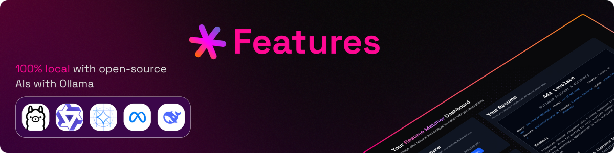

<div align="center">

[](https://www.resumematcher.fyi)

# Resume Matcher

[𝙹𝚘𝚒𝚗 𝙳𝚒𝚜𝚌𝚘𝚛𝚍](https://dsc.gg/resume-matcher) ✦ [𝚆𝚎𝚋𝚜𝚒𝚝𝚎](https://resumematcher.fyi) ✦ [𝙷𝚘𝚠 𝚝𝚘 𝙸𝚗𝚜𝚝𝚊𝚕𝚕](#how-to-install) ✦ [𝙲𝚘𝚗𝚝𝚛𝚒𝚋𝚞𝚝𝚘𝚛𝚜](#contributors) ✦ [𝙳𝚘𝚗𝚊𝚝𝚎](#support-the-development-by-donating) ✦ [𝚃𝚠𝚒𝚝𝚝𝚎𝚛/𝚇](https://twitter.com/ssrbhr) ✦ [𝙻𝚒𝚗𝚔𝚎𝚍𝙸𝚗](https://www.linkedin.com/company/resume-matcher/)

**Stop getting auto-rejected by ATS bots.** Resume Matcher is the AI-powered platform that reverse-engineers hiring algorithms to show you exactly how to tailor your resume. Get the keywords, formatting, and insights that actually get you past the first screen and into human hands.

Hoping to make this, **VS Code for making resumes**.

</div>

<br>

<div align="center">


  

[](https://dsc.gg/resume-matcher) [](https://resumematcher.fyi) [](https://www.linkedin.com/company/resume-matcher/)

<a href="https://trendshift.io/repositories/565" target="_blank"></a>


</div>

> \[!IMPORTANT]
>
> This project is in active development. New features are being added continuously, and we welcome contributions from the community. There are some breaking changes on the `main` branch. If you have any suggestions or feature requests, please feel free to open an issue on GitHub or discuss it on our [Discord](https://dsc.gg/resume-matcher) server.

## Getting started with Resume Matcher

Resume Matcher is designed to help you optimize your resume with the aim to highlight your skills and experience in a way that resonates with potential employers.

We're actively working on improving the platform, building towards a **VS Code for making resumes**, and adding new features. The best way to stay updated is to join the Discord discussion and be part of the active development community.

> Join our [Discord](https://dsc.gg/resume-matcher) community 👇
[](https://dsc.gg/resume-matcher)

> Follow us on [LinkedIn](https://www.linkedin.com/company/resume-matcher/) ✨
[](https://www.linkedin.com/company/resume-matcher/)

> ⭐ Star Resume Matcher to support the development and get updates on GitHub.


## Key Features



- **Works locally**: Run everything on your machine with local AI models via Ollama, or use cloud providers.
- **Multi-provider LLM support**: Works with OpenAI, Anthropic, Gemini, OpenRouter, DeepSeek, and Ollama.
- **Resume Tailoring**: Automatically optimize your resume for specific job descriptions.
- **Keyword Optimization**: Align your resume with job keywords and highlight relevant experience.
- **Guided Improvements**: Get actionable suggestions to make your resume stand out.

### Roadmap

If you have any suggestions or feature requests, please feel free to open an issue on GitHub. And discuss it on our [Discord](https://dsc.gg/resume-matcher) server.

- Visual keyword highlighting.
- AI Canvas, which can help to craft impactful, metric-driven resume content.
- Multi-job description optimization.

## How to Install


Follow the instructions in the [INSTALL.md](INSTALL.md) file to set up the project locally.

**Quick Start:**

```bash
# Backend
cd apps/backend && cp .env.sample .env && uv sync
uv run uvicorn app.main:app --reload --port 8000

# Frontend (new terminal)
cd apps/frontend && npm install && npm run dev
```

### Tech Stack

| Component | Technology |
|-----------|------------|
| Backend | FastAPI, Python 3.11+ |
| Frontend | Next.js 15, React 19 |
| Database | TinyDB |
| LLM | LiteLLM (OpenAI, Anthropic, Ollama, etc.) |
| Styling | Tailwind CSS 4 |

## Join Us and Contribute


We welcome contributions from everyone! Whether you're a developer, designer, or just someone who wants to help out. All the contributors are listed in the [about page](https://resumematcher.fyi/about) on our website and on the GitHub Readme here.

Check out the roadmap if you would like to work on the features that are planned for the future. If you have any suggestions or feature requests, please feel free to open an issue on GitHub and discuss it on our [Discord](https://dsc.gg/resume-matcher) server.

## Contributors


<a href="https://github.com/srbhr/Resume-Matcher/graphs/contributors">
  
</a>

## Support the Development by Donating


If you would like to support the development of Resume Matcher, you can do so by donating. Your contributions will help us keep the project alive and continue adding new features.

| Platform  | Link                                   |
|-----------|----------------------------------------|
| GitHub    | [](https://github.com/sponsors/srbhr) |
| Buy Me a Coffee | [](https://www.buymeacoffee.com/srbhr) |

<details>
  <summary><kbd>Star History</kbd></summary>
  <picture>
    <source media="(prefers-color-scheme: dark)" srcset="https://api.star-history.com/svg?repos=srbhr/resume-matcher&theme=dark&type=Date">
    
  </picture>
</details>

## Resume Matcher is a part of [Vercel Open Source Program](https://vercel.com/oss)


