<div align="center">

[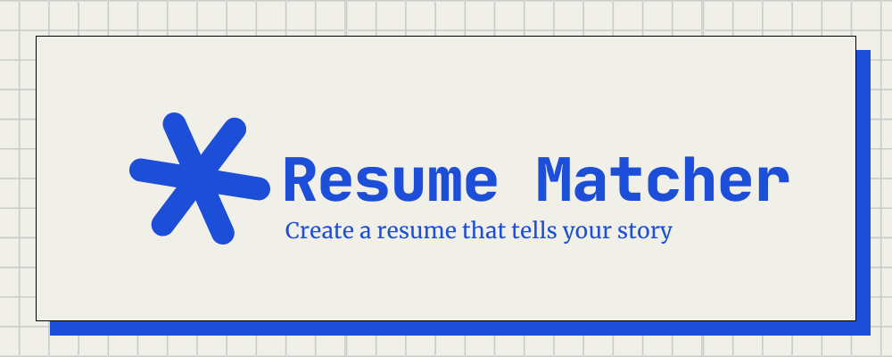](https://www.resumematcher.fyi)

# Resume Matcher

[𝙹𝚘𝚒𝚗 𝙳𝚒𝚜𝚌𝚘𝚛𝚍](https://dsc.gg/resume-matcher) ✦ [𝚆𝚎𝚋𝚜𝚒𝚝𝚎](https://resumematcher.fyi) ✦ [𝙷𝚘𝚠 𝚝𝚘 𝙸𝚗𝚜𝚝𝚊𝚕𝚕](https://resumematcher.fyi/docs/installation) ✦ [𝙲𝚘𝚗𝚝𝚛𝚒𝚋𝚞𝚝𝚘𝚛𝚜](#contributors) ✦ [𝚂𝚙𝚘𝚗𝚜𝚘𝚛](#sponsor-resume-matcher) ✦ [𝚃𝚠𝚒𝚝𝚝𝚎𝚛/𝚇](https://twitter.com/srbhrai) ✦ [𝙻𝚒𝚗𝚔𝚎𝚍𝙸𝚗](https://www.linkedin.com/company/resume-matcher/) ✦ [𝙲𝚛𝚎𝚊𝚝𝚘𝚛](https://srbhr.com)

**English** | [Español](README.es.md) | [简体中文](README.zh-CN.md) | [日本語](README.ja.md)

Create tailored resumes for each job application with AI-powered suggestions. Works locally with Ollama or connect to your favorite LLM provider via API.


</div>

<br>

<div align="center">


  

[](https://dsc.gg/resume-matcher) [](https://resumematcher.fyi) [](https://www.linkedin.com/company/resume-matcher/)

<a href="https://trendshift.io/repositories/565" target="_blank"></a>


</div>

> \[!IMPORTANT]
>
> This project is in active development. New features are being added continuously, and we welcome contributions from the community. If you have any suggestions or feature requests, please feel free to open an issue on GitHub or discuss it on our [Discord](https://dsc.gg/resume-matcher) server.

## Getting Started

Resume Matcher works by creating a master resume that you can use to tailor for each job application. Installation instructions here: [How to Install](#how-to-install)

### How It Works

1. **Upload** your master resume (PDF or DOCX)
2. **Paste** a job description you're targeting
3. **Review** AI-generated improvements and tailored content
4. **Cover Letter & Email** generator for the job application
5. **Customize** the layout and sections to fit your style
6. **Export** as a professional PDF with your preferred template

### Stay Connected

[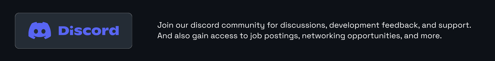](https://dsc.gg/resume-matcher)

Join our [Discord](https://dsc.gg/resume-matcher) for discussions, feature requests, and community support.

[](https://www.linkedin.com/company/resume-matcher/)

Follow us on [LinkedIn](https://www.linkedin.com/company/resume-matcher/) for updates.

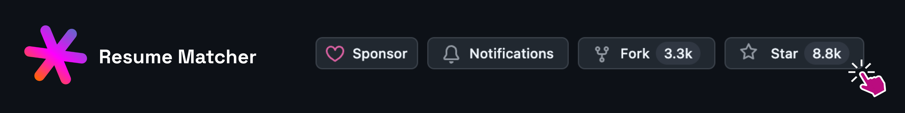

Star the repo to support development and get notified of new releases.

## Sponsors

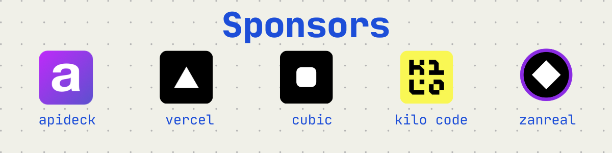

We are grateful to our sponsors who help keep this project going. If you find Resume Matcher helpful, please consider [**sponsoring us**](https://github.com/sponsors/srbhr) to ensure continued development and improvements.

| Sponsor | Description |
|---------|-------------|
| [APIDECK](https://apideck.com?utm_source=resumematcher&utm_medium=github&utm_campaign=sponsors) | One API to connect your app to 200+ SaaS platforms (accounting, HRIS, CRM, file storage). Build integrations once, not 50 times. 🌐 [apideck.com](https://apideck.com?utm_source=resumematcher&utm_medium=github&utm_campaign=sponsors) |
| [Vercel](https://vercel.com?utm_source=resumematcher&utm_medium=github&utm_campaign=sponsors) | Resume Matcher is a part of Vercel OSS // Summer 2025 Program 🌐 [vercel.com](https://vercel.com?utm_source=resumematcher&utm_medium=github&utm_campaign=sponsors) |
| [Cubic.dev](https://cubic.dev?utm_source=resumematcher&utm_medium=github&utm_campaign=sponsors) | Cubic provides PR reviews for Resume Matcher 🌐 [cubic.dev](https://cubic.dev?utm_source=resumematcher&utm_medium=github&utm_campaign=sponsors) |
| [Kilo Code](https://kilo.ai?utm_source=resumematcher&utm_medium=github&utm_campaign=sponsors) | Kilo Code provides AI code reviews and coding credits to Resume Matcher 🌐 [kilo.ai](https://kilo.ai?utm_source=resumematcher&utm_medium=github&utm_campaign=sponsors) |

<a id="support-the-development-by-donating"></a>

## Sponsor Resume Matcher


Please read our [Sponsorship Guide]([docs/agent/80-sponsorship/sponsorship-guide.md](https://resumematcher.fyi/docs/sponsoring)) for details on how your sponsorship helps the project. You will receive a special thank you in the ReadME and on our website.

| Platform  | Link                                   |
|-----------|----------------------------------------|
| GitHub    | [](https://github.com/sponsors/srbhr) |
| Buy Me a Coffee | [](https://www.buymeacoffee.com/srbhr) |

## Creators' Note

[](https://srbhr.com)

Thank you for checking out Resume Matcher. If you want to connect, collaborate, or just say hi, feel free to reach out!
~ **Saurabh Rai** ✨

You can follow me on:

- Website: [https://srbhr.com](https://srbhr.com)
- Linkedin: [https://www.linkedin.com/in/srbhr/](https://www.linkedin.com/in/srbhr/)
- Twitter: [https://twitter.com/srbhrai](https://twitter.com/srbhrai)
- GitHub: [https://github.com/srbhr](https://github.com/srbhr)

## Key Features

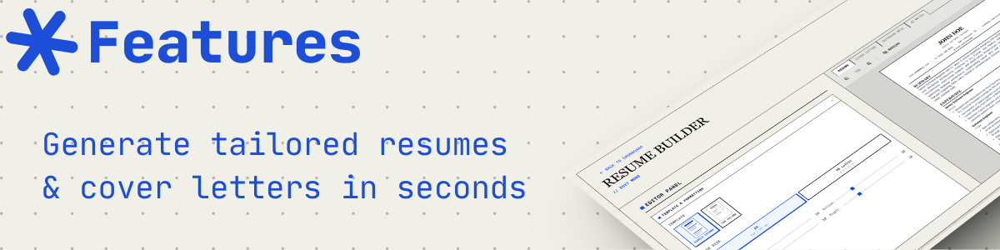

### Core Features

**Master Resume**: Create a comprehensive master resume to draw from your existing one.

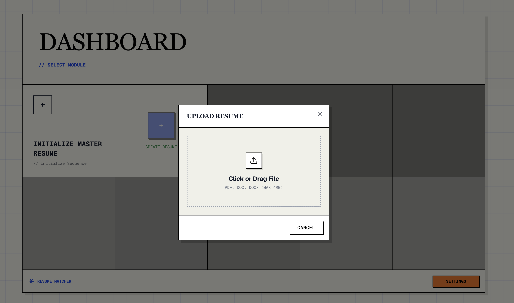

### Resume Builder

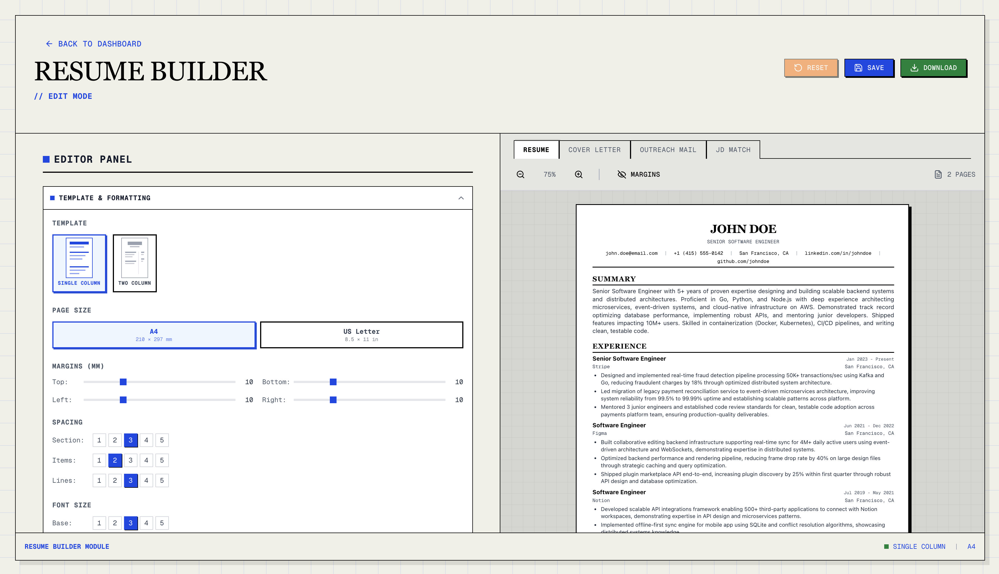

Paste in a job description and get AI-powered resume tailored for that specific role.

You can:

- Modify suggested content
- Add/remove sections
- Rearrange sections via drag-and-drop
- Choose from multiple resume templates

### Cover Letter & Email Generator

Generate tailored cover letters and email templates based on the job description and your resume.

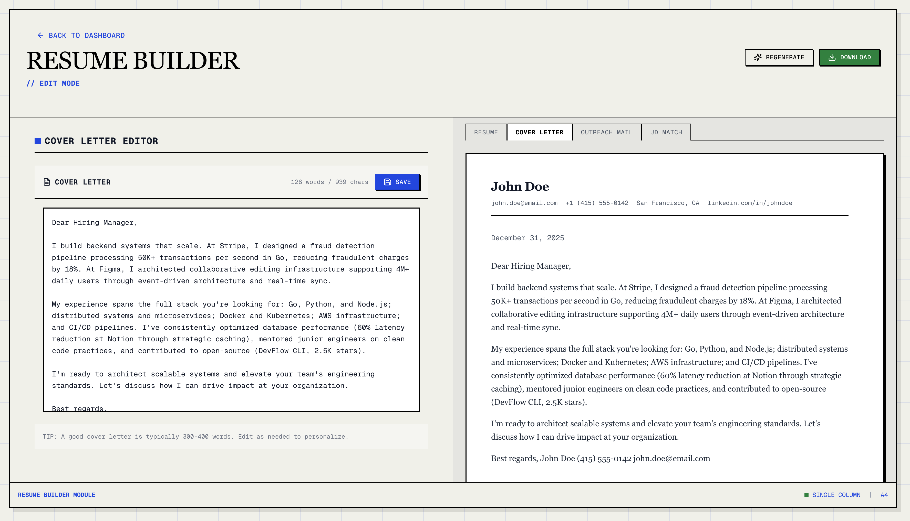

### Resume Scoring (In development feature)

We are working on a resume scoring feature that will analyze your resume against the job description and provide a match score along with suggestions for improvement.

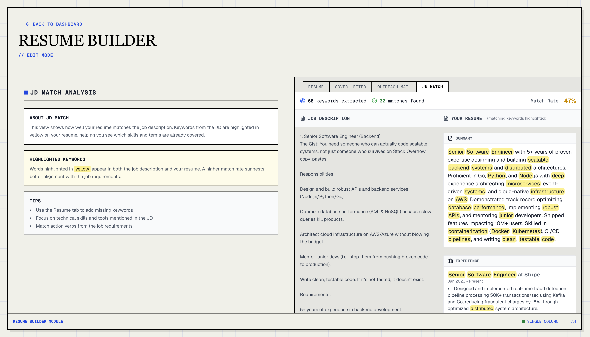

### PDF Export

Export your tailored resume and cover letter in PDF.

### Templates

| Template Name | Preview | Description |
|---------------|---------|-------------|
| **Classic Single Column** |  | A traditional and clean layout suitable for most industries. [𝐕𝐢𝐞𝐰 𝐏𝐃𝐅](assets/pdf-templates/single-column.pdf) |
| **Modern Single Column** | 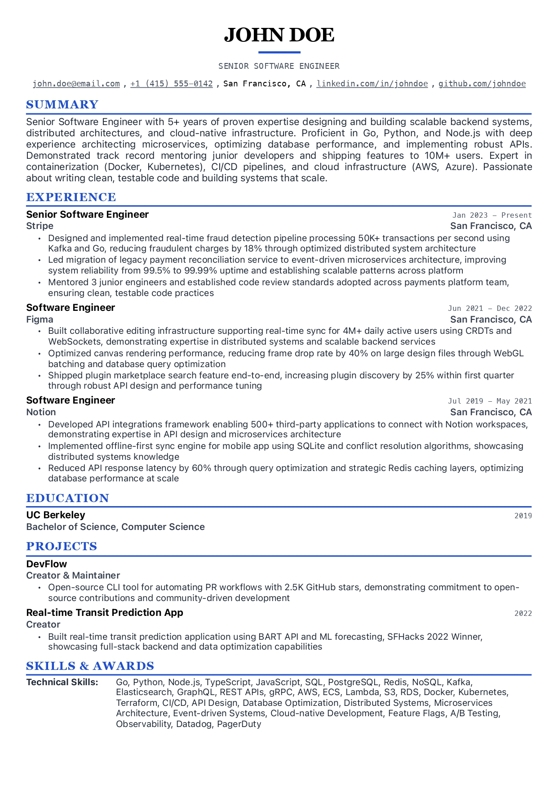 | A contemporary design with a focus on readability and aesthetics. [𝐕𝐢𝐞𝐰 𝐏𝐃𝐅](assets/pdf-templates/modern-single-column.pdf)|
| **Classic Two Column** | 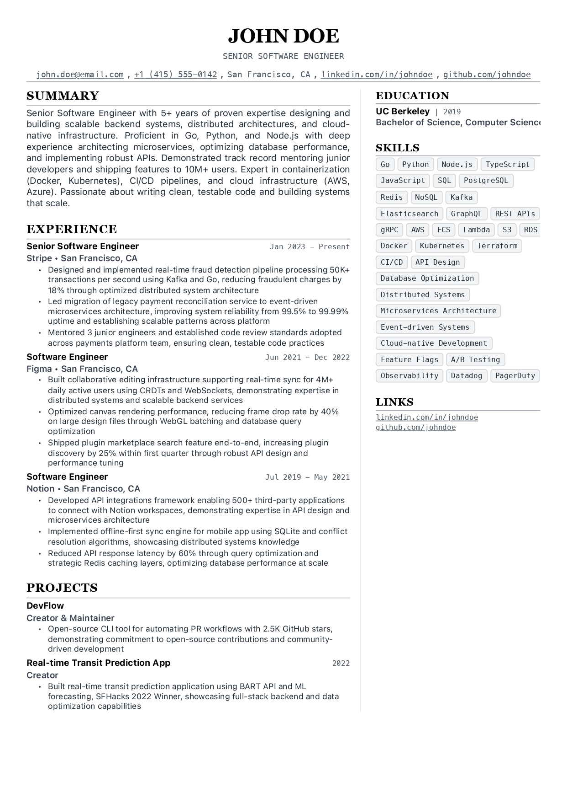 | A structured layout that separates sections for clarity. [𝐕𝐢𝐞𝐰 𝐏𝐃𝐅](assets/pdf-templates/two-column.pdf)|
| **Modern Two Column** | 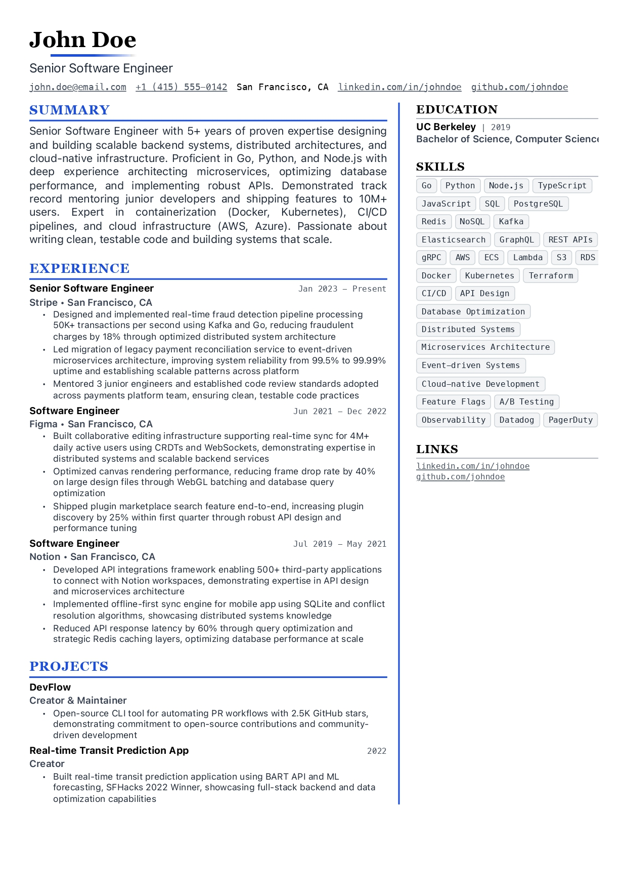 | A sleek design that utilizes two columns for better organization. [𝐕𝐢𝐞𝐰 𝐏𝐃𝐅](assets/pdf-templates/modern-two-column.pdf)|

### Internationalization

- **Multi-Language UI**: Interface available in English, Spanish, Chinese, and Japanese
- **Multi-Language Content**: Generate resumes and cover letters in your preferred language

### Roadmap

If you have any suggestions or feature requests, please feel free to open an issue on GitHub or discuss it on our [Discord](https://dsc.gg/resume-matcher) server.

- Visual keyword highlighting
- AI Canvas for crafting impactful, metric-driven resume content
- Multi-job description optimization

<a id="how-to-install"></a>

## How to Install


For detailed setup instructions, see **[SETUP.md](SETUP.md)** (English) or: [Español](SETUP.es.md), [简体中文](SETUP.zh-CN.md), [日本語](SETUP.ja.md).

### Prerequisites

| Tool | Version | Installation |
|------|---------|--------------|
| Python | 3.13+ | [python.org](https://python.org) |
| Node.js | 22+ | [nodejs.org](https://nodejs.org) |
| uv | Latest | [astral.sh/uv](https://docs.astral.sh/uv/getting-started/installation/) |

### Quick Start

Fastest for MacOS, WSL and Ubuntu users:

```bash
# Clone the repository
git clone https://github.com/srbhr/Resume-Matcher.git
cd Resume-Matcher

# Backend (Terminal 1)
cd apps/backend
cp .env.example .env        # Configure your AI provider
uv sync                      # Install dependencies
uv run uvicorn app.main:app --reload --port 8000

# Frontend (Terminal 2)
cd apps/frontend
npm install
npm run dev
```

Open **<http://localhost:3000>** and configure your AI provider in Settings.

### Supported AI Providers

| Provider | Local/Cloud | Notes |
|----------|-------------|-------|
| **Ollama** | Local | Free, runs on your machine |
| **OpenAI** | Cloud | GPT-4o, GPT-4o-mini |
| **Anthropic** | Cloud | Claude 3.5 Sonnet |
| **Google Gemini** | Cloud | Gemini 1.5 Flash/Pro |
| **OpenRouter** | Cloud | Access to multiple models |
| **DeepSeek** | Cloud | DeepSeek Chat |

### Docker Deployment

```bash
docker pull srbhr/resume-matcher:latest

docker run srbhr/resume-matcher:latest
```

<!-- Note: Docker documentation is pending. For now, use docker-compose.yml as reference -->

> **Using Ollama with Docker?** Use `http://host.docker.internal:11434` as the Ollama URL instead of `localhost`.

### Tech Stack

| Component | Technology |
|-----------|------------|
| Backend | FastAPI, Python 3.13+, LiteLLM |
| Frontend | Next.js 15, React 19, TypeScript |
| Database | TinyDB (JSON file storage) |
| Styling | Tailwind CSS 4, Swiss International Style |
| PDF | Headless Chromium via Playwright |

## Join Us and Contribute


We welcome contributions from everyone! Whether you're a developer, designer, or just someone who wants to help out. All the contributors are listed in the [about page](https://resumematcher.fyi/about) on our website and on the GitHub Readme here.

Check out the roadmap if you would like to work on the features that are planned for the future. If you have any suggestions or feature requests, please feel free to open an issue on GitHub and discuss it on our [Discord](https://dsc.gg/resume-matcher) server.

<a id="contributors"></a>

## Contributors


<a href="https://github.com/srbhr/Resume-Matcher/graphs/contributors">
  
</a>

<br/>

<details>
  <summary><kbd>Star History</kbd></summary>
  <picture>
    <source media="(prefers-color-scheme: dark)" srcset="https://api.star-history.com/svg?repos=srbhr/resume-matcher&theme=dark&type=Date">
    
  </picture>
</details>

## Resume Matcher is a part of [Vercel Open Source Program](https://vercel.com/oss)


