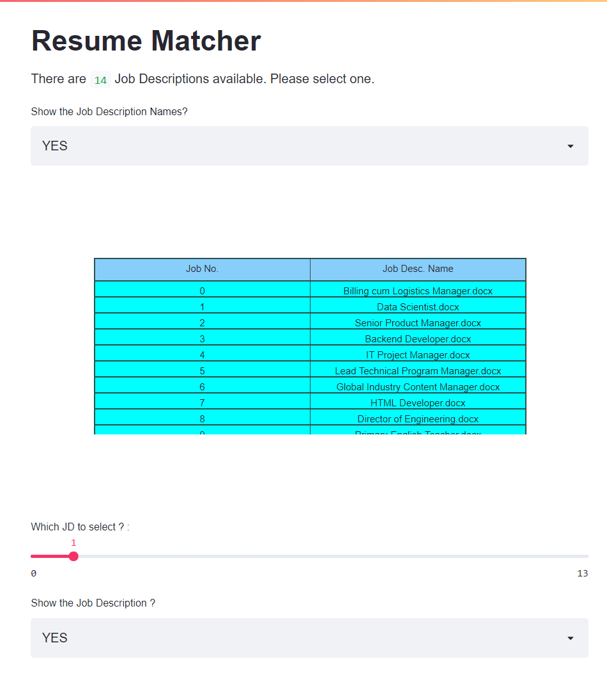
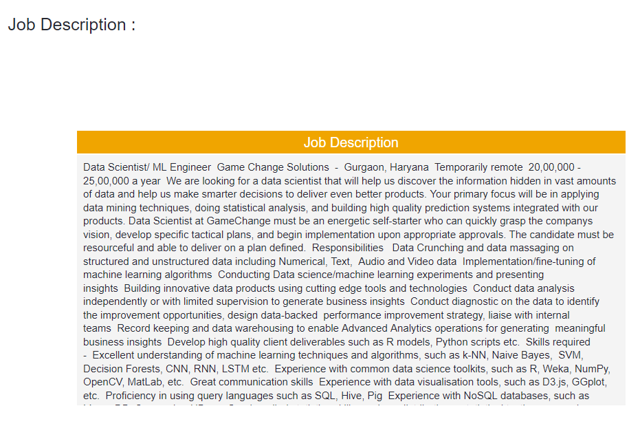
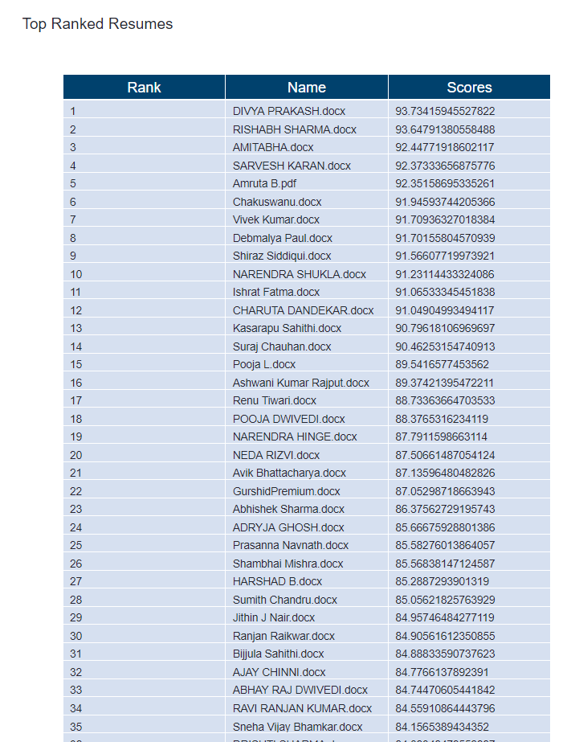
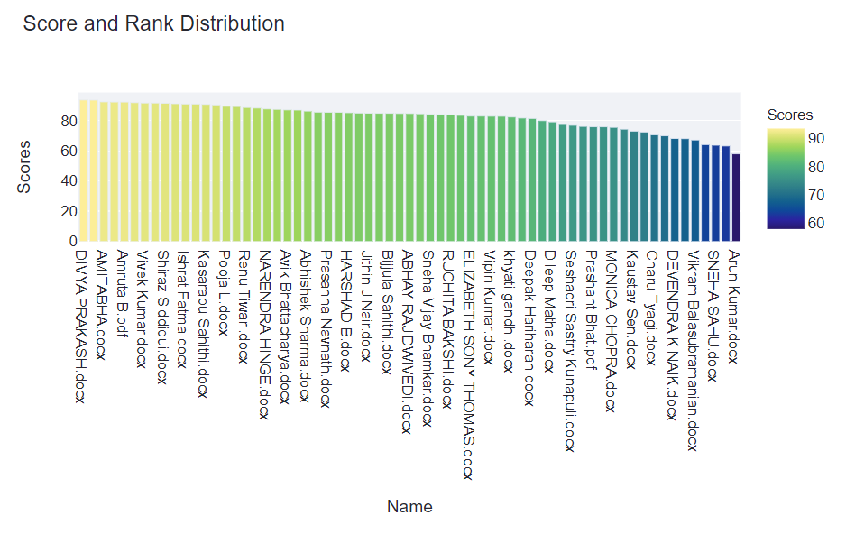
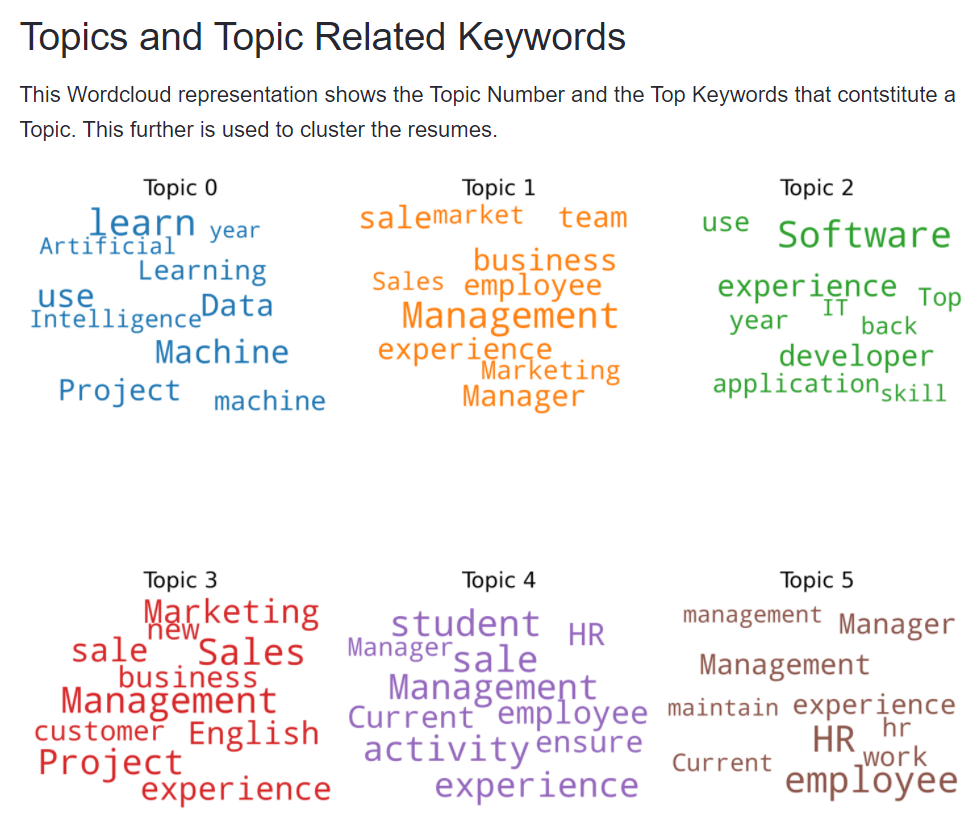
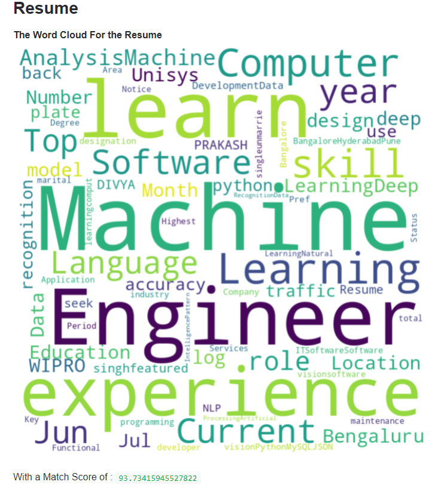

<p align="center">

<!--  -->

</p>

# Naive-Resume-Matcher
<p align="center">
<a href="https://img.shields.io/badge/Tested%20on-WSL%202.0-brightgreen"> </a>
<a href="https://img.shields.io/github/issues/srbhr/Naive-Resume-Matching?color=blueviolet">
 </a>
<a href="https://img.shields.io/github/forks/srbhr/Naive-Resume-Matching">
 </a>
<a href="https://img.shields.io/github/stars/srbhr/Naive-Resume-Matching?color=yellow">
 </a>
<a href="https://img.shields.io/github/license/srbhr/Naive-Resume-Matching">
 </a>
<a href="https://img.shields.io/twitter/url?url=https%3A%2F%2Fgithub.com%2Fsrbhr%2FNaive-Resume-Matching"></a>
</p>

<br/>

<div align="center">

###      

</div>


<br/>


A Machine Learning Based Resume Matcher, to compare Resumes with Job Descriptions.
Create a score based on how good/similar a resume is to the particular Job Description.\n
Documents are sorted based on Their TF-IDF Scores (Term Frequency-Inverse Document Frequency)

Check the live version [here](https://share.streamlit.io/srbhr/naive-resume-matching/app.py). _The instance might sleep if not used in a long time, so in such cases drop me a mail or fork this repo and launch your own instance at [Streamlit's Cloud Instance](https://streamlit.io/)_

Matching Algorihms used are :-

- **String Matching**

  - Monge Elkan

- **Token Based**
  - Jaccard
  - Cosine
  - Sorensen-Dice
  - Overlap Coefficient

Topic Modelling of Resumes is done to provide additional information about the resumes and what clusters/topics,
the belong to.
For this :-

1. [TF-IDF](https://en.wikipedia.org/wiki/Tf%E2%80%93idf) of resumes is done to improve the sentence similarities. As it helps reduce the redundant terms and brings out the important ones.
2. id2word, and doc2word algorithms are used on the Documents (from Gensim Library).
3. [LDA](https://en.wikipedia.org/wiki/Latent_Dirichlet_allocation) (Latent Dirichlet Allocation) is done to extract the Topics from the Document set.(In this case Resumes)
4. Additional Plots are done to gain more insights about the document.

---
## Images

1. List of Job Descriptions to Choose from.


2. Preview of your Chosen Job Description


3. Your Resumes are ranked now! Check the top Ones!! 


4. Score distribution of different candidates incase you want to check some more.


5. Topic Disctribution of Various Resumes



6. Topic Distribution Sunburst Chart


7. Word Cloud of your resume for a quick glance! 


## Preview

---

## Progress Flow

1. Input is Resumes and Job Description, the current code is capable to compare resumes to multiple job descriptions.
2. Job Description and Resumes are parsed with the help of Tesseract Library in python, and then is converted into two CSV files.Namely `Resume_Data.csv`and`Job_Data.csv`.
3. While doing the reading, the python script named [fileReader.py](fileReader.py) reads, and cleans the code and does the TF-IDF based filtering as well. (This might take sometime to process, so please be patient while executing the script.)
4. For any further comparisons the prepared CSV files are used.
5. [app.py](app.py) containg the code for running the streamlit server and allowing to perform tasks. Use `streamlit run app.py` to execute the script.

## File Structure

#### Data > Resumes and > JobDescription

The Data folder contains two folders that are used to read and provide data from.
Incase of allowing the option to upload documents, `Data\Resumes` and `Data\JobDesc` should be the target for Resumes and Job Description respectively.

Due the flexibility of Textract we need not to provide the type of document it needs to scan, it does so automatically.

But for the Job Description it needs to be in Docx format, it can be changed as well.

## Installation Instructions

A python virtual environment is required for this. Please read this [page](https://www.geeksforgeeks.org/creating-python-virtual-environment-windows-linux/) for more information.

A pip [requirements.txt](requirements.txt) file is provided. It is advised to install the packages listed below, manually by doing `pip install <package_name>`.
As the requirements.txt file may have some unecessary additional dependencies.

Popular Packages used are:-

- [Spacy](https://pypi.org/project/spacy/)
- [Plotly](https://pypi.org/project/plotly/)
- [Streamlit](https://pypi.org/project/streamlit/)
- [Gensim](https://pypi.org/project/gensim/)
- [Scikit Learn](https://pypi.org/project/scikit-learn/)
- [Pandas](https://pypi.org/project/pandas/)
- [Wordcloud](https://pypi.org/project/wordcloud/)
- [Matplotlib](https://pypi.org/project/matplotlib/)
- [Numpy](https://pypi.org/project/numpy/)
- [Scipy](https://pypi.org/project/scipy/)
- [NLTK](https://pypi.org/project/nltk/)
- [Textract](https://pypi.org/project/textract/)
- [Textdistance](https://pypi.org/project/textdistance/)

Furthermore the packages like NLTK and Spacy requires additional data to be downloaded.
After installing them please perform:-

```python
## For Spacy's English Package
python -m spacy download en_core_web_sm

## For NLTK Data
import nltk
nltk.download('popular')  # this downloads the popular packages from NLTK_DATA
```

## Execution Instructions

Please check the [How To](Howtorunthis.md) file for execution instructions.
