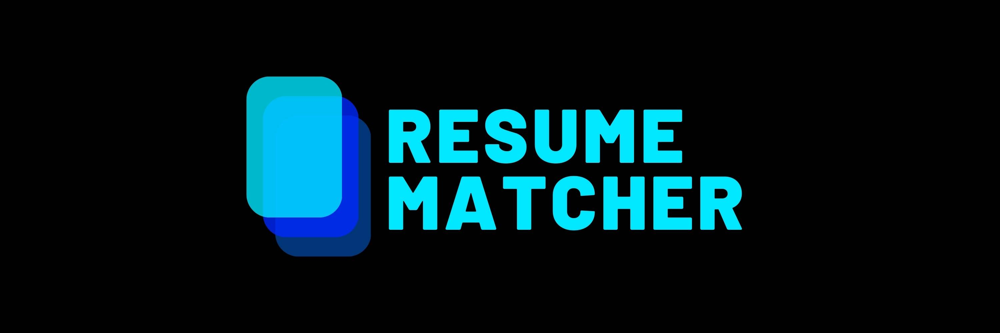

[](https://www.resumematcher.fyi)

<div align="center">

# Resume Matcher

## AI Based Free & Open Source ATS, Resume Matcher to tailor your resume to a job description. Find the best keywords, and gain deep insights into your resume.

</div>

<br>

<div align="center">


    [](https://github.com/qdrant/qdrant)

[](https://discord.gg/t3Y9HEuV34)

[](https://www.resumematcher.fyi)

#### Check the 🌐 **[LIVE DEMO on Streamlit Cloud 👇](https://resume-matcher.streamlit.app/)**

[](https://resume-matcher.streamlit.app/)

<a href="https://www.producthunt.com/posts/resume-matcher?utm_source=badge-featured&utm_medium=badge&utm_souce=badge-resume&#0045;matcher" target="_blank"></a>

</div>

### How does It work?

The Resume Matcher takes your resume and job descriptions as input, parses them using Python, and mimics the functionalities of an ATS, providing you with insights and suggestions to make your resume ATS-friendly.

The process is as follows:

1. **Parsing**: The system uses Python to parse both your resume and the provided job description, just like an ATS would. Parsing is critical as it transforms your documents into a format the system can readily analyze.

2. **Keyword Extraction**: The tool uses advanced machine learning algorithms to extract the most relevant keywords from the job description. These keywords represent the skills, qualifications, and experiences the employer seeks.

3. **Key Terms Extraction**: Beyond keyword extraction, the tool uses textacy to identify the main key terms or themes in the job description. This step helps in understanding the broader context of what the resume is about.

4. **Vector Similarity Using Qdrant**: The tool uses [Qdrant](https://github.com/qdrant/qdrant), a highly efficient vector similarity search tool, to measure how closely your resume matches the job description. This process is done by representing your resume and job description as vectors in a high-dimensional space and calculating their cosine similarity. The more similar they are, the higher the likelihood that your resume will pass the ATS screening.

On top of that, there are various data visualizations that I've added to help you get started.

### PRs Welcomed 🤗

💬 Feel free to join in the Discord to discuss anything.

💻 Create an issue.

👩‍💻 Contribute.

🔉Participate in the Discussions/Announcements.

🧪 Please check the [Landing Page](https://github.com/srbhr/website-for-resume-matcher). PRs are also welcomed over there.

<br/>

<div align="center">

## Support the development by Donating

[](https://buymeacoffee.com/srbhr)

[](https://github.com/sponsors/srbhr)

</div>

<br/>

<div align="center">

## How to install

</div>

Follow these steps to set up the environment and run the application:

1. Clone the Repository:

```bash
git clone https://github.com/srbhr/Resume-Matcher.git
cd Resume-Matcher
```

2. Create a Python Virtual Environment:

```bash
python -m venv env
```

3. Activate the Virtual Environment:

-   On Windows:

    ```bash
    env\Scripts\activate
    ```

-   On macOS and Linux:
    ```bash
    source env/bin/activate
    ```

4. Install Dependencies:

```bash
pip install -r requirements.txt
```

5. Prepare Data:

-   Resumes: Place your resumes in PDF format in the `Data/Resumes` folder. Remove any existing contents in this folder.
-   Job Descriptions: Place your job descriptions in PDF format in the `Data/JobDescription` folder. Remove any existing contents in this folder.

6. Parse Resumes to JSON:

```python
python run_first.py
```

7. Run the Application:

```python
streamlit run streamlit_app.py
```

**Note**: For local versions, you do not need to run "streamlit_second.py" as it is specifically for deploying to Streamlit servers.

**Additional Note**: The Vector Similarity part is precomputed to optimize performance due to the resource-intensive nature of sentence encoders that require significant GPU and RAM resources. If you are interested in leveraging this feature in a Google Colab environment for free, refer to the upcoming blog (link to be provided) for further guidance.

<br/>

---

### Note 📝

Thanks for the support 💙 this is an ongoing project that I want to build with open source community. There are many ways in which this tool can be upgraded. This includes (not limited to):

-   Create a better dashboard instead of Streamlit.
-   Add more features like uploading of resumes and parsing.
-   Add a docker image for easy usage.
-   Contribute to better parsing algorithm.
-   Contribute to on a blog to how to make this work.
-   Contribute to the [landing page](https://github.com/srbhr/website-for-resume-matcher) maybe re-create in React/Vue/etc.

---
