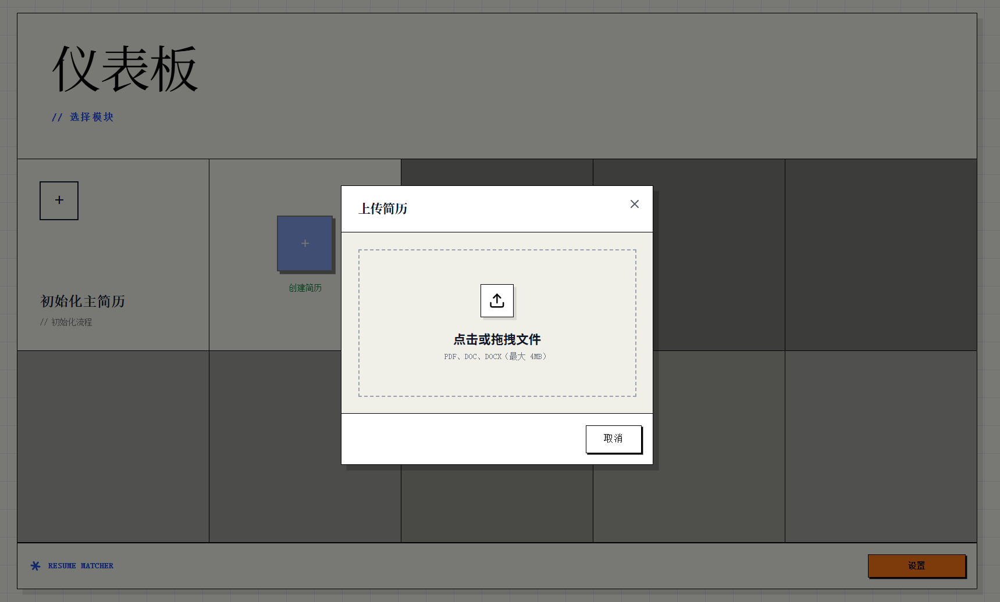
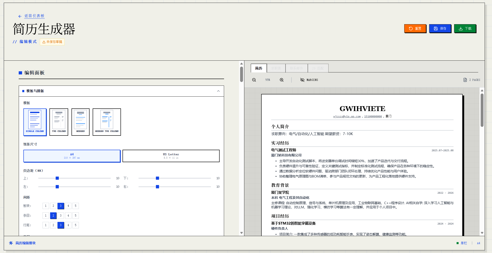
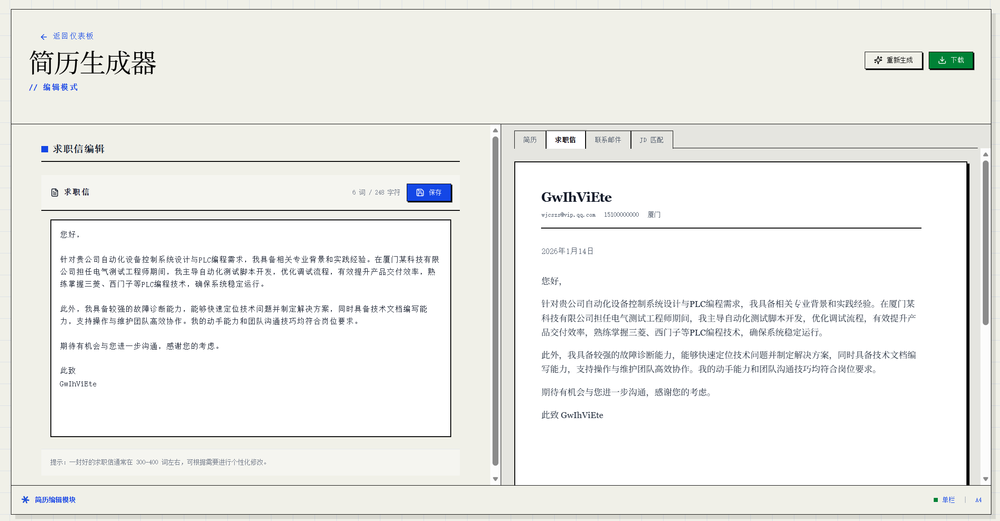
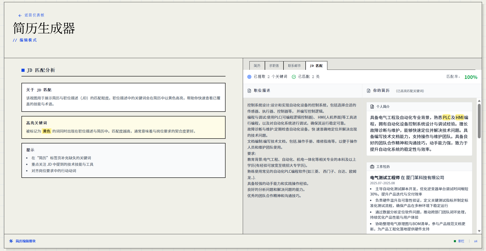

<div align="center">

[](https://www.resumematcher.fyi)

# Resume Matcher

[English](README.md) | [Español](README.es.md) | **简体中文** | [日本語](README.ja.md)

[Discord](https://dsc.gg/resume-matcher) • [官网](https://resumematcher.fyi) • [安装文档](https://resumematcher.fyi/docs/installation) • [贡献者](#contributors) • [捐助](#support-the-development-by-donating) • [X/Twitter](https://twitter.com/srbhrai) • [LinkedIn](https://www.linkedin.com/company/resume-matcher/)

为每一次求职投递生成量身定制的简历：AI 给出可执行的优化建议。支持本地使用 Ollama 运行，也可通过 API 连接你常用的 LLM 提供商。


</div>

<br>

<div align="center">


  

[](https://dsc.gg/resume-matcher) [](https://resumematcher.fyi) [](https://www.linkedin.com/company/resume-matcher/)

<a href="https://trendshift.io/repositories/565" target="_blank"></a>


</div>

> \[!IMPORTANT]
>
> 本项目处于活跃开发中。新功能会持续添加，我们也欢迎社区贡献。如果你有建议或功能需求，欢迎在 GitHub 提 Issue，或加入我们的 [Discord](https://dsc.gg/resume-matcher) 讨论。

## 快速开始

Resume Matcher 的工作方式是先建立一份“主简历”，然后针对每个职位描述进行定制。安装说明见：[如何安装](#how-to-install)

### 工作流程

1. **上传**你的主简历（PDF 或 DOCX）
2. **粘贴**你要投递的职位描述（JD）
3. **审阅**AI 生成的改进建议与定制内容
4. **生成**该岗位的求职信与邮件模板
5. **自定义**版式与章节，匹配你的风格
6. **导出**为你选定模板的专业 PDF

### 保持联系

[](https://dsc.gg/resume-matcher)

加入我们的 [Discord](https://dsc.gg/resume-matcher)，参与讨论、功能需求与社区支持。

[](https://www.linkedin.com/company/resume-matcher/)

关注我们的 [LinkedIn](https://www.linkedin.com/company/resume-matcher/) 获取更新。


给仓库点 Star 来支持开发，并及时获取新版本通知。

## 赞助商


感谢赞助商帮助项目持续推进。如果你觉得 Resume Matcher 有帮助，欢迎通过 [**GitHub Sponsors**](https://github.com/sponsors/srbhr) 支持我们，以便持续迭代与改进。

| Sponsor | Description |
|---------|-------------|
| [APIDECK](https://apideck.com?utm_source=resumematcher&utm_medium=github&utm_campaign=sponsors) | One API to connect your app to 200+ SaaS platforms (accounting, HRIS, CRM, file storage). Build integrations once, not 50 times. Visit [apideck.com](https://apideck.com?utm_source=resumematcher&utm_medium=github&utm_campaign=sponsors). |

<a id="support-the-development-by-donating"></a>
## 捐助支持项目开发


如果你愿意支持 Resume Matcher 的开发，可以通过捐助的方式参与。你的贡献将帮助我们保持项目运转并持续添加新功能。

| 平台  | 链接 |
|------|------|
| GitHub | [](https://github.com/sponsors/srbhr) |
| Buy Me a Coffee | [](https://www.buymeacoffee.com/srbhr) |

## 主要功能


### 核心能力

**主简历（Master Resume）**：基于你现有简历创建一份完整的主简历，后续每次投递都从这份主简历中抽取与定制。



### 简历生成器



粘贴职位描述后，获得针对该岗位定制的 AI 简历建议。

你可以：

- 修改建议内容
- 添加/移除章节
- 通过拖拽调整章节顺序
- 从多种简历模板中选择

### 求职信与邮件生成器

基于职位描述与你的简历，生成定制化的求职信与邮件模板。



### 简历评分（开发中功能）

我们正在开发“简历评分”功能：对比你的简历与职位描述，输出匹配分数，并给出改进建议。



### PDF 导出

将定制后的简历与求职信导出为 PDF。

### 模板

| 模板名称 | 预览 | 说明 |
|---------|------|------|
| **经典单栏** |  | 传统且干净的排版，适用于大多数行业。[查看 PDF](assets/pdf-templates/single-column.pdf) |
| **现代单栏** |  | 更强调可读性与审美的现代风格。[查看 PDF](assets/pdf-templates/modern-single-column.pdf) |
| **经典双栏** |  | 将内容分区展示，更清晰易扫读。[查看 PDF](assets/pdf-templates/two-column.pdf) |
| **现代双栏** |  | 利用双栏结构做更强的信息组织。[查看 PDF](assets/pdf-templates/modern-two-column.pdf) |

### 国际化

- **多语言 UI**：界面支持英语、西班牙语、中文与日语
- **多语言内容**：可按你偏好的语言生成简历与求职信

### 路线图

如果你有建议或功能需求，欢迎在 GitHub 提 Issue，或加入我们的 [Discord](https://dsc.gg/resume-matcher) 讨论。

- 可视化关键词高亮
- 用于打造量化、可落地简历内容的 AI 画布（AI Canvas）
- 多职位描述联合优化

<a id="how-to-install"></a>
## 如何安装


更详细的安装与配置说明请查看 **[安装文档](SETUP.zh-CN.md)**（也提供 [English](SETUP.md) / [Español](SETUP.es.md) / [日本語](SETUP.ja.md)）。

### 前置条件

| 工具 | 版本 | 安装 |
|------|------|------|
| Python | 3.13+ | [python.org](https://python.org) |
| Node.js | 22+ | [nodejs.org](https://nodejs.org) |
| uv | 最新版 | [astral.sh/uv](https://docs.astral.sh/uv/getting-started/installation/) |

### 快速开始

适用于 MacOS、WSL 与 Ubuntu 的最快方式：

```bash
# 克隆仓库
git clone https://github.com/srbhr/Resume-Matcher.git
cd Resume-Matcher

# 后端（终端 1）
cd apps/backend
cp .env.example .env        # 配置你的 AI 提供商
uv sync                      # 安装依赖
uv run uvicorn app.main:app --reload --port 8000

# 前端（终端 2）
cd apps/frontend
npm install
npm run dev
```

打开 **<http://localhost:3000>**，并在 Settings 中配置你的 AI 提供商。

### 支持的 AI 提供商

| 提供商 | 本地/云 | 说明 |
|--------|---------|------|
| **Ollama** | 本地 | 免费，在你的机器上运行 |
| **OpenAI** | 云 | GPT-4o、GPT-4o-mini |
| **Anthropic** | 云 | Claude 3.5 Sonnet |
| **Google Gemini** | 云 | Gemini 1.5 Flash/Pro |
| **OpenRouter** | 云 | 访问多种模型 |
| **DeepSeek** | 云 | DeepSeek Chat |

### Docker 部署

```bash
docker pull srbhr/resume-matcher:latest

docker run srbhr/resume-matcher:latest
```

更完整的 Docker 指南见 [docs/agent/60-docker/docker.md](docs/agent/60-docker/docker.md)。

> **在 Docker 中使用 Ollama？** 见 [docs/agent/60-docker/docker-ollama.md](docs/agent/60-docker/docker-ollama.md)。TL;DR：将 Ollama URL 配置为 `http://host.docker.internal:11434`（而不是 `localhost`）。

### 技术栈

| 组件 | 技术 |
|------|------|
| 后端 | FastAPI、Python 3.13+、LiteLLM |
| 前端 | Next.js 15、React 19、TypeScript |
| 数据库 | TinyDB（JSON 文件存储） |
| 样式 | Tailwind CSS 4、Swiss International Style |
| PDF | Playwright 驱动的无头 Chromium |

## 参与贡献


我们欢迎所有人的贡献！无论你是开发者、设计师，还是希望帮忙的用户。所有贡献者都会展示在我们官网的 [about 页面](https://resumematcher.fyi/about)，也会显示在 GitHub README 中。

如果你希望参与未来规划的功能，可以先看看路线图。若你有建议或功能需求，欢迎在 GitHub 提 Issue，并在我们的 [Discord](https://dsc.gg/resume-matcher) 讨论。

<a id="contributors"></a>
## 贡献者


<a href="https://github.com/srbhr/Resume-Matcher/graphs/contributors">
  
</a>

<br/>

<details>
  <summary><kbd>Star 历史</kbd></summary>
  <picture>
    <source media="(prefers-color-scheme: dark)" srcset="https://api.star-history.com/svg?repos=srbhr/resume-matcher&theme=dark&type=Date">
    
  </picture>
</details>

## Resume Matcher 是 [Vercel Open Source Program](https://vercel.com/oss) 的一部分


