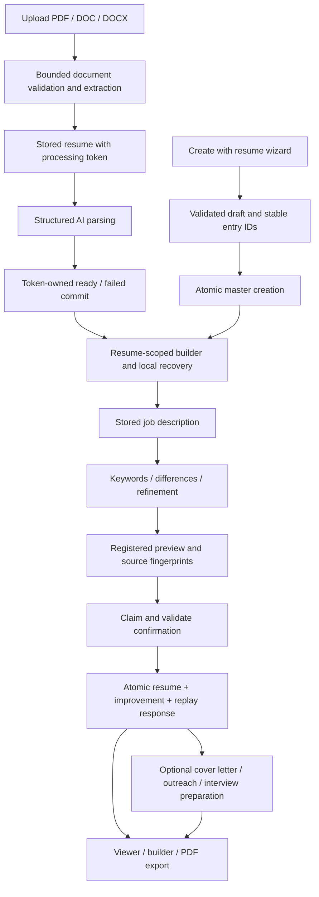

# Resume reliability: file and flow map

This map accompanies the fixes for audit issues #932–#975, tracked by [#931](https://github.com/srbhr/Resume-Matcher/issues/931). The stack is split by ownership boundary so each PR can be reviewed against its issues. Merge from the first PR upward. The [file inventory](reliability-file-inventory.csv) lists tracked repository paths, their role and the audit issues that changed them; the table below identifies the files that own each behavior.

## Ownership and issue map

Paths in the backend column are relative to `apps/backend`; frontend paths are relative to `apps/frontend`.

| Area / issues                                        | Backend owner                                                                                                                         | Frontend owner / verification                                                                                                                                             |
| ---------------------------------------------------- | ------------------------------------------------------------------------------------------------------------------------------------- | ------------------------------------------------------------------------------------------------------------------------------------------------------------------------- |
| Configuration and isolated tests: #932, #972         | `app/config.py`, `app/crypto.py`, `app/database.py`, `tests/conftest.py`                                                              | Settings use the same DATA_DIR-owned configuration; tests replace data/config/key paths before imports                                                                    |
| GPT-5 sampling: #975                                 | `app/llm.py`, `tests/integration/test_temperature_request_contract.py`                                                                | Settings reasoning/sampling values are interpreted against the actual provider/model capability                                                                           |
| HTTP/upload lifecycle: #939, #964, #965              | Upload response contract                                                                                                              | `lib/api/client.ts`, `hooks/use-file-upload.ts`, `components/dashboard/resume-upload-dialog.tsx`; body timeout, cancellation, StrictMode and real dashboard-counter tests |
| Builder identity and consent: #933, #934             | Resume GET and PATCH                                                                                                                  | `components/builder/resume-builder.tsx`, `lib/utils/resume-draft-storage.ts`; document-key remount, load baseline and explicit draft restore                              |
| Attachments and failures: #935, #936, #937           | Cover/outreach generation, PATCH and PDF endpoints                                                                                    | Builder/editor/viewer/dashboard components; `lib/utils/attachment-draft-storage.ts`; save/export and recovery tests                                                       |
| Wizard persistence: #938, #967, #968                 | `app/services/resume_wizard.py`, `app/services/resume_wizard_copy.py`                                                                 | `components/resume-wizard/resume-wizard-page.tsx`, `lib/utils/resume-wizard-storage.ts`; nested validation, truthful backup and acknowledged creation                     |
| Dashboard races: #966                                | List and processing status endpoints                                                                                                  | `app/(default)/dashboard/page.tsx`, `tests/dashboard-refresh.test.tsx`; dispatch ownership and serial polling                                                             |
| Ingestion/processing: #952, #953, #954               | `app/services/parser.py`, `app/routers/resumes.py`, `app/database.py`; document, ownership and upload integration tests               | Upload UI consumes explicit format/limit/stale/deleted outcomes                                                                                                           |
| Storage transactions: #955, #956, #957, #958         | `app/database.py`, `app/models.py`, `app/routers/jobs.py`, application schemas; `tests/integration/test_storage_atomicity.py`         | Tracker/list refresh consumes committed results                                                                                                                           |
| Preview/confirm: #948, #949, #950, #951              | `app/preview.py`, `app/models.py`, `app/database.py`, `app/routers/resumes.py`; `tests/integration/test_confirmation_transactions.py` | `lib/api/resume.ts`, `components/common/resume_previewer_context.tsx`, tailor page forward preview identity                                                               |
| AI output/retries: #943, #944, #945, #969            | `app/llm.py`, parser/improver/auxiliary services, enrichment router/schemas; real Router and result-contract tests                    | Partial/failed results remain distinct from applicable replacements                                                                                                       |
| Source preservation: #940, #941, #947, #970          | Parser, refinement, preservation helpers and resume router                                                                            | Confirmed data retains source identity/sections; generated claims follow the documented grounding policy                                                                  |
| Wizard corrections: #946                             | Wizard service and prompt                                                                                                             | Positive stable IDs target existing entries; new entries receive collision-free IDs                                                                                       |
| AI budgets: #942                                     | `app/ai_budget.py`, `app/ai_limits.py`, AI routers/schemas; `tests/integration/test_ai_operation_budgets.py`                          | Client/proxy timeout must be aligned when increasing backend duration                                                                                                     |
| Monitor/evaluations: #959, #963, #971                | `e2e_monitor/`, `tests/evals/`, monitor tests; shared refinement statistics                                                           | Owned temporary services and generated-result evaluation; paid evaluations require explicit opt-in                                                                        |
| PDF: #960, #961, #962                                | `app/pdf.py`; lifecycle and real Chromium geometry tests                                                                              | `components/resume/styles/` and print route; gap-aware tracks and long-token wrapping                                                                                     |
| Remaining cross-flow protection and docs: #973, #974 | Multilingual PDF test, current architecture and this map                                                                              | `hooks/use-operation-owner.ts`, actual wizard-hook/tailor-page tests, `tests/browser/reliability_flow.py`                                                                 |

## End-to-end routes



Optional generation can occur during confirmation before the required transaction or later through dedicated endpoints. Optional failure must remain visible without falsely undoing a committed resume. The diagram shows the user-visible relationships, not a claim that every attachment is generated after commit.

The builder owns a server baseline and separate current edits for one resume ID. Browser drafts are recovery copies, not proof of a server save. Recovery requires consent, and leave warnings reflect whether every unsaved content type has a successful browser backup. Attachment exports must save the intended current revision before requesting a PDF.

Enrichment and regeneration have separate analyze/generate/apply stages. An acknowledged apply followed by a failed refresh must retry the refresh, not apply again. Reset, context changes and unmount invalidate old asynchronous results. The tailor page likewise records a confirmed response before downstream navigation; retrying a failed navigation reuses that response and does not increment counters twice.

Generation and confirmation retries differ. The current Generate action uploads a job before previewing; retrying a failed Generate or explicitly regenerating performs a new upload. Confirmation retries reuse the existing job and preview and rely on server replay semantics. Tests preserve this distinction rather than treating all retry buttons as the same operation.

## Storage and limits

Current storage is SQLite: `DATA_DIR/resume_matcher.db`. Document/tracker/preview operations use SQLAlchemy async sessions; encrypted provider-key access uses a synchronous engine for the same file. `database.json` is only the legacy TinyDB migration input. JSON settings and `.secret_key` share DATA_DIR ownership. Atomic JSON replacement and encrypted-key database transactions are distinct operations.

See [storage transactions](storage-transactions.md), [preview confirmation](../features/preview-confirmation.md), [AI operation budgets](ai-operation-budgets.md), [LLM retry policy](../llm-integration.md) and [PDF rendering](../design/pdf-template-guide.md) for exact boundaries. A timeout cancels cooperative work; resource cleanup can outlast that deadline while still retaining its resource reservation.

PDF ingestion additionally limits decoded streams to 16 MiB in total. Predictor and fax dimensions are checked before decoder allocation: at most 32,768 scanline columns and 256 KiB per predictor row. Compressed image formats passed through by pdfminer are not rasterized or OCR-processed by this text extraction path. These are processing limits, not an exact process-memory or wall-clock guarantee.

## Reproducible checks and their limits

Run the deterministic suites from their own application directories:

```sh
# apps/backend
uv run pytest -q

# apps/frontend
npm test
npm run lint
npm run typecheck
npm run build
```

The backend test configuration isolates data/configuration before application imports and blocks external network by default. Model tests use controlled transports or synthetic service seams; they do not establish live-provider latency, quality, cost or every model's compatibility. Paid generated-result evaluations are separately opted into as described in `apps/backend/tests/evals/README.md`.

For the actual browser checks, launch an owned frontend with an unused port and an unreachable backend origin, then run the script in another terminal:

```sh
# apps/frontend; do not reuse a developer server connected to real data
BACKEND_ORIGIN=http://127.0.0.1:9 NEXT_PUBLIC_API_URL=/ npm run dev -- --hostname 127.0.0.1 --port 3177

# apps/frontend, separate terminal; OUTPUT is a disposable artifact directory
uv run --project ../backend python tests/browser/reliability_flow.py \
  --base-url http://127.0.0.1:3177 --output /tmp/resume-browser-check
```

The script intercepts every API call with synthetic responses and blocks other origins. It checks real Next navigation and request ordering when A resolves after navigating through the dashboard to B, an actual downloaded PDF, query-only builder switching and same-origin multi-tab draft separation. That navigation unmounts the A viewer, so the browser check alone does not prove stale-result invalidation. The operation-owner hook and viewer lifecycle component tests exercise the ownership guards across context changes and deferred refreshes. These checks do not infer a production wrong-delete bug from forced unkeyed component reuse.

PDF tests render actual template CSS with Chromium and inspect geometry and extracted text. The multilingual fixture covers French, Spanish, Japanese and Chinese in a long A4/Letter document, including embedded non-missing glyph programs for its asserted CJK corpus. Install CJK fonts (for example `fonts-noto-cjk` on Debian/Ubuntu); the Docker image already includes them. Text extraction alone does not prove glyph rendering. These are representative checks, not proof for every locale/font/layout, visual quality score or vendor ATS certification. Missing Chromium is reported as a skipped browser-dependent test, not a successful render.
