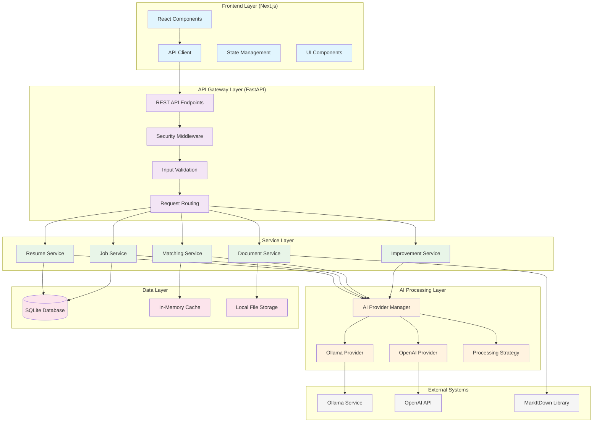

# System Architecture and Design Patterns

## Overview

Resume Matcher follows a modular, microservices-inspired architecture designed for local deployment with privacy-first principles. This document outlines the comprehensive system architecture, design patterns, and architectural decisions that make the application scalable, maintainable, and secure.

## High-Level Architecture

### System Architecture Diagram



### Architectural Principles

```python
# architecture/principles.py
from abc import ABC, abstractmethod
from typing import Protocol, TypeVar, Generic

class ArchitecturalPrinciples:
    """
    Codified architectural principles that guide system design
    """
    
    PRINCIPLES = {
        "separation_of_concerns": {
            "description": "Each component has a single, well-defined responsibility",
            "implementation": "Layered architecture with clear boundaries",
            "example": "Service layer handles business logic, data layer handles persistence"
        },
        "dependency_inversion": {
            "description": "High-level modules don't depend on low-level modules",
            "implementation": "Dependency injection and interface-based design",
            "example": "Services depend on abstract repositories, not concrete implementations"
        },
        "privacy_by_design": {
            "description": "Privacy protection is built into the architecture",
            "implementation": "Local processing, encryption at rest, no external data transmission",
            "example": "AI processing happens locally via Ollama, not cloud APIs"
        },
        "fail_safe_defaults": {
            "description": "System defaults to secure, privacy-preserving behavior",
            "implementation": "Default to local processing, no telemetry, encrypted storage",
            "example": "If AI service fails, gracefully degrade rather than send data externally"
        },
        "loose_coupling": {
            "description": "Components are minimally dependent on each other",
            "implementation": "Event-driven architecture, dependency injection, interface contracts",
            "example": "Resume service can work with any AI provider that implements the interface"
        },
        "high_cohesion": {
            "description": "Related functionality is grouped together",
            "implementation": "Domain-driven design, feature-based organization",
            "example": "All resume-related operations are in the resume service module"
        }
    }

# Example of architectural principle implementation
class DependencyInversionExample:
    """
    Demonstrates dependency inversion principle in practice
    """
    
    # Abstract interface (high-level)
    class AIProvider(Protocol):
        async def extract_structured_data(self, text: str, schema: dict) -> dict:
            ...
        
        async def calculate_similarity(self, text1: str, text2: str) -> float:
            ...
    
    # High-level service depends on abstraction
    class ResumeService:
        def __init__(self, ai_provider: AIProvider, repository: 'ResumeRepository'):
            self.ai_provider = ai_provider  # Depends on interface, not implementation
            self.repository = repository
        
        async def process_resume(self, resume_content: str) -> dict:
            # Business logic doesn't care which AI provider is used
            structured_data = await self.ai_provider.extract_structured_data(
                resume_content, 
                self.get_resume_schema()
            )
            
            return await self.repository.save_processed_resume(structured_data)
    
    # Low-level implementations
    class OllamaProvider:
        async def extract_structured_data(self, text: str, schema: dict) -> dict:
            # Ollama-specific implementation
            pass
        
        async def calculate_similarity(self, text1: str, text2: str) -> float:
            # Ollama-specific similarity calculation
            pass
    
    class OpenAIProvider:
        async def extract_structured_data(self, text: str, schema: dict) -> dict:
            # OpenAI-specific implementation
            pass
        
        async def calculate_similarity(self, text1: str, text2: str) -> float:
            # OpenAI-specific similarity calculation
            pass
```

## Design Patterns Implementation

### Repository Pattern

```python
# patterns/repository.py
from abc import ABC, abstractmethod
from typing import List, Optional, TypeVar, Generic
from sqlalchemy.ext.asyncio import AsyncSession

T = TypeVar('T')

class Repository(Generic[T], ABC):
    """
    Abstract repository pattern for data access
    """
    
    @abstractmethod
    async def create(self, entity: T) -> T:
        """Create a new entity"""
        pass
    
    @abstractmethod
    async def get_by_id(self, entity_id: str) -> Optional[T]:
        """Get entity by ID"""
        pass
    
    @abstractmethod
    async def update(self, entity: T) -> T:
        """Update existing entity"""
        pass
    
    @abstractmethod
    async def delete(self, entity_id: str) -> bool:
        """Delete entity by ID"""
        pass
    
    @abstractmethod
    async def list(self, limit: int = 100, offset: int = 0) -> List[T]:
        """List entities with pagination"""
        pass

class ResumeRepository(Repository[Resume]):
    """
    Repository implementation for Resume entities
    """
    
    def __init__(self, session: AsyncSession):
        self.session = session
    
    async def create(self, resume: Resume) -> Resume:
        """
        Creates new resume in database
        """
        self.session.add(resume)
        await self.session.commit()
        await self.session.refresh(resume)
        return resume
    
    async def get_by_id(self, resume_id: str) -> Optional[Resume]:
        """
        Gets resume by ID with optimized query
        """
        query = (
            select(Resume)
            .options(
                selectinload(Resume.raw_resume_association),
                selectinload(Resume.jobs)
            )
            .where(Resume.resume_id == resume_id)
        )
        
        result = await self.session.execute(query)
        return result.unique().scalar_one_or_none()
    
    async def update(self, resume: Resume) -> Resume:
        """
        Updates existing resume
        """
        await self.session.merge(resume)
        await self.session.commit()
        return resume
    
    async def delete(self, resume_id: str) -> bool:
        """
        Deletes resume and all associated data
        """
        resume = await self.get_by_id(resume_id)
        if not resume:
            return False
        
        await self.session.delete(resume)
        await self.session.commit()
        return True
    
    async def list(self, limit: int = 100, offset: int = 0) -> List[Resume]:
        """
        Lists resumes with pagination
        """
        query = (
            select(Resume)
            .order_by(Resume.created_at.desc())
            .limit(limit)
            .offset(offset)
        )
        
        result = await self.session.execute(query)
        return result.scalars().all()
    
    async def find_by_keywords(self, keywords: List[str]) -> List[Resume]:
        """
        Domain-specific method to find resumes by keywords
        """
        # Use JSON extraction for keyword search
        conditions = []
        for keyword in keywords:
            conditions.append(
                func.json_extract(ProcessedResume.extracted_keywords, '$[*]').contains(keyword)
            )
        
        query = (
            select(Resume)
            .join(ProcessedResume)
            .where(or_(*conditions))
            .distinct()
        )
        
        result = await self.session.execute(query)
        return result.scalars().all()

# Usage with dependency injection
class ResumeService:
    """
    Service layer using repository pattern
    """
    
    def __init__(self, resume_repository: ResumeRepository, ai_provider: AIProvider):
        self.resume_repository = resume_repository
        self.ai_provider = ai_provider
    
    async def create_resume_from_upload(self, file_content: bytes, filename: str) -> Resume:
        """
        Business logic for creating resume from uploaded file
        """
        # Extract text content
        extracted_text = await self.extract_text_from_file(file_content, filename)
        
        # Create resume entity
        resume = Resume(
            resume_id=f"resume_{uuid4().hex[:8]}",
            content=extracted_text,
            content_type="md"
        )
        
        # Save using repository
        saved_resume = await self.resume_repository.create(resume)
        
        # Process asynchronously
        asyncio.create_task(self._process_resume_async(saved_resume.resume_id))
        
        return saved_resume
```

### Strategy Pattern for AI Providers

```python
# patterns/strategy.py
from abc import ABC, abstractmethod
from typing import Dict, Any, List
from enum import Enum

class ProcessingStrategy(ABC):
    """
    Abstract strategy for different AI processing approaches
    """
    
    @abstractmethod
    async def extract_resume_data(self, text: str) -> Dict[str, Any]:
        """Extract structured data from resume text"""
        pass
    
    @abstractmethod
    async def extract_job_data(self, text: str) -> Dict[str, Any]:
        """Extract structured data from job description"""
        pass
    
    @abstractmethod
    async def calculate_match_score(self, resume_data: dict, job_data: dict) -> float:
        """Calculate compatibility score between resume and job"""
        pass
    
    @abstractmethod
    async def generate_improvements(self, resume_data: dict, job_data: dict) -> Dict[str, Any]:
        """Generate resume improvements based on job requirements"""
        pass

class LocalProcessingStrategy(ProcessingStrategy):
    """
    Strategy for local AI processing using Ollama
    """
    
    def __init__(self, ollama_provider: OllamaProvider):
        self.ollama_provider = ollama_provider
        self.processing_type = "local"
    
    async def extract_resume_data(self, text: str) -> Dict[str, Any]:
        """
        Extracts resume data using local Ollama model
        """
        from schemas.json.structured_resume import RESUME_SCHEMA
        
        prompt = f"""
        Extract structured information from this resume text:
        
        {text}
        
        Focus on extracting:
        - Personal information (name, contact details)
        - Work experience with dates and descriptions
        - Skills categorized by type
        - Education background
        - Notable achievements and projects
        """
        
        return await self.ollama_provider.generate_structured_response(prompt, RESUME_SCHEMA)
    
    async def extract_job_data(self, text: str) -> Dict[str, Any]:
        """
        Extracts job data using local Ollama model
        """
        from schemas.json.structured_job import JOB_SCHEMA
        
        prompt = f"""
        Extract structured information from this job description:
        
        {text}
        
        Focus on extracting:
        - Job title and company information
        - Key responsibilities and requirements
        - Required and preferred qualifications
        - Compensation and benefits information
        - Application details
        """
        
        return await self.ollama_provider.generate_structured_response(prompt, JOB_SCHEMA)
    
    async def calculate_match_score(self, resume_data: dict, job_data: dict) -> float:
        """
        Calculates match score using local semantic similarity
        """
        # Extract keywords from both sources
        resume_keywords = resume_data.get('extracted_keywords', [])
        job_keywords = job_data.get('extracted_keywords', [])
        
        # Calculate semantic similarity using local embeddings
        resume_text = ' '.join(resume_keywords)
        job_text = ' '.join(job_keywords)
        
        similarity = await self.ollama_provider.calculate_similarity(resume_text, job_text)
        
        # Convert to 0-100 score
        return similarity * 100
    
    async def generate_improvements(self, resume_data: dict, job_data: dict) -> Dict[str, Any]:
        """
        Generates improvements using local AI analysis
        """
        current_score = await self.calculate_match_score(resume_data, job_data)
        
        prompt = f"""
        Analyze this resume against the job requirements and suggest specific improvements:
        
        Current Match Score: {current_score:.1f}/100
        
        Resume Data:
        {json.dumps(resume_data, indent=2)}
        
        Job Requirements:
        {json.dumps(job_data, indent=2)}
        
        Provide specific, actionable improvements that would increase the match score.
        Focus on:
        1. Skills alignment
        2. Experience presentation
        3. Keyword optimization
        4. Achievement quantification
        """
        
        from schemas.json.improvement_schema import IMPROVEMENT_SCHEMA
        
        return await self.ollama_provider.generate_structured_response(prompt, IMPROVEMENT_SCHEMA)

class CloudProcessingStrategy(ProcessingStrategy):
    """
    Strategy for cloud-based AI processing (fallback)
    """
    
    def __init__(self, openai_provider: OpenAIProvider):
        self.openai_provider = openai_provider
        self.processing_type = "cloud"
    
    async def extract_resume_data(self, text: str) -> Dict[str, Any]:
        """
        Extracts resume data using OpenAI API
        Note: Only used for non-sensitive operations or with explicit user consent
        """
        # Implementation similar to LocalProcessingStrategy but using OpenAI
        pass
    
    # ... other methods similar to LocalProcessingStrategy

class ProcessingContext:
    """
    Context class that uses different processing strategies
    """
    
    def __init__(self, strategy: ProcessingStrategy):
        self._strategy = strategy
    
    def set_strategy(self, strategy: ProcessingStrategy):
        """
        Allows runtime strategy switching
        """
        self._strategy = strategy
    
    async def process_resume(self, text: str) -> Dict[str, Any]:
        """
        Processes resume using current strategy
        """
        return await self._strategy.extract_resume_data(text)
    
    async def process_job(self, text: str) -> Dict[str, Any]:
        """
        Processes job description using current strategy
        """
        return await self._strategy.extract_job_data(text)
    
    async def calculate_compatibility(self, resume_data: dict, job_data: dict) -> Dict[str, Any]:
        """
        Calculates compatibility using current strategy
        """
        score = await self._strategy.calculate_match_score(resume_data, job_data)
        improvements = await self._strategy.generate_improvements(resume_data, job_data)
        
        return {
            "match_score": score,
            "improvements": improvements,
            "processing_type": self._strategy.processing_type
        }

# Strategy factory
class ProcessingStrategyFactory:
    """
    Factory for creating appropriate processing strategies
    """
    
    @staticmethod
    async def create_strategy(
        preferred_type: str = "local",
        fallback_enabled: bool = True
    ) -> ProcessingStrategy:
        """
        Creates appropriate processing strategy based on availability and preferences
        """
        if preferred_type == "local":
            try:
                ollama_provider = OllamaProvider()
                if await ollama_provider.health_check():
                    return LocalProcessingStrategy(ollama_provider)
                elif fallback_enabled:
                    logger.warning("Ollama not available, falling back to OpenAI")
                    return CloudProcessingStrategy(OpenAIProvider())
                else:
                    raise ProcessingStrategyError("Local processing not available and fallback disabled")
            except Exception as e:
                if fallback_enabled:
                    logger.error(f"Local strategy failed: {e}, using cloud fallback")
                    return CloudProcessingStrategy(OpenAIProvider())
                else:
                    raise
        
        elif preferred_type == "cloud":
            return CloudProcessingStrategy(OpenAIProvider())
        
        else:
            raise ValueError(f"Unknown processing strategy type: {preferred_type}")

# Usage example
async def process_user_resume(resume_text: str, job_text: str):
    """
    Example of using strategy pattern for resume processing
    """
    # Create strategy based on system configuration
    strategy = await ProcessingStrategyFactory.create_strategy(
        preferred_type="local",
        fallback_enabled=True
    )
    
    # Create processing context
    context = ProcessingContext(strategy)
    
    # Process data
    resume_data = await context.process_resume(resume_text)
    job_data = await context.process_job(job_text)
    
    # Calculate compatibility
    compatibility = await context.calculate_compatibility(resume_data, job_data)
    
    return {
        "resume_data": resume_data,
        "job_data": job_data,
        "compatibility": compatibility
    }
```

### Observer Pattern for Event Handling

```python
# patterns/observer.py
from abc import ABC, abstractmethod
from typing import List, Dict, Any
from enum import Enum
import asyncio
import weakref

class EventType(Enum):
    """
    Types of events in the system
    """
    RESUME_UPLOADED = "resume_uploaded"
    RESUME_PROCESSED = "resume_processed"
    JOB_PROCESSED = "job_processed"
    MATCH_CALCULATED = "match_calculated"
    IMPROVEMENT_GENERATED = "improvement_generated"
    ERROR_OCCURRED = "error_occurred"

class Event:
    """
    Event data structure
    """
    
    def __init__(self, event_type: EventType, data: Dict[str, Any], source: str = None):
        self.event_type = event_type
        self.data = data
        self.source = source
        self.timestamp = datetime.utcnow()
        self.event_id = str(uuid4())

class EventObserver(ABC):
    """
    Abstract observer for system events
    """
    
    @abstractmethod
    async def handle_event(self, event: Event):
        """Handle an event"""
        pass
    
    @abstractmethod
    def get_interested_events(self) -> List[EventType]:
        """Return list of event types this observer is interested in"""
        pass

class EventPublisher:
    """
    Event publisher that manages observers and publishes events
    """
    
    def __init__(self):
        self._observers: Dict[EventType, List[weakref.ref]] = {}
        self._event_history: List[Event] = []
        self._max_history = 1000
    
    def subscribe(self, observer: EventObserver):
        """
        Subscribe an observer to relevant events
        """
        interested_events = observer.get_interested_events()
        
        for event_type in interested_events:
            if event_type not in self._observers:
                self._observers[event_type] = []
            
            # Use weak reference to prevent memory leaks
            observer_ref = weakref.ref(observer)
            self._observers[event_type].append(observer_ref)
    
    def unsubscribe(self, observer: EventObserver):
        """
        Unsubscribe an observer from all events
        """
        for event_type in self._observers:
            self._observers[event_type] = [
                ref for ref in self._observers[event_type]
                if ref() is not observer
            ]
    
    async def publish_event(self, event: Event):
        """
        Publishes an event to all interested observers
        """
        # Add to history
        self._event_history.append(event)
        if len(self._event_history) > self._max_history:
            self._event_history.pop(0)
        
        # Get observers for this event type
        observers = self._observers.get(event.event_type, [])
        
        # Clean up dead references and collect active observers
        active_observers = []
        for observer_ref in observers[:]:  # Copy list to avoid modification during iteration
            observer = observer_ref()
            if observer is None:
                observers.remove(observer_ref)  # Clean up dead reference
            else:
                active_observers.append(observer)
        
        # Notify all active observers
        if active_observers:
            await asyncio.gather(
                *[observer.handle_event(event) for observer in active_observers],
                return_exceptions=True
            )
    
    def get_event_history(self, event_type: EventType = None, limit: int = 100) -> List[Event]:
        """
        Gets event history, optionally filtered by type
        """
        if event_type:
            filtered_events = [e for e in self._event_history if e.event_type == event_type]
        else:
            filtered_events = self._event_history
        
        return filtered_events[-limit:]

# Concrete observer implementations
class AuditLogger(EventObserver):
    """
    Observer that logs all events for audit purposes
    """
    
    def __init__(self):
        self.audit_log = logging.getLogger("audit")
    
    async def handle_event(self, event: Event):
        """
        Logs event for audit trail
        """
        self.audit_log.info(
            f"Event: {event.event_type.value} | "
            f"Source: {event.source} | "
            f"ID: {event.event_id} | "
            f"Data: {json.dumps(event.data, default=str)}"
        )
    
    def get_interested_events(self) -> List[EventType]:
        """
        Audit logger is interested in all events
        """
        return list(EventType)

class PerformanceMonitor(EventObserver):
    """
    Observer that monitors system performance based on events
    """
    
    def __init__(self):
        self.performance_metrics = {}
    
    async def handle_event(self, event: Event):
        """
        Updates performance metrics based on events
        """
        if event.event_type == EventType.RESUME_PROCESSED:
            processing_time = event.data.get('processing_time_seconds', 0)
            self._update_metric('resume_processing_time', processing_time)
        
        elif event.event_type == EventType.MATCH_CALCULATED:
            calculation_time = event.data.get('calculation_time_ms', 0)
            self._update_metric('match_calculation_time', calculation_time)
    
    def _update_metric(self, metric_name: str, value: float):
        """
        Updates running average for a metric
        """
        if metric_name not in self.performance_metrics:
            self.performance_metrics[metric_name] = {
                'count': 0,
                'total': 0.0,
                'average': 0.0
            }
        
        metric = self.performance_metrics[metric_name]
        metric['count'] += 1
        metric['total'] += value
        metric['average'] = metric['total'] / metric['count']
    
    def get_interested_events(self) -> List[EventType]:
        """
        Performance monitor is interested in processing events
        """
        return [
            EventType.RESUME_PROCESSED,
            EventType.JOB_PROCESSED,
            EventType.MATCH_CALCULATED,
            EventType.IMPROVEMENT_GENERATED
        ]

class CacheInvalidator(EventObserver):
    """
    Observer that invalidates caches when data changes
    """
    
    def __init__(self, cache_manager):
        self.cache_manager = cache_manager
    
    async def handle_event(self, event: Event):
        """
        Invalidates relevant caches based on events
        """
        if event.event_type == EventType.RESUME_PROCESSED:
            resume_id = event.data.get('resume_id')
            if resume_id:
                await self.cache_manager.invalidate_resume_cache(resume_id)
        
        elif event.event_type == EventType.JOB_PROCESSED:
            job_id = event.data.get('job_id')
            if job_id:
                await self.cache_manager.invalidate_job_cache(job_id)
    
    def get_interested_events(self) -> List[EventType]:
        """
        Cache invalidator is interested in data change events
        """
        return [
            EventType.RESUME_PROCESSED,
            EventType.JOB_PROCESSED,
            EventType.IMPROVEMENT_GENERATED
        ]

# Global event publisher
event_publisher = EventPublisher()

# Usage in service layer
class ResumeService:
    """
    Service that publishes events during resume processing
    """
    
    def __init__(self, repository: ResumeRepository, ai_provider: AIProvider):
        self.repository = repository
        self.ai_provider = ai_provider
    
    async def process_uploaded_resume(self, file_content: bytes, filename: str) -> str:
        """
        Processes uploaded resume and publishes relevant events
        """
        start_time = time.time()
        
        try:
            # Extract text and create resume
            resume_text = await self.extract_text(file_content, filename)
            resume = await self.repository.create_resume(resume_text, filename)
            
            # Publish upload event
            await event_publisher.publish_event(Event(
                EventType.RESUME_UPLOADED,
                {
                    "resume_id": resume.resume_id,
                    "filename": filename,
                    "file_size": len(file_content)
                },
                source="ResumeService"
            ))
            
            # Process with AI
            processed_data = await self.ai_provider.extract_structured_data(resume_text)
            await self.repository.save_processed_data(resume.resume_id, processed_data)
            
            # Publish processing complete event
            processing_time = time.time() - start_time
            await event_publisher.publish_event(Event(
                EventType.RESUME_PROCESSED,
                {
                    "resume_id": resume.resume_id,
                    "processing_time_seconds": processing_time,
                    "extracted_sections": list(processed_data.keys())
                },
                source="ResumeService"
            ))
            
            return resume.resume_id
            
        except Exception as e:
            # Publish error event
            await event_publisher.publish_event(Event(
                EventType.ERROR_OCCURRED,
                {
                    "error_type": type(e).__name__,
                    "error_message": str(e),
                    "operation": "resume_processing"
                },
                source="ResumeService"
            ))
            raise

# Initialize observers
def initialize_event_system():
    """
    Initializes the event system with default observers
    """
    # Create observers
    audit_logger = AuditLogger()
    performance_monitor = PerformanceMonitor()
    cache_invalidator = CacheInvalidator(cache_manager)
    
    # Subscribe to events
    event_publisher.subscribe(audit_logger)
    event_publisher.subscribe(performance_monitor)
    event_publisher.subscribe(cache_invalidator)
    
    logger.info("Event system initialized with observers")
```

### Factory Pattern for Component Creation

```python
# patterns/factory.py
from abc import ABC, abstractmethod
from typing import Dict, Any, Type
from enum import Enum

class ComponentType(Enum):
    """
    Types of components that can be created by factories
    """
    AI_PROVIDER = "ai_provider"
    REPOSITORY = "repository"
    SERVICE = "service"
    CACHE = "cache"
    VALIDATOR = "validator"

class ComponentFactory(ABC):
    """
    Abstract factory for creating system components
    """
    
    @abstractmethod
    def create_component(self, component_type: str, config: Dict[str, Any]) -> Any:
        """Create a component of the specified type"""
        pass
    
    @abstractmethod
    def get_supported_types(self) -> List[str]:
        """Get list of supported component types"""
        pass

class AIProviderFactory(ComponentFactory):
    """
    Factory for creating AI providers
    """
    
    def __init__(self):
        self._providers = {
            "ollama": OllamaProvider,
            "openai": OpenAIProvider,
            "local": LocalAIProvider  # Hypothetical local-only provider
        }
    
    def create_component(self, provider_type: str, config: Dict[str, Any]) -> AIProvider:
        """
        Creates AI provider instance
        """
        if provider_type not in self._providers:
            raise ValueError(f"Unsupported AI provider type: {provider_type}")
        
        provider_class = self._providers[provider_type]
        
        # Create provider with configuration
        if provider_type == "ollama":
            return provider_class(
                base_url=config.get("base_url", "http://localhost:11434"),
                model=config.get("model", "gemma2:4b"),
                timeout=config.get("timeout", 60)
            )
        
        elif provider_type == "openai":
            api_key = config.get("api_key")
            if not api_key:
                raise ValueError("OpenAI API key is required")
            
            return provider_class(
                api_key=api_key,
                model=config.get("model", "gpt-3.5-turbo")
            )
        
        else:
            return provider_class(**config)
    
    def get_supported_types(self) -> List[str]:
        """
        Returns list of supported AI provider types
        """
        return list(self._providers.keys())
    
    async def create_best_available_provider(self, preferences: List[str] = None) -> AIProvider:
        """
        Creates the best available AI provider based on preferences and availability
        """
        if not preferences:
            preferences = ["ollama", "openai"]  # Default preference order
        
        for provider_type in preferences:
            try:
                # Test configuration for this provider type
                test_config = self._get_default_config(provider_type)
                provider = self.create_component(provider_type, test_config)
                
                # Test if provider is available
                if await provider.health_check():
                    logger.info(f"Using AI provider: {provider_type}")
                    return provider
                else:
                    logger.warning(f"AI provider {provider_type} is not available")
            
            except Exception as e:
                logger.warning(f"Failed to initialize AI provider {provider_type}: {e}")
                continue
        
        raise RuntimeError("No AI providers are available")
    
    def _get_default_config(self, provider_type: str) -> Dict[str, Any]:
        """
        Gets default configuration for a provider type
        """
        defaults = {
            "ollama": {
                "base_url": "http://localhost:11434",
                "model": "gemma2:4b",
                "timeout": 60
            },
            "openai": {
                "api_key": os.getenv("OPENAI_API_KEY"),
                "model": "gpt-3.5-turbo"
            },
            "local": {}
        }
        
        return defaults.get(provider_type, {})

class RepositoryFactory(ComponentFactory):
    """
    Factory for creating repository instances
    """
    
    def __init__(self, db_session: AsyncSession):
        self.db_session = db_session
        self._repositories = {
            "resume": ResumeRepository,
            "job": JobRepository,
            "user": UserRepository,  # Future feature
            "analytics": AnalyticsRepository  # Future feature
        }
    
    def create_component(self, repository_type: str, config: Dict[str, Any]) -> Repository:
        """
        Creates repository instance
        """
        if repository_type not in self._repositories:
            raise ValueError(f"Unsupported repository type: {repository_type}")
        
        repository_class = self._repositories[repository_type]
        
        # All repositories need database session
        return repository_class(self.db_session, **config)
    
    def get_supported_types(self) -> List[str]:
        """
        Returns list of supported repository types
        """
        return list(self._repositories.keys())

class ServiceFactory(ComponentFactory):
    """
    Factory for creating service instances with proper dependency injection
    """
    
    def __init__(self, ai_factory: AIProviderFactory, repo_factory: RepositoryFactory):
        self.ai_factory = ai_factory
        self.repo_factory = repo_factory
        
        self._services = {
            "resume": ResumeService,
            "job": JobService,
            "matching": MatchingService,
            "improvement": ImprovementService
        }
    
    def create_component(self, service_type: str, config: Dict[str, Any]) -> Any:
        """
        Creates service instance with proper dependencies
        """
        if service_type not in self._services:
            raise ValueError(f"Unsupported service type: {service_type}")
        
        service_class = self._services[service_type]
        
        # Create dependencies based on service type
        if service_type == "resume":
            ai_provider = self.ai_factory.create_component(
                config.get("ai_provider", "ollama"),
                config.get("ai_config", {})
            )
            resume_repo = self.repo_factory.create_component("resume", {})
            
            return service_class(ai_provider, resume_repo)
        
        elif service_type == "job":
            ai_provider = self.ai_factory.create_component(
                config.get("ai_provider", "ollama"),
                config.get("ai_config", {})
            )
            job_repo = self.repo_factory.create_component("job", {})
            
            return service_class(ai_provider, job_repo)
        
        elif service_type == "matching":
            resume_repo = self.repo_factory.create_component("resume", {})
            job_repo = self.repo_factory.create_component("job", {})
            ai_provider = self.ai_factory.create_component(
                config.get("ai_provider", "ollama"),
                config.get("ai_config", {})
            )
            
            return service_class(resume_repo, job_repo, ai_provider)
        
        else:
            # Generic service creation
            return service_class(**config)
    
    def get_supported_types(self) -> List[str]:
        """
        Returns list of supported service types
        """
        return list(self._services.keys())

# Application factory that ties everything together
class ApplicationFactory:
    """
    Main application factory that creates and wires all components
    """
    
    def __init__(self, config: Dict[str, Any]):
        self.config = config
        self.components = {}
    
    async def create_application(self) -> Dict[str, Any]:
        """
        Creates complete application with all components
        """
        # Create database session
        db_manager = DatabaseManager(self.config.get("database_url"))
        await db_manager.initialize()
        db_session = await db_manager.get_session()
        
        # Create factories
        ai_factory = AIProviderFactory()
        repo_factory = RepositoryFactory(db_session)
        service_factory = ServiceFactory(ai_factory, repo_factory)
        
        # Create core services
        services = {}
        for service_type in ["resume", "job", "matching", "improvement"]:
            services[service_type] = service_factory.create_component(
                service_type,
                self.config.get(f"{service_type}_service", {})
            )
        
        # Create AI provider manager
        ai_provider = await ai_factory.create_best_available_provider(
            self.config.get("ai_provider_preferences", ["ollama", "openai"])
        )
        
        # Store components for cleanup
        self.components = {
            "db_manager": db_manager,
            "db_session": db_session,
            "ai_provider": ai_provider,
            "services": services,
            "factories": {
                "ai": ai_factory,
                "repository": repo_factory,
                "service": service_factory
            }
        }
        
        logger.info("Application components created and wired successfully")
        
        return self.components
    
    async def cleanup(self):
        """
        Cleans up application components
        """
        if "db_manager" in self.components:
            await self.components["db_manager"].close()
        
        logger.info("Application components cleaned up")

# Usage example
async def create_resume_matcher_app():
    """
    Example of creating the complete Resume Matcher application
    """
    config = {
        "database_url": "sqlite+aiosqlite:///./data/resume_matcher.db",
        "ai_provider_preferences": ["ollama", "openai"],
        "resume_service": {
            "ai_provider": "ollama",
            "ai_config": {
                "model": "gemma2:4b",
                "timeout": 60
            }
        }
    }
    
    app_factory = ApplicationFactory(config)
    app_components = await app_factory.create_application()
    
    return app_components, app_factory
```

## Component Interaction Patterns

### Service Layer Coordination

```python
# patterns/service_coordination.py
class ServiceCoordinator:
    """
    Coordinates interactions between different services
    """
    
    def __init__(self, services: Dict[str, Any]):
        self.services = services
        self.event_publisher = event_publisher
    
    async def process_resume_and_job_matching(
        self,
        resume_file: bytes,
        resume_filename: str,
        job_descriptions: List[str]
    ) -> Dict[str, Any]:
        """
        Coordinates the complete workflow of processing resume and jobs, then matching
        """
        workflow_id = f"workflow_{uuid4().hex[:8]}"
        
        try:
            # Step 1: Process resume
            resume_id = await self.services["resume"].process_uploaded_resume(
                resume_file, resume_filename
            )
            
            # Step 2: Process job descriptions
            job_ids = []
            for job_description in job_descriptions:
                job_id = await self.services["job"].process_job_description(job_description)
                job_ids.append(job_id)
            
            # Step 3: Calculate matches
            matches = []
            for job_id in job_ids:
                match_result = await self.services["matching"].calculate_match(
                    resume_id, job_id
                )
                matches.append(match_result)
            
            # Step 4: Generate improvements for best matches
            improvements = []
            for match in sorted(matches, key=lambda x: x["score"], reverse=True)[:3]:
                improvement = await self.services["improvement"].generate_improvements(
                    resume_id, match["job_id"]
                )
                improvements.append(improvement)
            
            # Publish completion event
            await self.event_publisher.publish_event(Event(
                EventType.WORKFLOW_COMPLETED,
                {
                    "workflow_id": workflow_id,
                    "resume_id": resume_id,
                    "job_ids": job_ids,
                    "match_count": len(matches),
                    "improvement_count": len(improvements)
                },
                source="ServiceCoordinator"
            ))
            
            return {
                "workflow_id": workflow_id,
                "resume_id": resume_id,
                "job_ids": job_ids,
                "matches": matches,
                "improvements": improvements
            }
            
        except Exception as e:
            await self.event_publisher.publish_event(Event(
                EventType.WORKFLOW_FAILED,
                {
                    "workflow_id": workflow_id,
                    "error": str(e),
                    "error_type": type(e).__name__
                },
                source="ServiceCoordinator"
            ))
            raise
```

---

This comprehensive architecture documentation provides developers with detailed understanding of Resume Matcher's system design, architectural patterns, and component interactions that ensure maintainability, scalability, and code quality.
