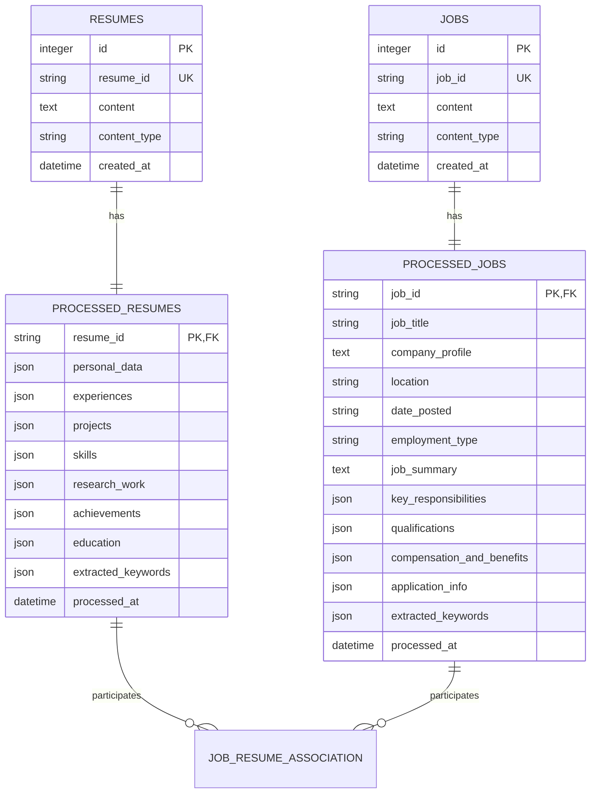

# Data Models and Schemas

## Overview

Resume Matcher uses a sophisticated data modeling approach that bridges the gap between unstructured resume documents and structured, queryable data. This document explains our database design, data models, and the schemas that define how information flows through our system.

## Database Architecture

### Why SQLite + SQLAlchemy?

We chose SQLite for local development and SQLAlchemy as our ORM for several reasons:

- **Privacy First**: Data stays on user's machine
- **Zero Configuration**: No database server setup required
- **Reliability**: SQLite is battle-tested and robust
- **Flexibility**: Easy migration to PostgreSQL for production deployments
- **Relationship Management**: SQLAlchemy handles complex relationships elegantly

### Database Schema Overview



## Core Data Models

### Resume Models

#### Raw Resume Storage
```python
# models/resume.py
class Resume(Base):
    """
    Stores the original resume content as uploaded by the user
    """
    __tablename__ = "resumes"

    id = Column(Integer, primary_key=True, index=True)
    resume_id = Column(String, unique=True, nullable=False)  # UUID for external reference
    content = Column(Text, nullable=False)                   # Parsed markdown/HTML content
    content_type = Column(String, nullable=False)            # 'md' or 'html'
    created_at = Column(
        DateTime(timezone=True),
        server_default=text("CURRENT_TIMESTAMP"),
        nullable=False,
        index=True,
    )

    # Relationship to processed data
    raw_resume_association = relationship(
        "ProcessedResume", 
        back_populates="raw_resume", 
        uselist=False,
        cascade="all, delete-orphan"
    )
    
    # Many-to-many with jobs through association table
    jobs = relationship("Job", back_populates="resumes", secondary=job_resume_association)

# Example usage:
resume = Resume(
    resume_id="resume_abc123",
    content="# John Smith\nSoftware Engineer...",
    content_type="md"
)
```

**Why We Store Raw Content**: 
- Allows re-processing with improved algorithms
- Maintains audit trail of original user input
- Enables debugging parsing issues

#### Processed Resume Data
```python
class ProcessedResume(Base):
    """
    Stores structured data extracted from resume via AI processing
    """
    __tablename__ = "processed_resumes"

    resume_id = Column(
        String,
        ForeignKey("resumes.resume_id", ondelete="CASCADE"),
        primary_key=True,
        index=True,
    )
    
    # Structured JSON fields
    personal_data = Column(JSON, nullable=False)        # Name, contact info, location
    experiences = Column(JSON, nullable=True)           # Work history
    projects = Column(JSON, nullable=True)              # Portfolio projects
    skills = Column(JSON, nullable=True)                # Technical and soft skills
    research_work = Column(JSON, nullable=True)         # Publications, research
    achievements = Column(JSON, nullable=True)          # Awards, certifications
    education = Column(JSON, nullable=True)             # Academic background
    extracted_keywords = Column(JSON, nullable=True)    # AI-identified keywords
    
    processed_at = Column(
        DateTime(timezone=True),
        server_default=text("CURRENT_TIMESTAMP"),
        nullable=False,
        index=True,
    )

    # Relationships
    raw_resume = relationship("Resume", back_populates="raw_resume_association")
    processed_jobs = relationship(
        "ProcessedJob",
        secondary=job_resume_association,
        back_populates="processed_resumes",
    )
```

**JSON Field Examples**:
```python
# Example personalData JSON structure
personalDataExample = {
    "firstName": "John",
    "lastName": "Smith",
    "emailAddress": "john.smith@email.com",
    "phone": "(555) 123-4567",
    "linkedin": "linkedin.com/in/johnsmith",
    "portfolio": "johnsmith.dev",
    "location": {
        "city": "San Francisco",
        "country": "USA"
    }
}

# Example experiences JSON structure
experiencesExample = {
    "experiences": [
        {
            "jobTitle": "Senior Software Developer",
            "company": "Tech Corp",
            "location": "San Francisco, CA",
            "startDate": "2021-03-01",
            "endDate": "2023-06-15",
            "description": [
                "Developed microservices using Python and Docker",
                "Led team of 4 developers on critical projects",
                "Improved system performance by 40%"
            ],
            "technologiesUsed": ["Python", "Docker", "Microservices", "Leadership"]
        },
        {
            "jobTitle": "Software Developer",
            "company": "StartupXYZ",
            "location": "Remote",
            "startDate": "2019-01-15",
            "endDate": "2021-02-28",
            "description": [
                "Built responsive web applications using React and Node.js",
                "Implemented CI/CD pipelines reducing deployment time by 60%"
            ],
            "technologiesUsed": ["React", "Node.js", "ciCd", "JavaScript"]
        }
    ]
}

# Example skills JSON structure
skillsExample = {
    "skills": [
        {"category": "programmingLanguages", "skillName": "Python"},
        {"category": "programmingLanguages", "skillName": "JavaScript"},
        {"category": "frameworks", "skillName": "React"},
        {"category": "frameworks", "skillName": "Django"},
        {"category": "devOps", "skillName": "Docker"},
        {"category": "cloud", "skillName": "AWS"},
        {"category": "databases", "skillName": "PostgreSQL"},
        {"category": "softSkills", "skillName": "Team Leadership"}
    ]
}
```

### Job Models

#### Raw Job Storage
```python
class Job(Base):
    """
    Stores original job description content
    """
    __tablename__ = "jobs"

    id = Column(Integer, primary_key=True, index=True)
    job_id = Column(String, unique=True, nullable=False)
    content = Column(Text, nullable=False)              # Original job description text
    content_type = Column(String, nullable=False)       # Usually 'text' or 'md'
    created_at = Column(
        DateTime(timezone=True),
        server_default=text("CURRENT_TIMESTAMP"),
        nullable=False,
        index=True,
    )

    # Relationships
    raw_job_association = relationship(
        "ProcessedJob", 
        back_populates="raw_job", 
        uselist=False,
        cascade="all, delete-orphan"
    )
    resumes = relationship("Resume", back_populates="jobs")

# Example job content storage:
job_example = Job(
    job_id="job_xyz789",
    content="""
    Senior Python Developer - Tech Company
    
    We're looking for an experienced Python developer to join our team.
    
    Requirements:
    - 5+ years Python experience
    - Experience with Django or Flask
    - AWS cloud experience
    - Strong communication skills
    
    Responsibilities:
    - Lead development of web applications
    - Mentor junior developers
    - Collaborate with product team
    """,
    content_type="text"
)
```

#### Processed Job Data
```python
class ProcessedJob(Base):
    """
    Stores structured data extracted from job descriptions
    """
    __tablename__ = "processed_jobs"

    job_id = Column(
        String,
        ForeignKey("jobs.job_id", ondelete="CASCADE"),
        primary_key=True,
        index=True,
    )
    
    # Structured fields
    job_title = Column(String, nullable=False)
    company_profile = Column(Text, nullable=True)
    location = Column(String, nullable=True)
    date_posted = Column(String, nullable=True)
    employment_type = Column(String, nullable=True)  # Full-time, Contract, etc.
    job_summary = Column(Text, nullable=False)
    
    # JSON fields for complex data
    key_responsibilities = Column(JSON, nullable=True)
    qualifications = Column(JSON, nullable=True)
    compensation_and_benefits = Column(JSON, nullable=True)
    application_info = Column(JSON, nullable=True)
    extracted_keywords = Column(JSON, nullable=True)
    
    processed_at = Column(
        DateTime(timezone=True),
        server_default=text("CURRENT_TIMESTAMP"),
        nullable=False,
        index=True,
    )

    # Relationships
    raw_job = relationship("Job", back_populates="raw_job_association")
    processed_resumes = relationship(
        "ProcessedResume",
        secondary=job_resume_association,
        back_populates="processed_jobs",
    )
```

**Processed Job Example**:
```python
processedJobExample = {
    "jobTitle": "Senior Python Developer",
    "companyProfile": "Fast-growing tech company focused on ML applications",
    "location": "San Francisco, CA (Remote OK)",
    "employmentType": "Full-time",
    "jobSummary": "We're seeking an experienced Python developer to lead our backend development team and build scalable applications.",
    "keyResponsibilities": [
        "Lead development of web applications using Python and Django",
        "Mentor junior developers and conduct code reviews", 
        "Collaborate with product team on feature requirements",
        "Design and implement scalable backend architectures"
    ],
    "qualifications": {
        "required": [
            "5+ years of Python development experience",
            "Experience with Django or Flask frameworks",
            "AWS cloud platform experience",
            "Strong communication and leadership skills"
        ],
        "preferred": [
            "Experience with Docker and Kubernetes",
            "Machine learning background",
            "Previous team lead experience"
        ]
    },
    "extractedKeywords": [
        "Python", "Django", "Flask", "AWS", "Docker", "Kubernetes",
        "Leadership", "Mentoring", "Backend", "Scalable", "Senior"
    ]
}
```

### Association Table for Many-to-Many Relationships

```python
# models/association.py
from sqlalchemy import Table, Column, String, ForeignKey
from .base import Base

job_resume_association = Table(
    'job_resume_association',
    Base.metadata,
    Column(
        'job_id', 
        String, 
        ForeignKey('processed_jobs.job_id', ondelete='CASCADE'),
        primary_key=True
    ),
    Column(
        'resume_id', 
        String, 
        ForeignKey('processed_resumes.resume_id', ondelete='CASCADE'),
        primary_key=True
    )
)
```

**Why Many-to-Many**: Users often want to test one resume against multiple job descriptions, or compare multiple resumes against the same job. This relationship tracks those comparisons and enables features like:
- "Show me all jobs I've tested this resume against"
- "Compare how different resumes perform against this job"
- Historical analysis of matching attempts

## API Data Models (Pydantic)

### Request/Response Models

These models define the structure of data exchanged between frontend and backend:

```python
# schemas/pydantic/resume_preview.py
from typing import List, Optional
from pydantic import BaseModel, EmailStr, Field

class PersonalInfo(BaseModel):
    name: str = Field(..., description="Full name of the candidate")
    title: Optional[str] = Field(None, description="Professional title/role")
    email: EmailStr = Field(..., description="Email address")
    phone: str = Field(..., description="Phone number")
    location: Optional[str] = Field(None, description="City, State/Country")
    website: Optional[str] = Field(None, description="Personal website or portfolio")
    linkedin: Optional[str] = Field(None, description="LinkedIn profile URL")
    github: Optional[str] = Field(None, description="GitHub profile URL")

    class Config:
        schema_extra = {
            "example": {
                "name": "Jane Smith",
                "title": "Senior Software Engineer",
                "email": "jane.smith@email.com",
                "phone": "(555) 123-4567",
                "location": "San Francisco, CA",
                "website": "janesmith.dev",
                "linkedin": "linkedin.com/in/janesmith",
                "github": "github.com/janesmith"
            }
        }

class ExperienceItem(BaseModel):
    id: int = Field(..., description="Unique identifier for UI purposes")
    title: str = Field(..., description="Job title/position")
    company: Optional[str] = Field(None, description="Company name")
    location: Optional[str] = Field(None, description="Job location")
    years: Optional[str] = Field(None, description="Date range (e.g., '2021-2023')")
    description: List[str] = Field(default=[], description="List of job responsibilities/achievements")

    class Config:
        schema_extra = {
            "example": {
                "id": 1,
                "title": "Senior Software Engineer",
                "company": "Tech Corp",
                "location": "San Francisco, CA",
                "years": "2021-2023",
                "description": [
                    "Led development of microservices architecture serving 1M+ users",
                    "Mentored team of 5 junior developers",
                    "Improved system performance by 40% through code optimization"
                ]
            }
        }

class EducationItem(BaseModel):
    id: int = Field(..., description="Unique identifier for UI purposes")
    institution: str = Field(..., description="School/university name")
    degree: str = Field(..., description="Degree type and field of study")
    years: Optional[str] = Field(None, description="Date range or graduation year")
    description: Optional[str] = Field(None, description="Additional details, GPA, honors, etc.")

class ResumePreviewModel(BaseModel):
    """
    Model for displaying resume data in the frontend preview
    """
    personalInfo: PersonalInfo
    summary: Optional[str] = Field(None, description="Professional summary/objective")
    experience: List[ExperienceItem] = Field(default=[], description="Work experience")
    education: List[EducationItem] = Field(default=[], description="Educational background")
    skills: List[str] = Field(default=[], description="Technical and soft skills")

    class Config:
        schema_extra = {
            "example": {
                "personalInfo": {
                    "name": "Jane Smith",
                    "title": "Senior Software Engineer",
                    "email": "jane.smith@email.com",
                    "phone": "(555) 123-4567",
                    "location": "San Francisco, CA"
                },
                "summary": "Experienced software engineer with 8+ years building scalable web applications...",
                "experience": [
                    {
                        "id": 1,
                        "title": "Senior Software Engineer",
                        "company": "Tech Corp",
                        "years": "2021-2023",
                        "description": ["Led team of 5 developers", "Built microservices architecture"]
                    }
                ],
                "skills": ["Python", "JavaScript", "React", "AWS", "Docker"]
            }
        }
```

### Request Models for API Endpoints

```python
# schemas/pydantic/requests.py
class ResumeImprovementRequest(BaseModel):
    """
    Request model for resume improvement endpoint
    """
    resume_id: str = Field(..., description="UUID of the resume to improve")
    job_id: str = Field(..., description="UUID of the job to optimize for")

    class Config:
        schema_extra = {
            "example": {
                "resume_id": "resume_abc123",
                "job_id": "job_xyz789"
            }
        }

class JobUploadRequest(BaseModel):
    """
    Request model for uploading job descriptions
    """
    job_descriptions: List[str] = Field(..., description="List of job description texts")
    resume_id: Optional[str] = Field(None, description="Optional resume ID to associate with")

    class Config:
        schema_extra = {
            "example": {
                "job_descriptions": [
                    "Senior Python Developer needed with 5+ years experience..."
                ],
                "resume_id": "resume_abc123"
            }
        }

class ImprovementResult(BaseModel):
    """
    Response model for resume improvement results
    """
    request_id: str
    resume_id: str
    job_id: str
    original_score: float = Field(..., ge=0, le=100, description="Original match score (0-100)")
    new_score: float = Field(..., ge=0, le=100, description="Improved match score (0-100)")
    resume_preview: ResumePreviewModel
    details: Optional[str] = Field(None, description="Detailed explanation of improvements")
    commentary: Optional[str] = Field(None, description="AI commentary on changes made")
    improvements: Optional[List[dict]] = Field(None, description="List of specific improvements made")

    class Config:
        schema_extra = {
            "example": {
                "request_id": "req_12345",
                "resume_id": "resume_abc123", 
                "job_id": "job_xyz789",
                "original_score": 65.5,
                "new_score": 78.2,
                "resume_preview": {"personalInfo": {}, "experience": []},
                "details": "Enhanced technical skills section and added quantifiable achievements",
                "improvements": [
                    {
                        "section": "experience",
                        "change": "Added specific technologies and metrics to job descriptions",
                        "impact": "+8.5 points"
                    }
                ]
            }
        }
```

## JSON Schema Definitions

### Resume Structure Schema

For AI processing, we use strict JSON schemas to ensure consistent data extraction:

```python
# schemas/json/structured_resume.py
RESUME_SCHEMA = {
    "type": "object",
    "properties": {
        "UUID": {
            "type": "string",
            "description": "Unique identifier for the resume"
        },
        "Personal Data": {
            "type": "object",
            "properties": {
                "firstName": {"type": "string"},
                "lastName": {"type": "string"},
                "email": {"type": "string", "format": "email"},
                "phone": {"type": "string"},
                "linkedin": {"type": "string"},
                "portfolio": {"type": "string"},
                "location": {
                    "type": "object",
                    "properties": {
                        "city": {"type": "string"},
                        "country": {"type": "string"}
                    }
                }
            },
            "required": ["firstName", "lastName", "email"]
        },
        "Experiences": {
            "type": "array",
            "items": {
                "type": "object",
                "properties": {
                    "jobTitle": {"type": "string"},
                    "company": {"type": "string"},
                    "location": {"type": "string"},
                    "startDate": {"type": "string", "pattern": "^\\d{4}-\\d{2}-\\d{2}$"},
                    "endDate": {"type": "string"},  # Can be date or "Present"
                    "description": {
                        "type": "array",
                        "items": {"type": "string"}
                    },
                    "technologiesUsed": {
                        "type": "array", 
                        "items": {"type": "string"}
                    }
                },
                "required": ["jobTitle", "company", "startDate"]
            }
        },
        "Skills": {
            "type": "array",
            "items": {
                "type": "object",
                "properties": {
                    "category": {"type": "string"},
                    "skillName": {"type": "string"}
                },
                "required": ["skillName"]
            }
        },
        "Education": {
            "type": "array",
            "items": {
                "type": "object", 
                "properties": {
                    "institution": {"type": "string"},
                    "degree": {"type": "string"},
                    "fieldOfStudy": {"type": "string"},
                    "startDate": {"type": "string"},
                    "endDate": {"type": "string"},
                    "grade": {"type": "string"},
                    "description": {"type": "string"}
                },
                "required": ["institution", "degree"]
            }
        },
        "Extracted Keywords": {
            "type": "array",
            "items": {"type": "string"},
            "description": "AI-extracted keywords relevant for job matching"
        }
    },
    "required": ["Personal Data", "Extracted Keywords"]
}
```

### Resume Preview Schema (for Frontend)

```python
# schemas/json/resume_preview.py
PREVIEW_SCHEMA = {
    "type": "object",
    "properties": {
        "personalInfo": {
            "type": "object",
            "properties": {
                "name": {"type": "string"},
                "title": {"type": "string"},
                "email": {"type": "string"},
                "phone": {"type": "string"},
                "location": {"type": ["string", "null"]},
                "website": {"type": ["string", "null"]},
                "linkedin": {"type": ["string", "null"]},
                "github": {"type": ["string", "null"]}
            },
            "required": ["name", "email", "phone"]
        },
        "summary": {"type": ["string", "null"]},
        "experience": {
            "type": "array",
            "items": {
                "type": "object",
                "properties": {
                    "id": {"type": "integer"},
                    "title": {"type": "string"},
                    "company": {"type": "string"},
                    "location": {"type": "string"},
                    "years": {"type": "string"},
                    "description": {
                        "type": "array",
                        "items": {"type": "string"}
                    }
                },
                "required": ["id", "title", "company"]
            }
        },
        "education": {
            "type": "array",
            "items": {
                "type": "object",
                "properties": {
                    "id": {"type": "integer"},
                    "institution": {"type": "string"},
                    "degree": {"type": "string"},
                    "years": {"type": ["string", "null"]},
                    "description": {"type": ["string", "null"]}
                },
                "required": ["id", "institution", "degree"]
            }
        },
        "skills": {
            "type": "array",
            "items": {"type": "string"}
        }
    },
    "required": ["personalInfo", "experience", "education", "skills"]
}
```

## Data Validation and Quality

### Validation Layers

We implement multiple validation layers to ensure data quality:

```python
# Example: Multi-layer validation
class DataValidator:
    def __init__(self):
        self.schema_validator = JSONSchemaValidator()
        self.business_validator = BusinessRuleValidator()
        self.quality_validator = DataQualityValidator()
    
    async def validate_resume_data(self, data: dict) -> ValidationResult:
        """
        Validates resume data through multiple layers
        """
        result = ValidationResult()
        
        # Layer 1: Schema validation
        schema_errors = self.schema_validator.validate(data, RESUME_SCHEMA)
        if schema_errors:
            result.add_errors("schema", schema_errors)
            return result  # Stop if schema is invalid
        
        # Layer 2: Business rule validation
        business_errors = await self.business_validator.validate_resume(data)
        if business_errors:
            result.add_warnings("business_rules", business_errors)
        
        # Layer 3: Data quality checks
        quality_issues = self.quality_validator.check_resume_quality(data)
        if quality_issues:
            result.add_suggestions("quality", quality_issues)
        
        return result

class BusinessRuleValidator:
    async def validate_resume(self, data: dict) -> List[str]:
        """
        Validates business rules for resume data
        """
        errors = []
        
        # Check date consistency
        for exp in data.get('Experiences', []):
            if not self._validate_date_range(exp.get('startDate'), exp.get('endDate')):
                errors.append(f"Invalid date range in experience: {exp.get('jobTitle')}")
        
        # Check required sections
        if not data.get('Experiences') and not data.get('Education'):
            errors.append("Resume must have either work experience or education")
        
        # Validate contact information
        personal_data = data.get('Personal Data', {})
        if not self._validate_email(personal_data.get('email')):
            errors.append("Invalid email format")
        
        return errors

class DataQualityValidator:
    def check_resume_quality(self, data: dict) -> List[str]:
        """
        Checks data quality and provides improvement suggestions
        """
        suggestions = []
        
        # Check for sufficient detail
        experiences = data.get('Experiences', [])
        for exp in experiences:
            descriptions = exp.get('description', [])
            if len(descriptions) < 2:
                suggestions.append(f"Consider adding more details to {exp.get('jobTitle')} role")
            
            # Check for quantifiable achievements
            if not any(self._contains_numbers(desc) for desc in descriptions):
                suggestions.append(f"Add quantifiable achievements to {exp.get('jobTitle')} role")
        
        # Check skill diversity
        skills = data.get('Skills', [])
        skill_categories = set(skill.get('category', 'Other') for skill in skills)
        if len(skill_categories) < 3:
            suggestions.append("Consider adding skills from different categories")
        
        return suggestions
```

### Error Handling Patterns

```python
# Custom exceptions for data validation
class ValidationError(Exception):
    """Base class for validation errors"""
    def __init__(self, message: str, field: str = None, value: any = None):
        self.message = message
        self.field = field
        self.value = value
        super().__init__(message)

class SchemaValidationError(ValidationError):
    """Raised when data doesn't match expected schema"""
    pass

class BusinessRuleError(ValidationError):
    """Raised when data violates business rules"""
    pass

class DataQualityWarning(ValidationError):
    """Raised for data quality issues (warnings, not errors)"""
    pass

# Usage in service layer
async def process_resume_data(raw_data: dict) -> ProcessedResume:
    try:
        # Validate the data
        validation_result = await validator.validate_resume_data(raw_data)
        
        if validation_result.has_errors():
            raise SchemaValidationError(
                message="Resume data validation failed",
                field="schema",
                value=validation_result.errors
            )
        
        # Process the validated data
        processed_data = await ai_processor.extract_structured_data(raw_data)
        
        # Store in database
        return await database.save_processed_resume(processed_data)
        
    except ValidationError as e:
        logger.error(f"Validation failed: {e.message}")
        raise
    except Exception as e:
        logger.error(f"Unexpected error processing resume: {str(e)}")
        raise ProcessingError("Failed to process resume data")
```

## Data Migration and Evolution

### Schema Versioning

As our understanding of resume data evolves, we need to handle schema changes gracefully:

```python
# Example: Schema version management
class SchemaVersionManager:
    CURRENT_VERSION = "1.2.0"
    
    VERSION_MIGRATIONS = {
        "1.0.0:1.1.0": migrate_1_0_to_1_1,
        "1.1.0:1.2.0": migrate_1_1_to_1_2,
    }
    
    async def migrate_resume_data(self, data: dict, from_version: str) -> dict:
        """
        Migrates resume data from old schema version to current
        """
        current_version = from_version
        
        while current_version != self.CURRENT_VERSION:
            next_version = self._get_next_version(current_version)
            migration_key = f"{current_version}:{next_version}"
            
            if migration_key not in self.VERSION_MIGRATIONS:
                raise MigrationError(f"No migration path from {current_version} to {next_version}")
            
            migration_func = self.VERSION_MIGRATIONS[migration_key]
            data = await migration_func(data)
            current_version = next_version
        
        return data

# Example migration function
async def migrate_1_1_to_1_2(data: dict) -> dict:
    """
    Migrates resume data from version 1.1 to 1.2
    Changes: Split skills into categories, add extracted keywords
    """
    # Convert flat skills list to categorized skills
    old_skills = data.get('skills', [])
    new_skills = []
    
    for skill in old_skills:
        if isinstance(skill, str):
            # Categorize the skill using AI
            category = await categorize_skill(skill)
            new_skills.append({
                "category": category,
                "skillName": skill
            })
        else:
            # Already in new format
            new_skills.append(skill)
    
    data['Skills'] = new_skills
    
    # Add extracted keywords if missing
    if 'Extracted Keywords' not in data:
        data['Extracted Keywords'] = await extract_keywords_from_resume(data)
    
    # Update version
    data['_schema_version'] = "1.2.0"
    
    return data
```

## Performance Considerations

### Database Optimization

```python
# Example: Optimized database queries
class OptimizedResumeService:
    async def get_resume_with_processed_data(self, resume_id: str) -> dict:
        """
        Efficiently loads resume with all related data in minimal queries
        """
        # Single query with eager loading
        query = (
            select(Resume)
            .options(
                selectinload(Resume.raw_resume_association)  # Load processed data
            )
            .where(Resume.resume_id == resume_id)
        )
        
        result = await self.db.execute(query)
        resume = result.unique().scalar_one_or_none()
        
        if not resume:
            raise ResumeNotFoundError(resume_id=resume_id)
        
        return self._format_resume_response(resume)
    
    async def get_matching_history(self, resume_id: str) -> List[dict]:
        """
        Gets all job matching history for a resume efficiently
        """
        query = (
            select(ProcessedJob)
            .join(job_resume_association)
            .join(ProcessedResume)
            .where(ProcessedResume.resume_id == resume_id)
            .options(selectinload(ProcessedJob.raw_job))
        )
        
        result = await self.db.execute(query)
        jobs = result.unique().scalars().all()
        
        return [self._format_job_summary(job) for job in jobs]

# Index optimization
class DatabaseIndexes:
    """
    Defines indexes for optimal query performance
    """
    INDEXES = [
        # Primary lookups
        ("resumes", ["resume_id"]),
        ("processed_resumes", ["resume_id"]),
        ("jobs", ["job_id"]),
        ("processed_jobs", ["job_id"]),
        
        # Time-based queries
        ("resumes", ["created_at"]),
        ("processed_resumes", ["processed_at"]),
        
        # Search and filtering
        ("processed_jobs", ["job_title"]),
        ("processed_jobs", ["location"]),
        
        # Association table
        ("job_resume_association", ["job_id", "resume_id"]),
    ]
```

### JSON Field Optimization

```python
# Example: Efficient JSON querying with SQLite
class JSONQueryOptimizer:
    async def find_resumes_with_skill(self, skill_name: str) -> List[Resume]:
        """
        Efficiently searches for resumes containing specific skills
        """
        # Use SQLite JSON operators for efficient querying
        query = (
            select(Resume)
            .join(ProcessedResume)
            .where(
                func.json_extract(
                    ProcessedResume.skills, 
                    '$.skills[*].skillName'
                ).contains(skill_name)
            )
        )
        
        result = await self.db.execute(query)
        return result.scalars().all()
    
    async def get_skill_statistics(self) -> dict:
        """
        Generates statistics about skills across all resumes
        """
        # Aggregate query using JSON functions
        query = text("""
            SELECT 
                json_extract(value, '$.skillName') as skill_name,
                json_extract(value, '$.category') as category,
                COUNT(*) as frequency
            FROM processed_resumes,
                 json_each(skills, '$.skills')
            GROUP BY skill_name, category
            ORDER BY frequency DESC
            LIMIT 50
        """)
        
        result = await self.db.execute(query)
        return [dict(row) for row in result]
```

---

This comprehensive data model documentation provides the foundation for understanding how Resume Matcher structures, validates, and optimizes data throughout the application. The combination of relational data integrity, flexible JSON storage, and robust validation ensures data quality while maintaining the flexibility needed for AI-powered resume analysis.
