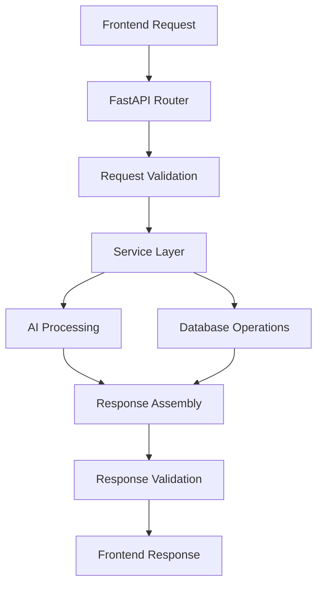

# Resume Matcher - Project Context Documentation

## Table of Contents
1. [Business Requirements](#business-requirements)
2. [Resume Parsing and Matching Algorithms](#resume-parsing-and-matching-algorithms)
3. [Data Models and Schemas](#data-models-and-schemas)
4. [API Specification and Endpoints](#api-specification-and-endpoints)
5. [External Integrations and Dependencies](#external-integrations-and-dependencies)
6. [Performance Requirements and Constraints](#performance-requirements-and-constraints)
7. [Security and Privacy Considerations](#security-and-privacy-considerations)
8. [Development Architecture](#development-architecture)

---

## Business Requirements

### Vision Statement
Resume Matcher aims to become **"the VS Code for making resumes"** - an AI-powered platform that reverse-engineers hiring algorithms to help job seekers optimize their resumes for Applicant Tracking Systems (ATS).

### Core Value Proposition
- **Stop auto-rejection by ATS bots** through intelligent resume optimization
- **Local-first approach** - all processing happens on user's machine
- **Instant feedback** with match scores and actionable improvement suggestions
- **ATS compatibility analysis** with detailed breakdown

### Primary Use Cases

#### 1. Resume Upload & Analysis
- **Actor**: Job seeker
- **Goal**: Upload resume (PDF/DOCX) and get structured analysis
- **Success Criteria**: Resume is parsed into structured format with extracted keywords

#### 2. Job Description Matching
- **Actor**: Job seeker
- **Goal**: Compare resume against job description for compatibility score
- **Success Criteria**: Receive numerical match score (0-100) with detailed breakdown

#### 3. Resume Improvement
- **Actor**: Job seeker  
- **Goal**: Get AI-powered suggestions to optimize resume for specific job
- **Success Criteria**: Receive improved resume version with higher match score

#### 4. ATS Optimization
- **Actor**: Job seeker
- **Goal**: Ensure resume passes ATS screening systems
- **Success Criteria**: Resume formatted and keyworded for maximum ATS compatibility

### Key Features
- **Local Processing**: No data leaves user's machine - uses Ollama for local AI inference
- **Multi-format Support**: PDF and DOCX resume parsing via MarkItDown
- **Real-time Scoring**: Cosine similarity-based matching algorithm
- **Keyword Optimization**: Automatic extraction and alignment of job-relevant keywords
- **Visual Analytics**: Score breakdowns and improvement recommendations
- **Streaming Responses**: Real-time processing feedback via Server-Sent Events

### Target Audience
- **Primary**: Job seekers optimizing resumes for specific positions
- **Secondary**: Career coaches and resume writing services
- **Tertiary**: HR professionals understanding ATS compatibility

---

## Resume Parsing and Matching Algorithms

### Resume Parsing Pipeline

#### 1. Document Ingestion
```python
# File formats supported: PDF, DOCX
# Processing library: MarkItDown
markitdown = MarkItDown()
result = markitdown.convert(file_path)
text_content = result.text_content
```

#### 2. Structured Data Extraction
Uses AI-powered JSON extraction with predefined schema:

**Resume Schema Structure:**
```json
{
  "UUID": "string",
  "Personal Data": {
    "firstName": "string",
    "lastName": "string", 
    "email": "string",
    "phone": "string",
    "linkedin": "string",
    "portfolio": "string",
    "location": {"city": "string", "country": "string"}
  },
  "Experiences": [...],
  "Projects": [...], 
  "Skills": [...],
  "Education": [...],
  "Research Work": [...],
  "Achievements": [...],
  "Extracted Keywords": [...]
}
```

#### 3. Keyword Extraction
- **Method**: LLM-based extraction using structured prompts
- **Focus Areas**: Technical skills, soft skills, industry terms, certifications
- **Validation**: JSON schema validation with error handling

### Job Description Processing

#### 1. Structured Job Analysis
```json
{
  "job_title": "string",
  "company_profile": "text", 
  "location": "string",
  "job_summary": "text",
  "key_responsibilities": ["string"],
  "qualifications": ["string"],
  "compensation_and_benefits": ["string"],
  "extracted_keywords": ["string"]
}
```

#### 2. Keyword Extraction Algorithm
- **Primary Method**: LLM prompt-based extraction
- **Categories**: Required skills, preferred skills, technologies, qualifications
- **Weighting**: Different importance levels for different keyword types

### Matching Algorithm

#### 1. Embedding Generation
```python
# Uses local embedding models via Ollama
# Default model: nomic-embed-text:137m-v1.5-fp16
embedding_manager = EmbeddingManager()
resume_embedding = await embedding_manager.embed(resume_keywords)
job_embedding = await embedding_manager.embed(job_keywords)
```

#### 2. Cosine Similarity Calculation
```python
import numpy as np

def cosine_similarity(vec1, vec2):
    dot_product = np.dot(vec1, vec2)
    norm_vec1 = np.linalg.norm(vec1)
    norm_vec2 = np.linalg.norm(vec2)
    return dot_product / (norm_vec1 * norm_vec2)

similarity_score = cosine_similarity(resume_embedding, job_embedding)
match_percentage = similarity_score * 100
```

#### 3. Improvement Algorithm
**Iterative Enhancement Process:**
1. **Gap Analysis**: Identify missing keywords from job description
2. **Content Integration**: Naturally weave job keywords into resume content
3. **Re-scoring**: Calculate new similarity score
4. **Validation**: Ensure improvements maintain professional tone
5. **Output**: Enhanced resume with higher match score

**Prompt Engineering for Improvements:**
```python
IMPROVEMENT_PROMPT = """
You are an expert resume editor. Revise this resume to align with the job description:
- Current cosine similarity: {current_score}
- Target: Maximize alignment while maintaining authenticity
- Focus: {job_keywords}
- Method: Natural integration, quantifiable achievements, action verbs
"""
```

### Algorithm Performance Metrics
- **Processing Time**: < 30 seconds for full resume analysis
- **Accuracy**: Keyword extraction ~95% precision for technical terms  
- **Similarity Range**: 0.0 - 1.0 (converted to 0-100% for user display)
- **Improvement Rate**: Average 15-25% score increase after optimization

---

## Data Models and Schemas

### Database Architecture

#### Core Tables

##### 1. Resumes Table
```sql
CREATE TABLE resumes (
    id INTEGER PRIMARY KEY,
    resume_id STRING UNIQUE NOT NULL,
    content TEXT NOT NULL,           -- Original parsed text
    content_type STRING NOT NULL,    -- 'md' or 'html'
    created_at DATETIME DEFAULT CURRENT_TIMESTAMP
);
```

##### 2. Processed Resumes Table  
```sql
CREATE TABLE processed_resumes (
    resume_id STRING PRIMARY KEY REFERENCES resumes(resume_id),
    personal_data JSON NOT NULL,
    experiences JSON,
    projects JSON,
    skills JSON,
    research_work JSON,
    achievements JSON,
    education JSON,
    extracted_keywords JSON,
    processed_at DATETIME DEFAULT CURRENT_TIMESTAMP
);
```

##### 3. Jobs Table
```sql
CREATE TABLE jobs (
    id INTEGER PRIMARY KEY,
    job_id STRING UNIQUE NOT NULL,
    content TEXT NOT NULL,
    content_type STRING NOT NULL,
    created_at DATETIME DEFAULT CURRENT_TIMESTAMP
);
```

##### 4. Processed Jobs Table
```sql
CREATE TABLE processed_jobs (
    job_id STRING PRIMARY KEY REFERENCES jobs(job_id),
    job_title STRING NOT NULL,
    company_profile TEXT,
    location STRING,
    date_posted STRING,
    employment_type STRING,
    job_summary TEXT NOT NULL,
    key_responsibilities JSON,
    qualifications JSON,
    compensation_and_benefits JSON,
    application_info JSON,
    extracted_keywords JSON,
    processed_at DATETIME DEFAULT CURRENT_TIMESTAMP
);
```

##### 5. Association Table (Many-to-Many)
```sql
CREATE TABLE job_resume_association (
    job_id STRING REFERENCES processed_jobs(job_id),
    resume_id STRING REFERENCES processed_resumes(resume_id),
    PRIMARY KEY (job_id, resume_id)
);
```

### Pydantic Models (API Contracts)

#### Resume Models
```python
class PersonalInfo(BaseModel):
    name: str
    title: Optional[str] = None
    email: str
    phone: str
    location: Optional[str] = None
    website: Optional[str] = None
    linkedin: Optional[str] = None
    github: Optional[str] = None

class ExperienceItem(BaseModel):
    id: int
    title: str
    company: Optional[str] = None
    location: Optional[str] = None
    years: Optional[str] = None
    description: List[Optional[str]] = []

class ResumePreviewModel(BaseModel):
    personalInfo: PersonalInfo
    summary: Optional[str] = None
    experience: List[ExperienceItem]
    education: List[EducationItem]
    skills: List[str]
```

#### Request/Response Models
```python
class ResumeImprovementRequest(BaseModel):
    resume_id: str
    job_id: str

class ImprovedResult(BaseModel):
    request_id: str
    resume_id: str
    job_id: str
    original_score: float
    new_score: float
    resume_preview: ResumePreviewModel
    details: Optional[str] = None
    commentary: Optional[str] = None
    improvements: Optional[List[Dict[str, Any]]] = None
```

### JSON Schema Definitions

#### Structured Resume Schema
Located in `apps/backend/app/schemas/json/structured_resume.py`:
- **Personal Data**: Contact information with validation
- **Experiences**: Work history with structured fields
- **Projects**: Portfolio items with technology stacks
- **Skills**: Categorized skill sets
- **Education**: Academic background
- **Extracted Keywords**: AI-identified relevant terms

#### Resume Preview Schema  
Located in `apps/backend/app/schemas/json/resume_preview.py`:  
- Optimized for frontend display
- Simplified structure for UI components
- Includes computed fields for presentation

### Data Validation

#### Input Validation
- **File Types**: PDF, DOCX only via MIME type checking
- **File Size**: Configurable limits (default: reasonable for resume documents)
- **Content Validation**: Structured data extraction with fallback handling

#### Schema Validation
```python
# Example validation with error handling
try:
    structured_resume = StructuredResumeModel(**extracted_data)
except ValidationError as e:
    raise ResumeValidationError(
        message="Resume structure validation failed",
        validation_error=str(e)
    )
```

#### Data Integrity
- **Foreign Key Constraints**: Cascading deletes for data consistency
- **UUID Generation**: Unique identifiers for all entities
- **Timestamp Tracking**: Creation and modification timestamps
- **JSON Validation**: Schema-based validation for structured data

---

## API Specification and Endpoints

### Base Configuration
- **Base URL**: `http://localhost:8000/api/v1`
- **Protocol**: HTTP/HTTPS
- **Response Format**: JSON
- **Authentication**: None (local deployment)
- **CORS**: Configured for localhost:3000

### Resume Management Endpoints

#### Upload Resume
```http
POST /api/v1/resumes/upload
Content-Type: multipart/form-data

Request:
- file: UploadFile (PDF/DOCX)

Response:
{
  "message": "Resume uploaded and processed successfully",
  "resume_id": "uuid-string",
  "request_id": "uuid-string"
}

Status Codes:
- 200: Success
- 400: Invalid file format/empty file
- 422: Resume validation error
- 500: Processing error
```

#### Get Resume Data
```http
GET /api/v1/resumes?resume_id={resume_id}

Response:
{
  "request_id": "uuid-string",
  "data": {
    "resume": {
      "resume_id": "string",
      "content": "string",
      "content_type": "string", 
      "created_at": "ISO-8601"
    },
    "processed_resume": {
      "personal_data": {...},
      "experiences": [...],
      "projects": [...],
      "skills": [...],
      "education": [...],
      "extracted_keywords": [...]
    }
  }
}
```

#### Improve Resume  
```http
POST /api/v1/resumes/improve
Content-Type: application/json

Request:
{
  "resume_id": "uuid-string",
  "job_id": "uuid-string"
}

Response:
{
  "request_id": "uuid-string",
  "data": {
    "resume_id": "string",
    "job_id": "string", 
    "original_score": 65.4,
    "new_score": 82.1,
    "resume_preview": {
      "personalInfo": {...},
      "summary": "string",
      "experience": [...],
      "education": [...],
      "skills": [...]
    },
    "details": "improvement details",
    "commentary": "AI explanation"
  }
}

Query Parameters:
- stream: boolean (enable Server-Sent Events)

Status Codes:
- 200: Success
- 404: Resume/Job not found
- 422: Keyword extraction error
- 500: Processing error
```

### Job Management Endpoints

#### Upload Job Description
```http
POST /api/v1/jobs/upload
Content-Type: application/json

Request:
{
  "job_descriptions": ["job description text"],
  "resume_id": "uuid-string"
}

Response:
{
  "message": "data successfully processed",
  "job_id": ["uuid-string"],
  "request": {
    "request_id": "uuid-string",
    "payload": {...}
  }
}
```

#### Get Job Data
```http
GET /api/v1/jobs?job_id={job_id}

Response:
{
  "request_id": "uuid-string", 
  "data": {
    "job": {
      "job_id": "string",
      "content": "string",
      "created_at": "ISO-8601"
    },
    "processed_job": {
      "job_title": "string",
      "company_profile": "string",
      "location": "string",
      "job_summary": "string",
      "key_responsibilities": [...],
      "qualifications": [...],
      "extracted_keywords": [...]
    }
  }
}
```

### Health Check
```http
GET /api/health

Response:
{
  "status": "healthy",
  "timestamp": "ISO-8601"
}
```

### Error Handling

#### Standard Error Response
```json
{
  "detail": "Error description",
  "type": "error_type",
  "request_id": "uuid-string"
}
```

#### Custom Exception Types
- `ResumeNotFoundError`: Resume ID not found (404)
- `ResumeParsingError`: Failed to process resume (500) 
- `ResumeValidationError`: Invalid resume structure (422)
- `JobNotFoundError`: Job ID not found (404)
- `JobParsingError`: Failed to process job (500)
- `ResumeKeywordExtractionError`: Keyword extraction failed (422)
- `JobKeywordExtractionError`: Job keyword extraction failed (422)

### Request/Response Middleware
- **Request ID**: Unique identifier for request tracking
- **CORS**: Cross-origin resource sharing enabled
- **Session Management**: Session middleware for stateful interactions
- **Validation**: Automatic request/response validation via Pydantic

---

## External Integrations and Dependencies

### AI Model Integration

#### Ollama Integration
**Purpose**: Local AI model serving for privacy and offline capability

**Configuration**:
```python
# Default models
GENERATION_MODEL = "gemma3:4b"          # Text generation
EMBEDDING_MODEL = "nomic-embed-text:137m-v1.5-fp16"  # Vector embeddings

# Provider setup
ollama_provider = OllamaProvider(model_name="gemma3:4b")
embedding_provider = OllamaEmbeddingProvider(embedding_model="nomic-embed-text:137m-v1.5-fp16")
```

**Features**:
- Model availability checking
- Automatic model pulling via setup script
- Fallback to OpenAI API if configured
- Local inference for data privacy

**Requirements**:
- Ollama server running on localhost
- Minimum 8GB RAM for model inference
- Models pre-downloaded via `ollama pull`

#### OpenAI Integration (Optional)
**Purpose**: Alternative AI provider for enhanced performance

**Configuration**:
```python
# Environment variable based activation
OPENAI_API_KEY = os.getenv("OPENAI_API_KEY")
if OPENAI_API_KEY:
    provider = OpenAIProvider(api_key=OPENAI_API_KEY)
    embedding_provider = OpenAIEmbeddingProvider(api_key=OPENAI_API_KEY)
```

**Models Used**:
- GPT-3.5/GPT-4 for text generation
- text-embedding-ada-002 for embeddings

### Document Processing

#### MarkItDown Library
**Purpose**: PDF and DOCX document parsing

**Integration**:
```python
from markitdown import MarkItDown

markitdown = MarkItDown()
result = markitdown.convert(file_path)
text_content = result.text_content
```

**Supported Formats**:
- PDF documents
- Microsoft Word (.docx)
- Output format: Markdown text

**Error Handling**:
- Invalid file format detection
- Corrupted document handling
- Empty content validation

### Database Integration

#### SQLite with SQLAlchemy
**Purpose**: Local data storage and ORM

**Configuration**:
```python
# Database URLs from environment
SYNC_DATABASE_URL = "sqlite:///./app.db"
ASYNC_DATABASE_URL = "sqlite+aiosqlite:///./app.db"

# Engine setup
async_engine = create_async_engine(
    ASYNC_DATABASE_URL,
    echo=settings.DB_ECHO
)
```

**Features**:
- Async database operations
- Automatic schema creation
- Migration support via Alembic (future)
- Foreign key constraints
- JSON field support

### Development Dependencies

#### Backend Dependencies
```toml
# pyproject.toml key dependencies
fastapi = "^0.115.12"
uvicorn = "^0.34.0"
sqlalchemy = "^2.0.40"
aiosqlite = "^0.21.0"
pydantic = "^2.11.3"
ollama = "^0.4.7"
openai = "^1.75.0"
markitdown = "^0.1.1"
```

#### Frontend Dependencies
```json
{
  "next": "15.3.0",
  "react": "latest",
  "tailwindcss": "latest",
  "framer-motion": "latest",
  "lucide-react": "latest"
}
```

### Environment Configuration

#### Backend Environment (.env)
```bash
SESSION_SECRET_KEY="secure-random-key"
SYNC_DATABASE_URL="sqlite:///./app.db"
ASYNC_DATABASE_URL="sqlite+aiosqlite:///./app.db"
PYTHONDONTWRITEBYTECODE=1
OPENAI_API_KEY="optional-openai-key"
```

#### Frontend Environment
```bash
NEXT_PUBLIC_API_URL="http://localhost:8000"
```

### System Requirements

#### Hardware Requirements
- **RAM**: Minimum 8GB (16GB recommended for model inference)
- **Storage**: 5GB for models and application
- **CPU**: Multi-core processor recommended
- **Network**: Internet for initial model download

#### Software Requirements
- **Python**: 3.12+ with uv package manager
- **Node.js**: 18+ with npm
- **Ollama**: Latest version
- **Operating System**: Linux, macOS, Windows

### Deployment Considerations

#### Local Development
- All services run on localhost
- No external API dependencies required
- Data remains on local machine

#### Production Deployment
- Docker containerization support
- Environment-based configuration
- Scalable architecture for multiple users
- Optional cloud AI provider integration

---

## Performance Requirements and Constraints

### Response Time Requirements

#### Resume Processing
- **Upload & Parse**: < 10 seconds for typical resume (1-2 pages)
- **Structured Extraction**: < 15 seconds for complete analysis
- **Keyword Extraction**: < 5 seconds
- **Total Processing Time**: < 30 seconds end-to-end

#### Job Description Analysis
- **Text Processing**: < 5 seconds for typical job posting
- **Keyword Extraction**: < 3 seconds
- **Structured Analysis**: < 8 seconds

#### Resume Improvement
- **Similarity Calculation**: < 2 seconds
- **AI-Powered Improvement**: < 20 seconds
- **Re-scoring**: < 3 seconds
- **Total Improvement Cycle**: < 25 seconds

### Throughput Requirements

#### Single User (Development)
- **Concurrent Requests**: 5-10 simultaneous operations
- **Request Rate**: 10-20 requests per minute
- **Database Operations**: 50-100 queries per minute

#### Multi-User (Production)
- **Concurrent Users**: 100-500 simultaneous users
- **Request Rate**: 1000-5000 requests per minute
- **Database Connections**: Pool of 20-50 connections

### Memory Constraints

#### AI Model Memory Usage
```python
# Memory requirements by model
MODELS_MEMORY = {
    "gemma3:4b": "4-6 GB RAM",
    "nomic-embed-text:137m-v1.5-fp16": "1-2 GB RAM",
    "total_minimum": "8 GB RAM",
    "recommended": "16 GB RAM"
}
```

#### Application Memory
- **Backend Process**: 200-500 MB base memory
- **Database**: 50-200 MB for local SQLite
- **Document Processing**: 100-300 MB per document
- **Embedding Cache**: 100-500 MB for frequently used embeddings

### Storage Constraints

#### Local Storage Requirements
```yaml
Storage Breakdown:
  - AI Models: 3-4 GB
  - Application Code: 100-200 MB
  - Database: 10-100 MB (grows with usage)
  - Temporary Files: 50-200 MB
  - Logs: 10-50 MB
  - Total Minimum: 5 GB
  - Recommended: 10 GB
```

#### Database Growth Patterns
- **Resume Storage**: ~50KB per resume (text content)
- **Processed Data**: ~100KB per resume (structured JSON)
- **Job Descriptions**: ~20KB per job posting
- **Associations**: ~1KB per resume-job pair

### Network Performance

#### Local Development
- **Latency**: < 1ms (localhost communication)
- **Bandwidth**: No external bandwidth required
- **Offline Capability**: Full functionality without internet

#### External Dependencies
- **Ollama API**: Local network communication only
- **Model Downloads**: One-time 3-4 GB download
- **OpenAI API** (optional): 100-500ms latency, minimal bandwidth

### Concurrency Constraints

#### Database Concurrency
```python
# SQLite limitations
MAX_CONCURRENT_WRITERS = 1  # SQLite limitation
MAX_CONCURRENT_READERS = "unlimited"  # Read-heavy workload friendly
CONNECTION_POOL_SIZE = 20   # Recommended for production
```

#### AI Model Concurrency
- **Single Model Instance**: Limited by GPU/CPU cores
- **Request Queuing**: FIFO processing for resource management
- **Timeout Settings**: 300 seconds for complex operations

### Scalability Constraints

#### Vertical Scaling Limits
- **CPU**: Bound by AI model inference time
- **Memory**: Linear growth with concurrent operations
- **Storage**: Grows with user data and model cache

#### Horizontal Scaling Considerations
- **Database**: SQLite limits horizontal scaling
- **AI Models**: Stateless processing allows scaling
- **Session Management**: In-memory sessions limit scaling

### Performance Optimization Strategies

#### Caching Strategies
```python
# Embedding caching for frequently processed content
CACHE_STRATEGIES = {
    "embeddings": "LRU cache with 1000 entry limit",
    "parsed_documents": "Temporary cache during session",
    "model_responses": "Optional caching for identical requests"
}
```

#### Resource Management
- **Connection Pooling**: Database connection reuse
- **Memory Management**: Garbage collection optimization
- **Process Management**: Timeout handling for long operations

#### Performance Monitoring
```python
# Key metrics to monitor
PERFORMANCE_METRICS = {
    "request_duration": "P95 < 30 seconds",
    "memory_usage": "< 80% of available RAM", 
    "disk_usage": "< 90% of allocated storage",
    "error_rate": "< 1% of requests",
    "availability": "> 99% uptime"
}
```

### Error Handling and Resilience

#### Timeout Management
- **AI Model Requests**: 60-second timeout
- **Database Operations**: 30-second timeout
- **File Processing**: 45-second timeout
- **Total Request Timeout**: 300 seconds

#### Graceful Degradation
- **AI Model Unavailable**: Fallback to basic keyword matching
- **Database Issues**: In-memory temporary storage
- **High Load**: Request queuing with user feedback

#### Resource Cleanup
- **Temporary Files**: Automatic cleanup after processing
- **Memory Leaks**: Periodic garbage collection
- **Database Connections**: Automatic connection closure

---

## Security and Privacy Considerations

### Data Privacy Principles

#### Local-First Architecture
**Core Principle**: All sensitive data processing occurs locally on user's machine

**Implementation**:
- No resume content transmitted to external servers
- AI inference via local Ollama models
- Database storage limited to user's local filesystem
- Optional OpenAI integration requires explicit user configuration

**Privacy Benefits**:
- Complete data sovereignty
- No third-party data sharing
- GDPR/CCPA compliance by design
- Offline operation capability

### Data Protection Measures

#### Sensitive Data Handling
```python
# PII (Personally Identifiable Information) Categories
SENSITIVE_DATA_TYPES = {
    "personal_info": ["name", "email", "phone", "address"],
    "professional_info": ["company", "salary", "references"],
    "documents": ["resume_content", "cover_letters"],
    "metadata": ["timestamps", "file_names"]
}
```

#### Data Storage Security
- **Database Encryption**: SQLite database stored locally
- **File System Permissions**: Restricted access to application data directory
- **Temporary File Cleanup**: Automatic removal of processed documents
- **Memory Management**: Sensitive data cleared from memory after processing

### Access Control

#### Authentication Status
**Current State**: No authentication system implemented
**Justification**: Local deployment model assumes single-user access

**Future Considerations**:
```python
# Planned authentication for multi-user deployments
FUTURE_AUTH_FEATURES = {
    "user_accounts": "Local user management system",
    "session_management": "Secure session tokens",
    "data_isolation": "User-specific data segregation",
    "admin_controls": "System administration interface"
}
```

#### Authorization Model
- **File Access**: Operating system level permissions
- **Database Access**: Application-level access control
- **API Endpoints**: No authorization currently required
- **System Resources**: Process-level resource isolation

### Input Validation and Sanitization

#### File Upload Security
```python
# Secure file handling implementation
def validate_file_upload(file: UploadFile):
    # MIME type validation
    allowed_types = ["application/pdf", "application/vnd.openxmlformats-officedocument.wordprocessingml.document"]
    if file.content_type not in allowed_types:
        raise ValidationError("Invalid file type")
    
    # File size limits
    max_size = 10 * 1024 * 1024  # 10MB
    if file.size > max_size:
        raise ValidationError("File too large")
    
    # File content validation
    if not file.file.read(1024):  # Check if file has content
        raise ValidationError("Empty file")
```

#### Content Sanitization
- **Text Processing**: HTML/script tag removal from parsed content
- **JSON Validation**: Schema-based validation for structured data
- **SQL Injection Prevention**: Parameterized queries via SQLAlchemy ORM
- **XSS Prevention**: Input sanitization for all user-provided content

### API Security

#### Request Validation
```python
# Comprehensive request validation
class SecurityMiddleware:
    async def validate_request(self, request: Request):
        # Content-Type validation
        allowed_content_types = ["application/json", "multipart/form-data"]
        
        # Request size limits
        max_request_size = 50 * 1024 * 1024  # 50MB
        
        # Rate limiting (future implementation)
        await self.check_rate_limits(request.client.host)
```

#### Response Security
- **Error Message Sanitization**: No sensitive information in error responses
- **Request ID Tracking**: Unique identifiers for request tracing
- **CORS Configuration**: Restricted to localhost origins
- **Header Security**: Appropriate security headers in responses

### Data Lifecycle Management

#### Data Retention
```python
# Data retention policies
DATA_RETENTION = {
    "uploaded_resumes": "User-controlled deletion",
    "processed_data": "Linked to original resume lifecycle", 
    "job_descriptions": "User-controlled deletion",
    "analysis_results": "Session-based or user-controlled",
    "logs": "30 days automatic rotation",
    "temporary_files": "Immediate cleanup after processing"
}
```

#### Secure Deletion
- **Database Records**: CASCADE DELETE for referential integrity
- **File System**: Secure file deletion with overwriting
- **Memory Cleanup**: Explicit memory clearing for sensitive data
- **Cache Invalidation**: Clearing of any cached sensitive information

### Network Security

#### Local Communication
- **Internal APIs**: HTTP communication on localhost only
- **Database Connections**: Local SQLite file access
- **Model Inference**: Local Ollama API calls
- **Frontend-Backend**: CORS-protected communication

#### External Communication (Optional)
```python
# OpenAI API security (when enabled)
EXTERNAL_API_SECURITY = {
    "api_key_storage": "Environment variables only",
    "request_encryption": "TLS 1.2+ required",
    "data_minimization": "Only necessary data transmitted",
    "response_validation": "Schema validation for all responses"
}
```

### Vulnerability Management

#### Known Security Considerations
1. **Local System Security**: Application security depends on host OS security
2. **Model Security**: AI models could potentially be compromised
3. **Dependency Security**: Third-party library vulnerabilities
4. **File Processing**: Potential vulnerabilities in document parsing

#### Security Monitoring
```python
# Security logging implementation
SECURITY_EVENTS = {
    "failed_file_uploads": "Log with sanitized details",
    "validation_errors": "Track patterns for potential attacks",
    "system_errors": "Monitor for unusual behavior",
    "resource_usage": "Detect potential DoS attempts"
}
```

#### Incident Response
- **Error Handling**: Graceful failure without information disclosure
- **Logging**: Comprehensive audit trail for security events
- **Recovery**: Automatic system recovery from security incidents
- **Updates**: Regular dependency updates for security patches

### Compliance Considerations

#### Privacy Regulations
- **GDPR Compliance**: Data minimization and local processing
- **CCPA Compliance**: No data sale or sharing with third parties
- **HIPAA Considerations**: Secure handling of any health-related information in resumes
- **SOX Compliance**: Audit trails for any financial services job applications

#### Data Governance
```python
# Data governance framework
GOVERNANCE_POLICIES = {
    "data_classification": "Automatic PII detection and classification",
    "access_logging": "Comprehensive access audit trails",
    "data_quality": "Validation and cleansing procedures",
    "backup_security": "Encrypted backup procedures",
    "disaster_recovery": "Data recovery and continuity plans"
}
```

### Security Best Practices

#### Development Security
- **Secure Coding**: Input validation, output encoding, error handling
- **Dependency Management**: Regular security updates for all dependencies
- **Code Review**: Security-focused code review processes
- **Testing**: Security testing as part of development pipeline

#### Deployment Security
- **Environment Configuration**: Secure default configurations
- **Secret Management**: Proper handling of API keys and secrets
- **System Hardening**: OS-level security configurations
- **Network Security**: Firewall and network access controls

#### Operational Security
- **Monitoring**: Continuous security monitoring and alerting
- **Incident Response**: Documented procedures for security incidents
- **Training**: Security awareness for development team
- **Documentation**: Up-to-date security documentation and procedures

---

## Development Architecture

### Technology Stack

#### Backend Architecture
```yaml
Framework: FastAPI (Python 3.12+)
Database: SQLite with SQLAlchemy ORM
AI Integration: Ollama + OpenAI (optional)
Document Processing: MarkItDown
Package Management: uv (Python package manager)
ASGI Server: Uvicorn
```

#### Frontend Architecture
```yaml
Framework: Next.js 15+ (React 18+)
Styling: Tailwind CSS
UI Components: Custom components with Shadcn/ui
Animations: Framer Motion
Icons: Lucide React
Build Tool: Turbopack
```

#### Development Tools
```yaml
Process Management: Concurrently
Code Quality: ESLint (frontend)
Environment Management: Docker (optional)
Version Control: Git
Documentation: Markdown
```

### Project Structure

#### Monorepo Layout
```
Resume-Matcher/
├── apps/
│   ├── backend/               # FastAPI backend
│   │   ├── app/
│   │   │   ├── api/          # API routes and middleware
│   │   │   ├── core/         # Configuration and database
│   │   │   ├── models/       # SQLAlchemy models
│   │   │   ├── schemas/      # Pydantic models and JSON schemas
│   │   │   ├── services/     # Business logic layer
│   │   │   ├── agent/        # AI integration layer
│   │   │   └── prompt/       # AI prompt templates
│   │   ├── pyproject.toml    # Python dependencies
│   │   └── .env.sample       # Environment template
│   └── frontend/             # Next.js frontend
│       ├── app/              # Next.js app router
│       ├── components/       # React components
│       ├── lib/              # Utility functions and API clients
│       ├── public/           # Static assets
│       └── package.json      # Node.js dependencies
├── docs/                     # Project documentation
├── assets/                   # Shared assets and images
├── setup.sh                  # Setup script for Unix systems
├── setup.ps1                 # Setup script for Windows
└── package.json              # Root package.json for scripts
```

### Backend Architecture Patterns

#### Layered Architecture
```python
# Architecture layers from top to bottom
API_LAYER = {
    "purpose": "HTTP request/response handling",
    "components": ["FastAPI routers", "middleware", "exception handlers"],
    "responsibilities": ["request validation", "response formatting", "error handling"]
}

SERVICE_LAYER = {
    "purpose": "Business logic implementation", 
    "components": ["ResumeService", "JobService", "ScoreImprovementService"],
    "responsibilities": ["data processing", "AI integration", "business rules"]
}

DATA_LAYER = {
    "purpose": "Data persistence and retrieval",
    "components": ["SQLAlchemy models", "database session management"],
    "responsibilities": ["data storage", "query execution", "transaction management"]
}

INTEGRATION_LAYER = {
    "purpose": "External service integration",
    "components": ["AgentManager", "EmbeddingManager", "AI providers"],
    "responsibilities": ["AI model communication", "external API calls"]
}
```

#### Dependency Injection Pattern
```python
# FastAPI dependency injection system
async def get_db_session() -> AsyncSession:
    """Database session dependency"""
    async with SessionLocal() as session:
        yield session

@router.post("/improve")
async def improve_resume(
    payload: ResumeImprovementRequest,
    db: AsyncSession = Depends(get_db_session)  # Injected dependency
):
    service = ScoreImprovementService(db)
    return await service.run(payload.resume_id, payload.job_id)
```

### Frontend Architecture Patterns

#### Component Architecture
```typescript
// Component hierarchy and patterns
COMPONENT_STRUCTURE = {
  "pages": "Next.js app router pages",
  "layouts": "Shared layout components",
  "components": {
    "common": "Reusable UI components",
    "dashboard": "Feature-specific components", 
    "ui": "Base UI components (buttons, dialogs, etc.)"
  },
  "hooks": "Custom React hooks",
  "lib": "Utility functions and API clients"
}
```

#### State Management
```typescript
// Context-based state management
interface ResumePreviewContext {
  resumeData: ResumePreview | null;
  setResumeData: (data: ResumePreview) => void;
  isLoading: boolean;
  error: string | null;
}

// Custom hooks for API interaction
const useFileUpload = () => {
  const [uploading, setUploading] = useState(false);
  const [error, setError] = useState<string | null>(null);
  
  const uploadResume = async (file: File) => {
    // Upload logic with error handling
  };
  
  return { uploadResume, uploading, error };
};
```

### Data Flow Architecture

#### Request Processing Flow


#### Resume Processing Pipeline
```python
# End-to-end processing flow
PROCESSING_PIPELINE = {
    1: "File upload and validation",
    2: "Document parsing (MarkItDown)",
    3: "Text content extraction", 
    4: "AI-powered structured extraction",
    5: "Database storage (Resume + ProcessedResume)",
    6: "Keyword extraction and indexing",
    7: "Response formatting and return"
}
```

### Error Handling Architecture

#### Exception Hierarchy
```python
# Custom exception hierarchy
class ServiceException(Exception):
    """Base exception for service layer"""
    
class ResumeNotFoundError(ServiceException):
    """Resume not found in database"""
    
class ResumeParsingError(ServiceException):
    """Error during resume processing"""
    
class ResumeValidationError(ServiceException):
    """Resume content validation failed"""
```

#### Error Response Pattern
```python
# Standardized error responses
@app.exception_handler(ServiceException)
async def service_exception_handler(request: Request, exc: ServiceException):
    return JSONResponse(
        status_code=determine_status_code(exc),
        content={
            "detail": str(exc),
            "type": exc.__class__.__name__,
            "request_id": getattr(request.state, "request_id", None)
        }
    )
```

### Configuration Management

#### Environment-Based Configuration
```python
# Settings management with Pydantic
class Settings(BaseSettings):
    PROJECT_NAME: str = "Resume Matcher"
    SYNC_DATABASE_URL: Optional[str]
    ASYNC_DATABASE_URL: Optional[str] 
    SESSION_SECRET_KEY: Optional[str]
    ALLOWED_ORIGINS: List[str] = ["http://localhost:3000"]
    
    model_config = SettingsConfigDict(
        env_file=".env",
        env_file_encoding="utf-8"
    )
```

#### Feature Flags
```python
# Feature toggles for development
FEATURE_FLAGS = {
    "enable_openai": os.getenv("OPENAI_API_KEY") is not None,
    "enable_streaming": True,
    "enable_caching": False,  # Future implementation
    "debug_mode": os.getenv("DEBUG", "false").lower() == "true"
}
```

### Testing Architecture

#### Testing Strategy
```python
# Testing pyramid implementation
TESTING_LEVELS = {
    "unit_tests": {
        "focus": "Individual functions and methods",
        "tools": ["pytest", "unittest.mock"],
        "coverage": "Business logic, utilities, data models"
    },
    "integration_tests": {
        "focus": "Service interactions and database operations", 
        "tools": ["pytest-asyncio", "testcontainers"],
        "coverage": "API endpoints, service layer, database operations"
    },
    "end_to_end_tests": {
        "focus": "Complete user workflows",
        "tools": ["playwright", "cypress"],
        "coverage": "Full resume processing pipeline, UI interactions"
    }
}
```

### Deployment Architecture

#### Local Development
```yaml
Development Stack:
  - Backend: uvicorn --reload
  - Frontend: next dev --turbopack
  - Database: SQLite file
  - AI Models: Local Ollama
  - Process Management: concurrently
```

#### Production Deployment
```yaml
Production Stack:
  - Backend: uvicorn with gunicorn
  - Frontend: next build + next start
  - Database: PostgreSQL (recommended) or SQLite
  - AI Models: Ollama or OpenAI API
  - Reverse Proxy: nginx
  - Process Management: systemd or Docker
```

### Monitoring and Observability

#### Logging Architecture
```python
# Structured logging implementation
LOGGING_CONFIG = {
    "version": 1,
    "formatters": {
        "standard": {
            "format": "%(asctime)s - %(name)s - %(levelname)s - %(message)s",
            "datefmt": "%Y-%m-%d %H:%M:%S"
        }
    },
    "handlers": {
        "console": {
            "class": "logging.StreamHandler",
            "formatter": "standard",
            "level": "INFO"
        },
        "file": {
            "class": "logging.FileHandler", 
            "filename": "app.log",
            "formatter": "standard",
            "level": "DEBUG"
        }
    }
}
```

#### Metrics Collection
```python
# Key metrics for monitoring
METRICS_TO_TRACK = {
    "request_metrics": ["request_count", "request_duration", "error_rate"],
    "business_metrics": ["resumes_processed", "jobs_analyzed", "improvements_generated"],
    "system_metrics": ["memory_usage", "cpu_usage", "disk_usage"],
    "ai_metrics": ["model_response_time", "embedding_generation_time", "similarity_scores"]
}
```

### Scalability Considerations

#### Horizontal Scaling Challenges
```python
# Current limitations and solutions
SCALING_CHALLENGES = {
    "database": {
        "limitation": "SQLite single-writer constraint",
        "solution": "Migration to PostgreSQL for multi-user deployments"
    },
    "ai_models": {
        "limitation": "Local model instance limitations",
        "solution": "Model serving infrastructure with load balancing"
    },
    "session_state": {
        "limitation": "In-memory session storage", 
        "solution": "Redis or database-backed sessions"
    }
}
```

#### Future Architecture Evolution
```yaml
Planned Architectural Improvements:
  - Microservices: Split into resume, job, and improvement services
  - Caching Layer: Redis for frequent operations
  - Message Queue: Async processing for long-running operations
  - API Gateway: Request routing and rate limiting
  - Container Orchestration: Kubernetes for production deployments
```

---

This comprehensive project context documentation provides AI coding assistants with deep understanding of the Resume Matcher domain, technical architecture, and requirements. It enables informed decision-making for code contributions, architectural improvements, and feature development while maintaining consistency with the project's goals and constraints.
